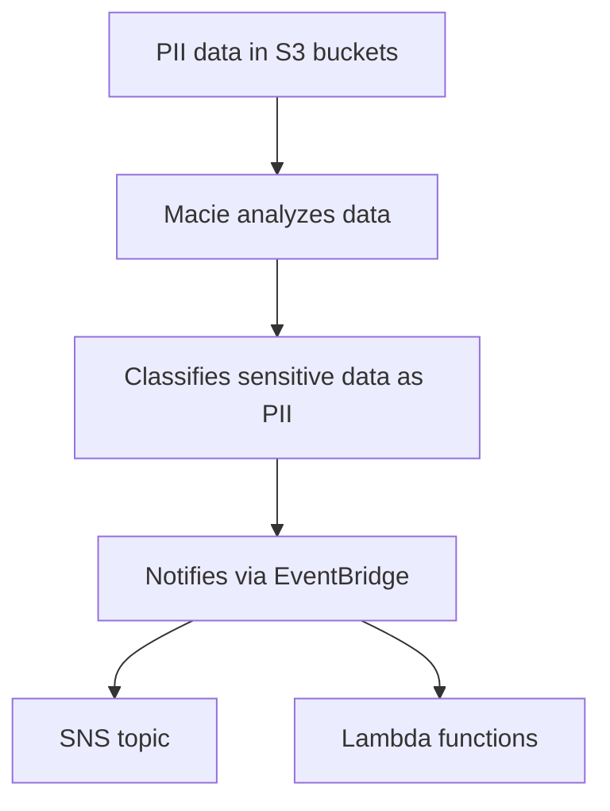

# 180. Amazon Macie

## 🎯 Giới thiệu
- **Amazon Macie** là một **fully managed data security** và **data privacy service**.
- Dịch vụ này dùng **machine learning** và **pattern matching** để phát hiện và bảo vệ **sensitive data** trong AWS.
- Mục tiêu chính trong bài giảng: tìm **PII (personally identifiable information)** trong **S3 buckets**.

## 1. Chức năng cốt lõi
- Macie dùng để **discover** dữ liệu nhạy cảm trong AWS.
- Trong transcript, trọng tâm là:
  - dữ liệu **PII**
  - dữ liệu nằm trong **S3 buckets**
- Macie sẽ phân tích dữ liệu trong S3 để xác định dữ liệu nào có thể được **classified as PII**.

## 2. Luồng hoạt động
- Dữ liệu PII được lưu trong **S3 buckets**.
- **Macie** phân tích các bucket được chỉ định.
- Khi phát hiện nội dung nhạy cảm, Macie sẽ **notify** thông qua **EventBridge**.
- Từ đó có thể tích hợp tiếp với:
  - **SNS topic**
  - **Lambda functions**
  - và các tích hợp khác tương tự được nhắc trong transcript

## 3. Kích hoạt và phạm vi sử dụng
- Chỉ cần **one click** để enable Macie.
- Bạn chỉ cần **specify the S3 buckets** muốn theo dõi.
- Theo transcript, Macie được dùng để:
  - tìm **sensitive data** trong **S3 buckets**
  - và đó là mục đích chính của dịch vụ trong bài giảng này

## 📊 Bảng tóm tắt
| Tiêu chí | Mô tả |
|----------|------|
| Loại dịch vụ | **Fully managed data security** và **data privacy service** |
| Kỹ thuật sử dụng | **Machine learning**, **pattern matching** |
| Dữ liệu mục tiêu | **Sensitive data**, đặc biệt là **PII** |
| Vị trí dữ liệu | **S3 buckets** |
| Cảnh báo | Qua **EventBridge** |
| Tích hợp | **SNS topic**, **Lambda functions** |
| Cách bật | **One click**, chọn các **S3 buckets** cần phân tích |

## 💡 Mẹo ghi nhớ cho kỳ thi AWS
- **Macie = S3 + PII + EventBridge**
- Nhớ rằng trong transcript, Macie được mô tả là công cụ để **tìm dữ liệu nhạy cảm trong S3 buckets**.
- Khi thấy câu hỏi về:
  - phát hiện **PII**
  - phân tích dữ liệu trong **S3**
  - gửi cảnh báo qua **EventBridge**
  
  thì Macie là lựa chọn cần nghĩ đến đầu tiên.

## ✅ Kết luận
- **Amazon Macie** là dịch vụ AWS dùng để phát hiện và bảo vệ **sensitive data** trong **S3 buckets**.
- Nó sử dụng **machine learning** và **pattern matching** để nhận diện **PII**.
- Kết quả phát hiện sẽ được thông báo qua **EventBridge**, và có thể tích hợp với **SNS** hoặc **Lambda**.
