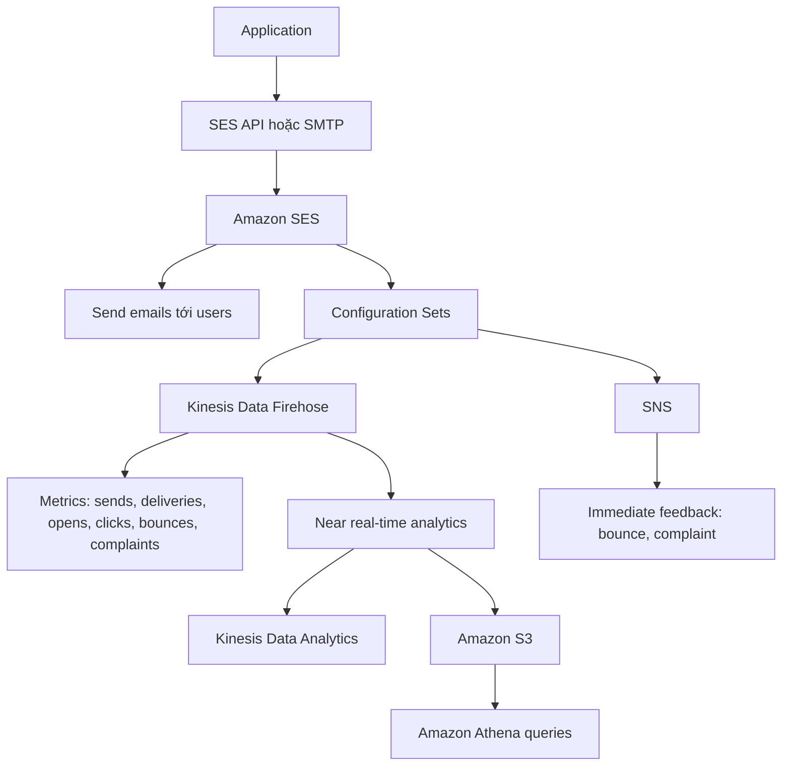

# 181. Amazon SES

## 🎯 Giới thiệu
Amazon SES (Simple Email Service) là một **fully managed service** dùng để **gửi email an toàn, toàn cầu và ở quy mô lớn**.

- Ứng dụng có thể gửi email thông qua:
  - `SES API`
  - `SMTP server`
- SES hỗ trợ:
  - **outbound emails** và **inbound emails**
  - nhận reply từ người dùng
  - thống kê và phân tích hiệu quả gửi mail
  - anti-spam feedback

## 1. Chức năng chính của Amazon SES 📧
Amazon SES dùng để gửi nhiều loại email cho người dùng:

- **Transactional emails**
- **Marketing emails**
- **Bulk email communications**

SES cung cấp các thông tin theo dõi quan trọng:

- `deliveries`
- `bounces`
- `feedback loop results`
- email có được mở hay không
- `reputation dashboard`
- `performance insights`
- `anti-spam feedback`

## 2. Bảo mật và cách triển khai 🔐
SES hỗ trợ các chuẩn bảo mật phổ biến cho email sending:

- `DKIAM` theo transcript
- `SPF`

Về deployment, SES cho phép linh hoạt trong việc dùng IP để gửi email:

- `shared IP`
- `dedicated IP`
- `customer owned IP`

Mục đích là gửi email từ một địa chỉ IP cụ thể và có thể tách riêng theo nhu cầu sử dụng.

## 3. Configuration Sets và luồng phân tích dữ liệu ⚙️
`Configuration sets` là tính năng để **customize** và **analyze** các email send events trong SES.

Có 2 thành phần chính:

- **Event destinations**
  - `Kinesis Data Firehose`
    - nhận metrics như:
      - sends
      - deliveries
      - opens
      - clicks
      - bounces
      - complaints
  - `SNS`
    - nhận feedback ngay lập tức về:
      - bounce
      - complaint
- **IP pool management**
  - dùng `IP pools` cho từng loại email
  - ví dụ:
    - một IP set cho `transactional emails`
    - một IP set cho `marketing emails`
  - giúp tạo **hai reputation riêng**

SES có thể gửi dữ liệu analytics theo thời gian gần thực:

- gửi sang `Kinesis Data Firehose`
- sau đó có thể:
  - phân tích bằng `Kinesis Data Analytics`
  - lưu vào `Amazon S3`
  - chạy query bằng `Amazon Athena`

Nếu muốn phản hồi tức thì về bounce và complaint:

- cấu hình một `Amazon SNS topic`

## 📊 Bảng tóm tắt
| Tiêu chí | Mô tả |
|----------|------|
| Tên dịch vụ | Amazon SES (Simple Email Service) |
| Loại dịch vụ | Fully managed email service |
| Mục đích | Gửi email secure, global, scale lớn |
| Giao tiếp | `SES API` hoặc `SMTP` |
| Hỗ trợ email | Outbound và inbound emails |
| Use cases | Transactional, marketing, bulk emails |
| Theo dõi | Deliveries, bounces, opens, clicks, complaints |
| Bảo mật | `DKIAM`, `SPF` |
| IP deployment | Shared IP, dedicated IP, customer owned IP |
| Tính năng phân tích | `Configuration sets` |
| Event destinations | `Kinesis Data Firehose`, `SNS` |
| IP quản lý | `IP pool management` |

## 💡 Mẹo ghi nhớ cho kỳ thi AWS
- `SES = email service` cho **sending email ở quy mô lớn**
- Nhớ 3 use case chính:
  - `transactional`
  - `marketing`
  - `bulk`
- `Configuration sets` dùng để:
  - theo dõi event
  - phân tích gửi mail
  - tách reputation theo `IP pools`
- `Firehose` phù hợp cho metrics và near real-time analytics
- `SNS` phù hợp khi cần feedback **ngay lập tức** về `bounce` và `complaint`

## ✅ Kết luận
Amazon SES là dịch vụ gửi email được quản lý hoàn toàn, hỗ trợ gửi email an toàn và quy mô lớn, đồng thời cung cấp cơ chế theo dõi, phân tích, và quản lý IP linh hoạt. Với `configuration sets`, `Firehose`, `SNS`, và `IP pools`, SES giúp kiểm soát tốt cả hiệu quả gửi mail lẫn reputation của từng nhóm email.
