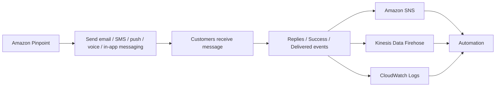

# 182. Amazon Pinpoint

## 🎯 Giới thiệu
- **Amazon Pinpoint** là một **scalable inbound and outbound marketing communication service**.
- Dịch vụ này dùng để gửi:
  - **email**
  - **SMS**
  - **push notifications**
  - **voice**
  - **in-app messaging**
- Một use case quan trọng nhất là **SMS**.
- Có thể **segment** và **personalize** nội dung theo từng nhóm khách hàng.
- Hỗ trợ **receive replies** và mở rộng đến **billions of messages per day**.

## 1. Chức năng chính của Amazon Pinpoint
- Gửi **marketing email in bulk** để chạy campaign.
- Gửi **transactional SMS messages**.
- Tạo:
  - **message templates**
  - **delivery schedules**
  - **highly targeted segments**
  - **full campaigns**
- Phù hợp khi cần một dịch vụ quản lý toàn bộ luồng messaging thay vì tự xử lý trong application.

## 2. Luồng sự kiện và tích hợp
- Khi có sự kiện như:
  - **text success**
  - **text delivered**
  - **replies**
- Các events này sẽ được đưa tới:
  - **Amazon SNS**
  - **Kinesis Data Firehose**
  - **CloudWatch Logs**
- Từ đó có thể xây dựng **automation** trên Amazon Pinpoint.

## 3. So sánh với SNS và SES
- Với **SNS** hoặc **SES**:
  - bạn phải tự quản lý **audience**
  - tự quản lý **content**
  - tự quản lý **delivery schedule**
  - các phần này là trách nhiệm của **application**
- Với **Amazon Pinpoint**:
  - service quản lý **templates**
  - **schedules**
  - **segments**
  - **campaigns**
- Có thể xem Pinpoint như **next evolution of SNS and SES** cho nhu cầu **full-blown marketing communications service**.

## 📊 Bảng tóm tắt
| Tiêu chí | Mô tả |
|----------|------|
| Loại dịch vụ | Inbound và outbound marketing communication service |
| Kênh hỗ trợ | Email, SMS, push notifications, voice, in-app messaging |
| Điểm mạnh | Segment, personalize, templates, schedules, campaigns |
| Quy mô | Scale đến billions of messages per day |
| Event output | Amazon SNS, Kinesis Data Firehose, CloudWatch Logs |
| Use case chính | Marketing email in bulk, transactional SMS messages |

## 💡 Mẹo ghi nhớ cho kỳ thi AWS
- **Pinpoint = marketing communication service**.
- Nhớ 5 kênh chính: **email, SMS, push, voice, in-app**.
- Nhớ điểm khác biệt với **SNS/SES**:
  - **SNS/SES**: application tự lo audience, content, schedule
  - **Pinpoint**: service lo templates, segments, campaigns
- Nếu đề bài nói về:
  - **campaigns**
  - **personalization**
  - **segmentation**
  - **SMS marketing**
  thì nghĩ ngay đến **Amazon Pinpoint**.
- Events từ Pinpoint có thể đi tới **SNS**, **Kinesis Data Firehose**, và **CloudWatch Logs**.

## ✅ Kết luận
- **Amazon Pinpoint** là dịch vụ phù hợp cho **marketing communications** quy mô lớn.
- Dịch vụ này hỗ trợ **gửi tin nhắn đa kênh**, **segment khách hàng**, **cá nhân hóa nội dung**, và **quản lý campaign**.
- So với **SNS** và **SES**, Pinpoint xử lý nhiều phần phức tạp hơn ở tầng service, giúp ứng dụng đỡ phải tự quản lý nhiều chi tiết.
