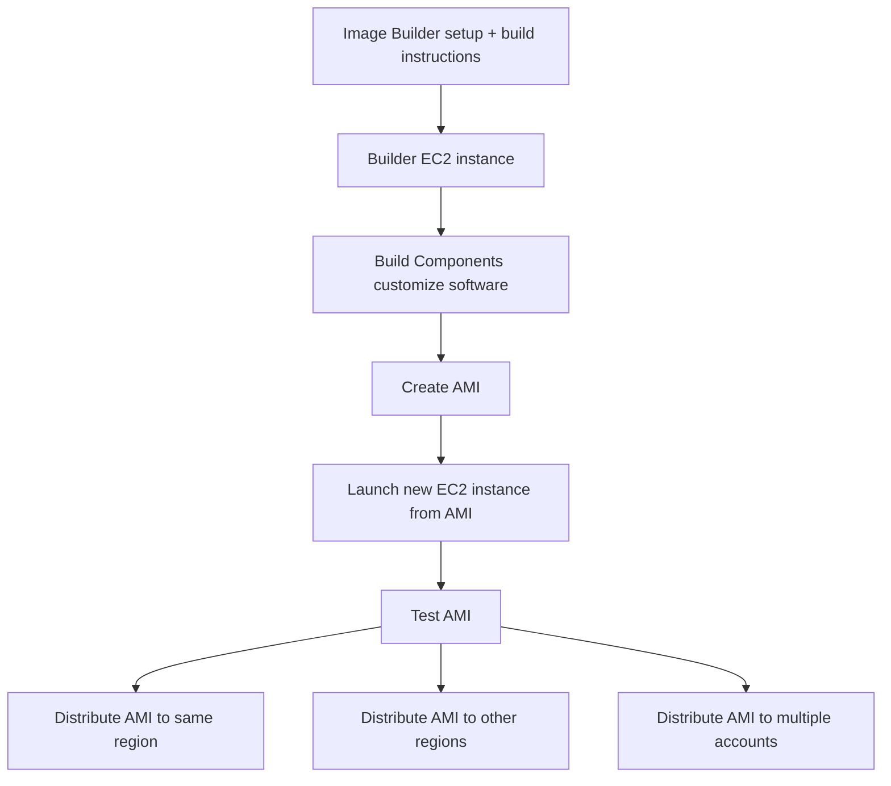
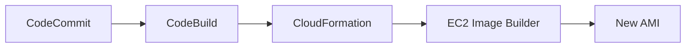
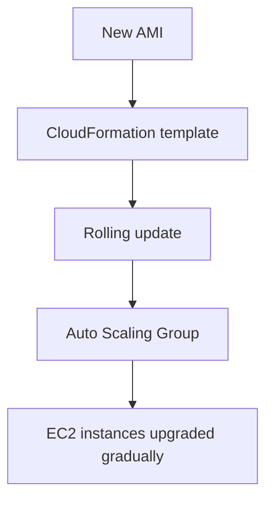

# 183. EC2 Image Builder

## 🎯 Giới thiệu
EC2 Image Builder là service dùng để tự động hóa việc tạo, duy trì, validate và test:
- EC2 AMIs
- virtual machines images
- container images

Mục tiêu chính:
- Tự động build AMI theo lịch hoặc theo automation
- Giảm thao tác thủ công khi tạo image
- Dễ dàng phân phối AMI ra nhiều region và nhiều account

## 1. EC2 Image Builder hoạt động như thế nào
Quy trình cơ bản của Image Builder:

- Tạo một `builder EC2 instance` gần như trống
- Chạy các `Build Components` để customize software theo instruction
- Tạo AMI từ instance sau khi build xong
- Tạo một EC2 instance mới từ AMI để `test`
- Kiểm tra AMI có hoạt động tốt, có secure hay không
- Phân phối AMI sang:
  - region ban đầu
  - các region khác
  - nhiều accounts khác nhau

### Mermaid: Flow tạo và phân phối AMI

## 2. Cách dùng trong CICD architecture
Transcript mô tả một luồng CICD gồm 3 giai đoạn chính:

- `CodeCommit`: nơi lưu source code
- `CodeBuild`: build và compile code thành executable
- `CloudFormation`: tự động launch `EC2 Image Builder service` để tạo AMI từ output của CodeBuild

Ý tưởng là:
- Source code đi vào CodeCommit
- CodeBuild xử lý build
- CloudFormation gọi Image Builder để tạo AMI
- AMI mới được dùng cho rollout production

### Mermaid: CICD flow

## 3. Rollout AMI vào production
Sau khi AMI mới được tạo, CloudFormation tiếp tục dùng template để:
- thực hiện `rolling update`
- update `Auto Scaling Group`
- nâng cấp EC2 instances từ AMI cũ sang AMI mới từng phần một

Điểm chính:
- Instances không bị thay thế đồng loạt
- Upgrade diễn ra theo thời gian
- Giúp rollout an toàn và tự động hơn

### Mermaid: Deployment flow

## 📊 Bảng tóm tắt
| Tiêu chí | Mô tả |
|----------|------|
| Mục đích | Tự động tạo, duy trì, validate và test EC2 AMIs |
| Đối tượng | Virtual machines images và container images |
| Cách vận hành | Tạo builder EC2 instance, chạy Build Components, tạo AMI, test, rồi phân phối |
| Lịch chạy | Có thể chạy theo schedule hoặc automation |
| Chi phí | Service miễn phí, chỉ trả cho underlying resources như EC2 instances |
| Phân phối | Có thể publish AMI sang nhiều regions và multiple accounts |
| CICD integration | Kết hợp với CodeCommit, CodeBuild và CloudFormation |
| Rollout production | Dùng CloudFormation để rolling update Auto Scaling Group |

## 💡 Mẹo ghi nhớ cho kỳ thi AWS
- `Image Builder` = công cụ để **build + test + distribute AMI** một cách tự động
- Nhớ chuỗi chính: `CodeCommit -> CodeBuild -> CloudFormation -> EC2 Image Builder -> AMI`
- `Builder EC2 instance` ban đầu gần như trống, sau đó được customize bằng `Build Components`
- AMI không chỉ được tạo ra mà còn được `test` trước khi phân phối
- `CloudFormation` trong flow này dùng để orchestration và `rolling update`
- Service không tính phí riêng, nhưng vẫn trả tiền cho tài nguyên EC2 bên dưới

## ✅ Kết luận
EC2 Image Builder là service giúp chuẩn hóa và tự động hóa toàn bộ vòng đời của EC2 AMI: build, test, và phân phối. Trong kiến trúc CICD, nó thường được điều phối bằng `CodePipeline`, `CodeCommit`, `CodeBuild`, và `CloudFormation` để tạo AMI mới rồi rollout dần vào `Auto Scaling Group` một cách an toàn.
