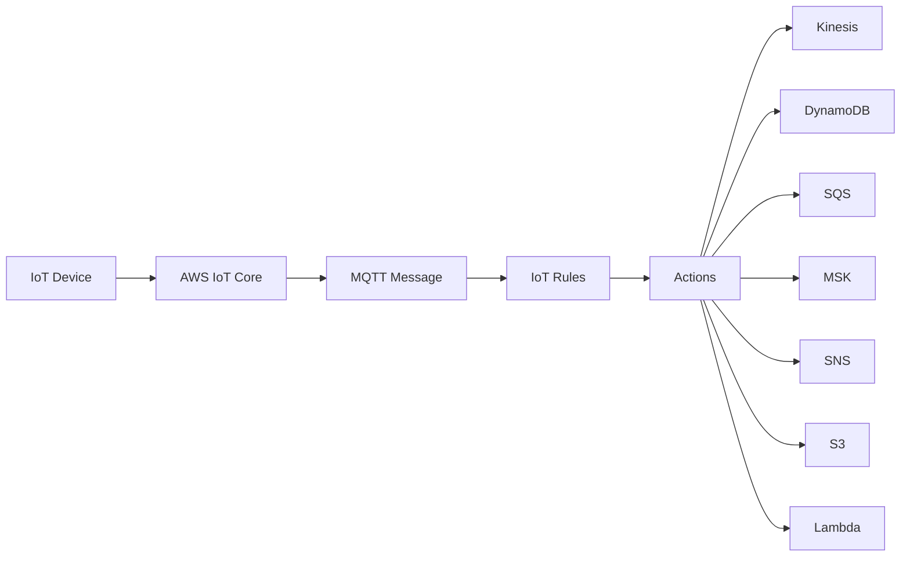
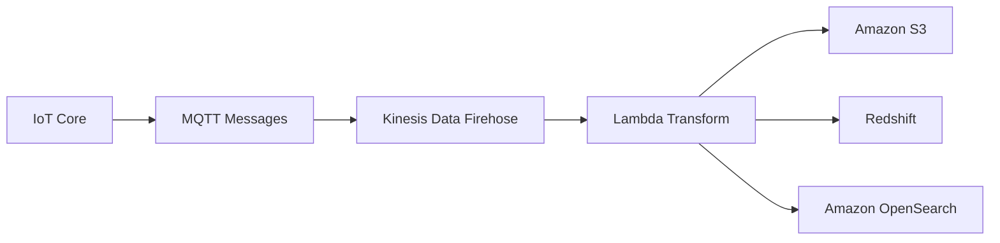

# 184. AWS IoT Core

## 🎯 Giới thiệu
- **AWS IoT Core** là service giúp kết nối **IoT devices** lên cloud một cách dễ dàng.
- **IoT** = **Internet of Things**: mạng lưới các thiết bị kết nối internet có thể **collect** và **transfer data**.
- Mục tiêu chính của AWS IoT Core:
  - **serverless**
  - **secure**
  - **scalable**
- Service này có thể hỗ trợ quy mô rất lớn: **billions of devices** và **trillions of messages**.
- IoT Core dùng mô hình **publish/subscribe** để các thiết bị hoặc ứng dụng có thể trao đổi message.

## 1. AWS IoT Core hoạt động như thế nào
- Thiết bị IoT gửi dữ liệu lên **AWS IoT Core**.
- Dữ liệu có thể được xử lý thông qua cơ chế **publish/subscribe**.
- Các device có thể là ví dụ như **smart cars**.
- Điểm quan trọng cần nhớ cho kỳ thi:
  - không cần học quá sâu toàn bộ service
  - cần nhớ các **integrations** của IoT Core với AWS services khác

## 2. IoT Topics, MQTT và IoT Rules
- **IoT Topics** tương tự như **SNS Topics**: chúng nhận dữ liệu đi vào.
- Dữ liệu đầu vào có thể dùng **MQTT protocol**.
- Khi IoT Core nhận **MQTT message**:
  - bạn tạo **IoT rules**
  - **rules** sẽ có **actions**
  - **actions** có thể gửi dữ liệu sang các AWS services khác

### 🔁 Luồng xử lý

## 3. Các integrations quan trọng
- AWS IoT Core có integrations với nhiều service như:
  - **Lambda**
  - **S3**
  - **SageMaker**
  - và các service khác
- Một luồng integration quan trọng được nhắc đến là **Kinesis Data Firehose**:
  - IoT Core nhận **MQTT messages**
  - gửi near real time vào **Amazon Kinesis Data Firehose**
  - có thể dùng **Lambda function** để transform dữ liệu
  - sau đó lưu vào:
    - **Amazon S3**
    - **Redshift**
    - **Amazon OpenSearch**

### 🧩 Flow Kinesis Data Firehose

## 📊 Bảng tóm tắt
| Tiêu chí | Mô tả |
|----------|------|
| Mục đích | Kết nối IoT devices lên cloud |
| Tính chất | Serverless, secure, scalable |
| Quy mô | Billions of devices, trillions of messages |
| Giao thức | MQTT |
| Cơ chế chính | Publish/subscribe |
| Xử lý message | IoT Rules + Actions |
| Integrations | Lambda, S3, SageMaker, Kinesis, DynamoDB, SQS, MSK, SNS |
| Pipeline nổi bật | IoT Core -> Kinesis Data Firehose -> Lambda -> S3/Redshift/OpenSearch |

## 💡 Mẹo ghi nhớ cho kỳ thi AWS
- Nhớ **IoT Core = kết nối device lên cloud**.
- Nhớ từ khóa **MQTT** vì transcript nhấn mạnh đây là protocol nhận message.
- Nhớ mô hình **Topic -> Rules -> Actions**.
- Nhớ các đích gửi dữ liệu phổ biến:
  - **Kinesis**
  - **DynamoDB**
  - **SQS**
  - **SNS**
  - **S3**
  - **Lambda**
- Nếu gặp câu hỏi về pipeline xử lý dữ liệu IoT, hãy nghĩ đến:
  - **IoT Core**
  - **Kinesis Data Firehose**
  - **Lambda**
  - **S3 / Redshift / OpenSearch**

## ✅ Kết luận
- **AWS IoT Core** là service để kết nối và xử lý dữ liệu từ **IoT devices** một cách **serverless, secure, scalable**.
- Service này đặc biệt đáng nhớ ở:
  - **MQTT**
  - **IoT Topics**
  - **IoT Rules**
  - **Actions**
  - các **integrations** với nhiều AWS services
- Đây là nền tảng quan trọng để xây dựng ứng dụng IoT có thể **gather, process, analyze, and act on data rapidly**.
