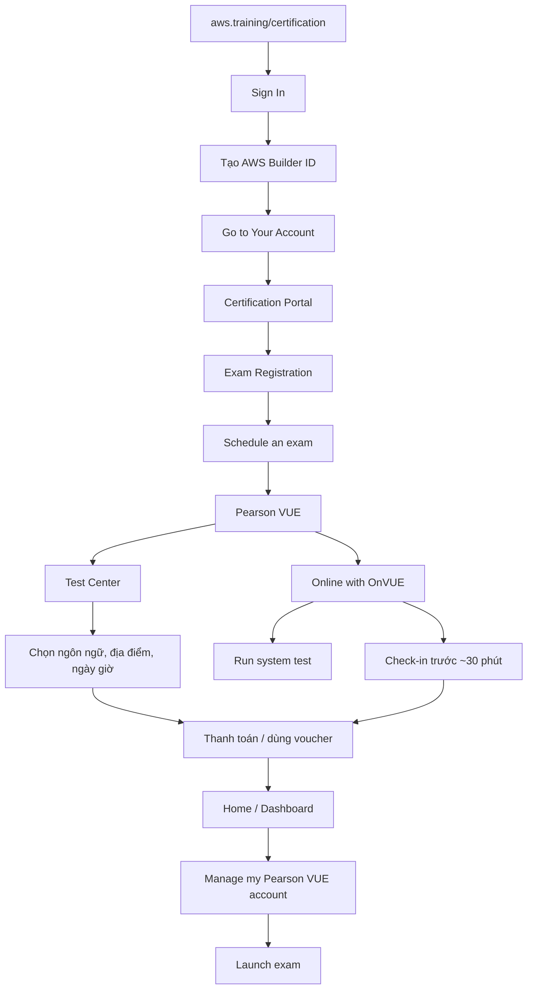

# 186. Exam Walkthrough and Signup

## 🎯 Giới thiệu
Bài này hướng dẫn cách:
- Đăng nhập vào AWS Certification portal
- Tạo **AWS Builder ID**
- Đăng ký và lên lịch thi trong **Pearson VUE**
- Chuẩn bị cho hình thức thi **test center** hoặc **online with OnVUE**
- Truy cập lại bài thi khi đã sẵn sàng để bấm **Launch exam**

## 1. Đăng nhập và tạo tài khoản AWS Certification
- Truy cập `aws.training/certification`
- Chọn **Sign In**
- Tạo **AWS Builder ID**
  - Đây là account riêng dùng cho **AWS certifications**
- Sau khi đăng nhập xong, chọn **Go to Your Account**
- Bạn sẽ vào **certification portal**

## 2. Đăng ký và lên lịch thi
- Trong portal, chọn **Exam Registration**
- Chọn **Schedule an exam**
- Danh sách exam sẽ hiện ra ở phía dưới
- Một số exam cần **Authorize** trước khi có thể schedule
- Ví dụ: chọn **AWS Certified Developer Associate Exam** rồi bấm **Schedule**
- Hệ thống sẽ chuyển sang **Pearson VUE** là đối tác lịch thi của AWS

### Hình thức thi
- **In person at a test center**
  - Thi tại địa điểm cụ thể
  - Cần mang **photo ID**
  - Cần hiểu rõ những gì được và không được mang vào phòng thi
  - Có thể chọn ngôn ngữ và địa điểm thi
- **Online with OnVUE**
  - Thi tại nhà
  - Cần máy tính có **webcam** và **good internet connection**
  - Nên chạy **Run system test** rất sớm trước ngày thi
  - Bàn thi phải **clear of everything**
  - Có thể bị yêu cầu cho thấy bàn làm việc trong quá trình kiểm tra
  - Cần **check in khoảng 30 phút trước giờ thi**

### Các bước đặt lịch
- Chọn ngôn ngữ thi
- Đồng ý với các điều khoản
- Chọn địa chỉ hoặc địa điểm thi
- Chọn múi giờ
- Chọn ngày
- Chọn giờ
- Hoàn tất **booking**
- Thanh toán
- Có thể thêm **voucher** nếu có mã giảm giá

## 3. Vào thi khi đã sẵn sàng
- Sau khi exam đã được schedule, cách truy cập lại là:
  - Vào **Home**
  - Chọn **Dashboard**
  - Chọn **Manage my Pearson VUE account**
- Từ trang Pearson VUE, bạn sẽ thấy nút **Launch exam**
- Chỉ cần bấm **Launch** là bắt đầu thi

## 📊 Bảng tóm tắt
| Tiêu chí | Mô tả |
|----------|------|
| Nền tảng đăng nhập | `aws.training/certification` |
| Tài khoản cần tạo | **AWS Builder ID** |
| Nơi quản lý exam | **AWS Certification portal** |
| Đơn vị lên lịch thi | **Pearson VUE** |
| Hình thức thi | **Test center** hoặc **Online with OnVUE** |
| Yêu cầu với thi online | **Webcam**, **internet tốt**, **Run system test** |
| Check-in | Khoảng **30 phút trước giờ thi** |
| Cách vào thi | **Home > Dashboard > Manage my Pearson VUE account > Launch exam** |

## 💡 Mẹo ghi nhớ cho kỳ thi AWS
- Nhớ chuỗi thao tác: **Sign In → AWS Builder ID → Go to Your Account → Exam Registration → Schedule an exam**
- **Pearson VUE** là nơi bạn thực sự đặt lịch thi
- Nếu thi **OnVUE**, phải:
  - chạy **system test**
  - dọn bàn sạch
  - chuẩn bị **webcam** và mạng ổn định
- Nếu thi tại **test center**, nhớ **photo ID**
- Trước giờ thi, vào **Dashboard** để tìm nút **Launch exam**
- Bài này nhấn mạnh quy trình, nên khi ôn thi hãy nhớ cả **flow** chứ không chỉ từng nút bấm

## ✅ Kết luận
Quy trình thi AWS gồm 3 phần chính:
- Tạo và đăng nhập bằng **AWS Builder ID**
- Schedule exam trong **Pearson VUE**
- Quay lại **Dashboard** để **Launch exam** khi đến giờ thi

Nội dung quan trọng nhất là phân biệt rõ hai hình thức thi: **in person at a test center** và **online with OnVUE**, cùng với các yêu cầu chuẩn bị tương ứng.
