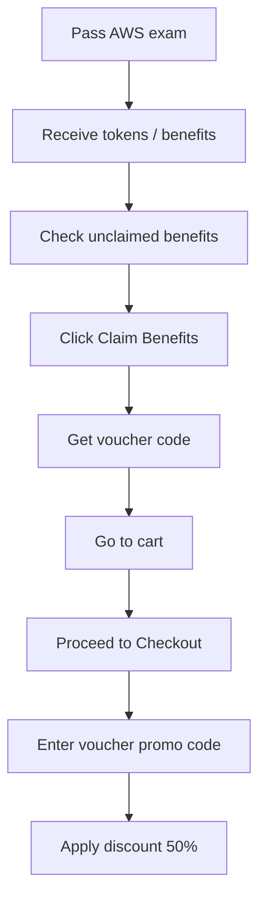

# 187. Save 50% on your AWS Exam Cost!

## 🎯 Giới thiệu
Bài giảng này chỉ ra một mẹo để **giảm 50% chi phí kỳ thi AWS** nếu bạn đã **đậu một AWS exam trước đó**. Sau khi pass, AWS sẽ cấp **tokens/benefits** dùng cho kỳ thi tiếp theo.

## 1. Cách nhận 50% voucher
- Sau khi **pass AWS exam**, bạn sẽ có các **benefits/tokens**.
- Các benefit chưa dùng sẽ hiển thị là **unclaimed**.
- Benefit có **expiry date** nên cần kiểm tra thời hạn.
- Chọn **Claim Benefits** để nhận voucher.
- Sau khi claim xong, benefit sẽ chuyển sang trạng thái **claimed**.
- Bạn sẽ nhận được một **voucher code** dùng để giảm giá **50%** cho kỳ thi kế tiếp.

## 2. Cách áp dụng voucher khi thanh toán
- Vào **cart** và chọn **Proceed to Checkout**.
- Tới bước nhập payment, tìm ô **voucher promo code**.
- Dán **code** đã claim vào ô này.
- Áp dụng mã và hệ thống sẽ hiển thị **discount** trên tổng chi phí.

## 3. Điểm cần nhớ
- Chỉ dùng được khi bạn **đã pass một AWS exam trước đó**.
- Voucher nằm trong phần **benefits** và có thể còn ở trạng thái **unclaimed**.
- Cần **claim** trước khi dùng.
- Mã voucher được nhập ở bước thanh toán, trong ô **voucher promo code**.
- Kết quả là **giảm 50% total cost**.

## 📊 Bảng tóm tắt
| Tiêu chí | Mô tả |
|----------|------|
| Điều kiện | Đã pass một AWS exam trước đó |
| Cơ chế | AWS cấp **tokens/benefits** cho kỳ thi tiếp theo |
| Trạng thái ban đầu | **Unclaimed** |
| Hành động cần làm | Chọn **Claim Benefits** |
| Kết quả | Nhận **voucher code** |
| Cách dùng | Nhập code ở ô **voucher promo code** khi checkout |
| Giá trị giảm | **50%** chi phí thi |

## 💡 Mẹo ghi nhớ cho kỳ thi AWS
- Nhớ chuỗi thao tác: **Pass exam → Claim Benefits → Copy voucher code → Apply at Checkout**.
- Từ khóa quan trọng: **unclaimed**, **claimed**, **voucher code**, **Proceed to Checkout**, **promo code**.
- Đây là mẹo tiết kiệm chi phí thi, không phải nội dung kỹ thuật dịch vụ AWS.

## ✅ Kết luận
Nếu bạn đã đậu một AWS exam, hãy kiểm tra phần **benefits/tokens**, **claim** voucher và nhập mã ở bước thanh toán để nhận **50% discount** cho kỳ thi tiếp theo.
