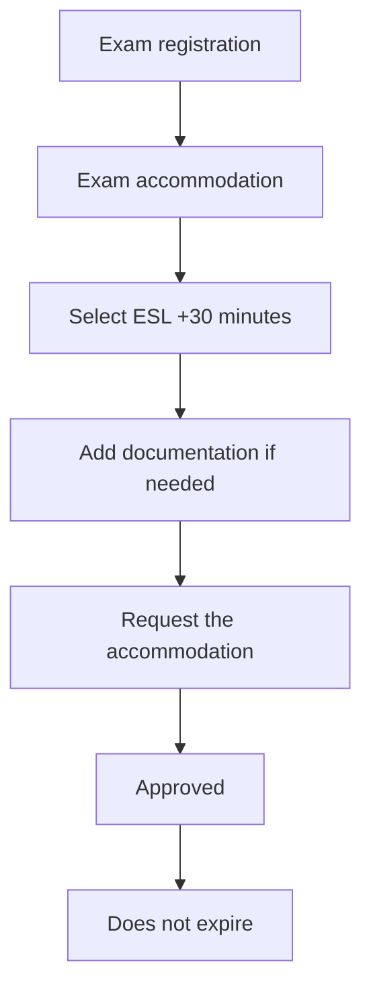

# 188. Get an Extra 30 Minutes on your AWS Exam - Non Native English Speakers only

## 🎯 Giới thiệu
- Bài học này nói về cách **request exam accommodation** để được thêm **30 minutes** khi thi AWS nếu bạn là **non-native English speaker**.
- Cách này được làm trong phần **exam registration** và có thể giúp bạn có thêm thời gian làm bài.
- Sau khi được duyệt, accommodation **không expire**.

## 1. 📌 Cách request thêm 30 phút
- Vào phần **exam registration**.
- Ở bên trái, chọn **exam accommodation**.
- Chọn tùy chọn **ESL +30 minutes**.
- Nếu cần, bạn có thể **add documentation**.
- Sau đó gửi yêu cầu bằng cách **request the accommodation**.

## 2. ⏱️ Sau khi được duyệt thì làm gì
- Khi accommodation đã được approved, nó sẽ **không hết hạn**.
- Bạn có thể tiếp tục **schedule exam** với thời gian đã được cộng thêm.
- Nếu trước đó bạn đã có lịch thi, bạn cần **cancel** lịch đó.
- Sau đó chọn **schedule exam** lại.
- Lúc này, **30 minutes accommodation** sẽ được áp dụng cho kỳ thi.

## 3. 🌐 Các accommodation khác
- Nếu cần loại accommodation khác, bạn có thể request trực tiếp trên website **Pearson VUE**.
- Theo transcript, đây là cách được nhiều **non-native English speaker** sử dụng nhất.

## 📊 Bảng tóm tắt
| Tiêu chí | Mô tả |
|----------|------|
| Mục tiêu | Xin thêm **30 minutes** cho kỳ thi AWS |
| Đối tượng | **Non-native English speaker** |
| Cách thực hiện | Vào **exam registration** > **exam accommodation** |
| Tùy chọn cần chọn | **ESL +30 minutes** |
| Tài liệu bổ sung | Có thể **add documentation** nếu cần |
| Kết quả | Accommodation được **approved** và **does not expire** |
| Lưu ý khi đã đặt lịch | Cần **cancel** lịch cũ rồi **schedule exam** lại |
| Accommodation khác | Có thể request qua website **Pearson VUE** |

## 💡 Mẹo ghi nhớ cho kỳ thi AWS
- Nhớ chuỗi hành động: **Exam registration → Exam accommodation → ESL +30 minutes → Request**.
- Nếu đã lỡ đặt lịch thi trước đó, hãy nhớ **cancel rồi schedule lại** để accommodation được tính vào.
- Từ khóa cần nhớ: **ESL +30 minutes**, **Pearson VUE**, **does not expire**.
- Đây là mẹo hữu ích cho thí sinh **non-native English speaker** khi ôn và thi AWS.

## ✅ Kết luận
- Transcript hướng dẫn cách xin **extra 30 minutes** cho kỳ thi AWS bằng mục **exam accommodation**.
- Sau khi được duyệt, accommodation **không expire** và sẽ được áp dụng khi bạn **schedule exam** lại.
- Nếu cần accommodation khác, có thể request trên website **Pearson VUE**.
