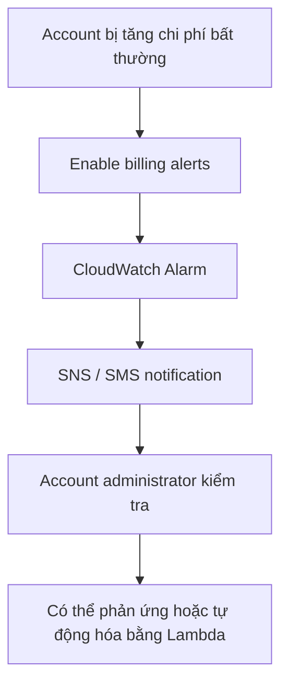

# 192. Sample Question 1

## 🎯 Giới thiệu
- Câu hỏi xoay quanh tình huống một account trong nhiều account bị compromise, attacker launch rất nhiều EC2 instances làm bill tăng cao. 💸
- Yêu cầu chính:
  - Ngăn **excessive spending** trong tất cả accounts
  - Mỗi business group vẫn giữ **full control** over accounts của mình
- Điểm mấu chốt của bài:
  - Cần giải pháp theo dõi chi tiêu và cảnh báo kịp thời
  - Không được làm mất quyền kiểm soát hợp lệ của các account

## 1. Phân tích yêu cầu
- Một account bị tấn công và bị dùng để launch số lượng lớn instances.
- Hành vi này có thể dẫn đến chi phí rất cao, thậm chí bị lạm dụng để mine bitcoins.
- Giải pháp phải áp dụng trên nhiều accounts nhưng không được khóa cứng quyền vận hành bình thường của từng nhóm.

## 2. Đánh giá các lựa chọn
### Option A: Organizations + SCP
- Dùng **Organizations** để đưa các accounts vào organization.
- Tạo **service control policy (SCP)** với **EC2 instance type condition key** để chặn launch các high cost instances.
- Vấn đề:
  - Có thể ngăn billing tăng cao
  - Nhưng cũng chặn luôn các trường hợp hợp lệ khi account thật sự cần loại instance đắt tiền
  - Vì vậy không giữ được **full control** cho từng account

### Option B: IAM policy trong IAM group
- Đặt **IAM policy** vào **IAM group** trong mỗi account.
- Dùng cùng condition để chặn launch instances đắt tiền.
- Vấn đề:
  - Vẫn hạn chế user hoạt động bình thường trong account
  - Không đảm bảo đầy đủ quyền kiểm soát
  - Transcript còn lưu ý rằng user có thể assume role khác để tránh policy gắn với group

### Option C: Billing alerts bằng CloudWatch
- Enable **billing alerts** trên từng account.
- Tạo **Amazon CloudWatch alarm** gửi **SMS notification** cho account administrator khi spending vượt budget.
- Ưu điểm:
  - Phát hiện sớm bất thường
  - Có thể phản ứng nhanh hoặc trigger **Lambda** để tự động hóa xử lý
- Hạn chế:
  - Không thể giới hạn cứng việc chi tiêu
  - Chỉ có thể cảnh báo khi đã vượt ngưỡng

### Option D: Cost Explorer
- Enable **Cost Explorer** trong từng account.
- Định kỳ xem report để phát hiện chi tiêu bất thường.
- Vấn đề:
  - Chậm hơn billing alarm
  - Phụ thuộc vào việc người quản trị tự kiểm tra
  - Không phải lựa chọn tốt để phát hiện nhanh attack

## 3. Kết luận
- Đáp án đúng là **Option C**.
- Lý do:
  - **CloudWatch billing alarm** giúp cảnh báo khi spending vượt ngưỡng
  - Phù hợp với yêu cầu phát hiện và phản ứng sớm
  - Không làm mất quyền kiểm soát của các business group đối với accounts của họ

## 📊 Bảng tóm tắt
| Tiêu chí | Mô tả |
|----------|------|
| Bối cảnh | Một account bị compromise và launch nhiều EC2 instances gây bill cao |
| Mục tiêu | Ngăn excessive spending nhưng vẫn giữ full control cho từng account |
| Cách đúng | Dùng **billing alerts** với **CloudWatch Alarm** và **SMS notification** |
| Điểm mạnh | Cảnh báo sớm, có thể kết hợp **Lambda** để tự động hóa |
| Điểm cần nhớ | Không nhầm giữa **alert** và **limit**: CloudWatch alarm chỉ cảnh báo, không chặn chi tiêu |
| Lựa chọn sai phổ biến | **SCP**, **IAM group policy**, **Cost Explorer** |

## 💡 Mẹo ghi nhớ cho kỳ thi AWS
- Nếu đề bài nhấn mạnh **“prevent excessive spending”** nhưng vẫn cần **“retain full control”**, hãy nghĩ ngay đến:
  - **Billing alerts**
  - **CloudWatch Alarm**
  - **SNS / SMS notification**
- Nhớ câu này:
  - **SCP/IAM policy** có thể chặn hành động, nhưng dễ ảnh hưởng quyền vận hành hợp lệ
  - **Cost Explorer** chỉ là công cụ xem báo cáo, không phải cảnh báo tức thời
- Trong các câu hỏi về cost anomaly:
  - **Alarm để phát hiện**
  - **Policy để ngăn**
  - Đọc kỹ xem đề đang cần **alert** hay **block**

## ✅ Kết luận
- Câu hỏi này kiểm tra khả năng phân biệt giữa:
  - **Blocking** bằng **SCP/IAM policy**
  - **Monitoring/alerting** bằng **CloudWatch billing alarm**
- Với yêu cầu của transcript, lựa chọn phù hợp là **Option C**: thiết lập **billing alerts** trên từng account bằng **Amazon CloudWatch alarm** để gửi **SMS** cho administrator khi spending vượt ngưỡng.
