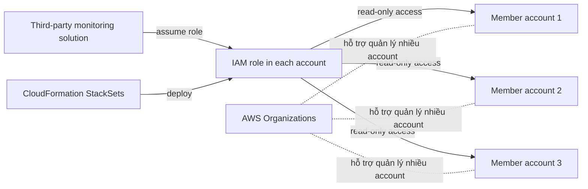

# 193. Sample Question 2

## 🎯 Giới thiệu
Bài này nói về tình huống **company có nhiều AWS accounts** và muốn cấp cho một **third-party monitoring solution** quyền **read-only** vào tất cả các account.

Điểm mấu chốt trong transcript:
- Công ty đã tích hợp **on-premises Active Directory** với **AWS SSO**
- Vì vậy **không thể** vừa dùng identity source từ AD vừa tạo user trực tiếp trong SSO cùng lúc
- Cách đúng là **deploy IAM role vào từng account** và cho bên thứ ba **assume role** thông qua **trust policy**
- Cách triển khai phù hợp là dùng **CloudFormation StackSets**

## 1. Bối cảnh và yêu cầu 🎯
- Có nhiều AWS accounts trong cùng môi trường
- Một **monitoring solution** ở account riêng cần:
  - **read-only access**
  - vào **tất cả** các accounts cần giám sát
- Hệ thống xác thực hiện tại đã có:
  - **on-prem Active Directory**
  - tích hợp với **AWS SSO**

### Ý nghĩa của bối cảnh
- Đây là bài về **cross-account access**
- Không phải chỉ cấp quyền trong một account duy nhất
- Cần một giải pháp triển khai đồng loạt trên nhiều account

## 2. Phân tích các lựa chọn sai và đúng ⚙️
### ❌ Option A
- Tạo user trong **AWS SSO**
- Gán **read-only permission sets**
- Cung cấp username/password cho monitoring solution

**Vì sao sai theo transcript:**
- Hệ thống đang dùng **một identity source duy nhất**
- Khi đã tích hợp với **Active Directory**, không thể đồng thời quản lý user trực tiếp trong **AWS SSO**
- Transcript cũng nhấn mạnh rằng giải thích trong sample PDF cho rằng credentials là temporary là **không đúng**; user trong SSO có password và có thể dùng lại

### ❌ Option B
- Tạo **IAM role** trong **organization master account**
- Cho third-party monitoring solution assume role đó

**Vì sao sai theo transcript:**
- Role ở **master account** không tự động có quyền vào các **member accounts**
- Đây chỉ là giải pháp **một phần**, không đủ cho yêu cầu giám sát tất cả accounts

### ❌ Option C
- Mời third-party accounts join **AWS Organizations**
- Enable all features

**Vì sao sai theo transcript:**
- **AWS Organizations** giúp:
  - consolidated billing
  - organizational units
  - service control policies
  - share reserved instances
- Nhưng **không tự tạo read-only access** vào các account khác
- Vẫn còn tính **independence** giữa các accounts

### ✅ Option D
- Tạo **CloudFormation template**
- Định nghĩa một **IAM role** cho third-party monitoring solution
- Thêm third-party account vào **trust policy**
- Dùng **CloudFormation StackSets** để deploy role đó vào tất cả linked accounts

**Vì sao đúng:**
- Mỗi account sẽ có một **IAM role riêng**
- Third-party monitoring solution có thể **assume role** nhờ **trust policy**
- **StackSets** cho phép triển khai đồng loạt vào:
  - nhiều accounts
  - nhiều regions

## 3. Luồng kiến trúc đúng 🏗️

### Ý chính của flow
- **CloudFormation StackSets** tạo cùng một **IAM role** trên từng account
- **Trust policy** cho phép third-party monitoring solution assume role
- Quyền **read-only** được cấp ngay trong từng account cần giám sát
- Đây là cách triển khai chuẩn và scalable theo transcript

## 📊 Bảng tóm tắt
| Tiêu chí | Mô tả |
|----------|------|
| Bối cảnh | Nhiều AWS accounts cần được giám sát bởi một third-party monitoring solution |
| Vấn đề | Cần cấp **read-only access** vào tất cả accounts |
| Ràng buộc | Công ty đã tích hợp **Active Directory** với **AWS SSO** |
| Cách sai | Tạo user trực tiếp trong SSO, chỉ tạo role ở master account, hoặc chỉ dùng AWS Organizations |
| Cách đúng | Dùng **CloudFormation StackSets** để deploy **IAM role** vào từng account |
| Cơ chế quyền | Third-party solution **assume role** qua **trust policy** |
| Từ khóa cần nhớ | IAM role, trust policy, AWS SSO, Active Directory, AWS Organizations, CloudFormation StackSets, read-only access |

## 💡 Mẹo ghi nhớ cho kỳ thi AWS
- **SSO + AD**: đã chọn một identity source thì không nên nghĩ đến việc tạo user nội bộ trực tiếp trong cùng mô hình đó
- **Organizations**: giúp quản trị nhiều account, nhưng **không phải** công cụ tự động cấp cross-account read access
- **Master account role**: không đồng nghĩa với quyền vào toàn bộ member accounts
- **StackSets + IAM role + trust policy**: là bộ ba rất hay gặp khi cần triển khai quyền trên nhiều account
- Khi đề bài có:
  - **multiple accounts**
  - **third-party access**
  - **read-only**
  - **deploy across accounts**
  
  thì hãy nghĩ ngay đến **CloudFormation StackSets**

## ✅ Kết luận
Đáp án đúng trong transcript là giải pháp dùng **CloudFormation StackSets** để tạo **IAM role** trong từng account, kèm **trust policy** cho third-party monitoring solution **assume role** và đọc dữ liệu theo kiểu **read-only**.

Đây là cách xử lý phù hợp nhất cho bài toán **cross-account monitoring** trong môi trường **AWS Organizations** nhiều account.
