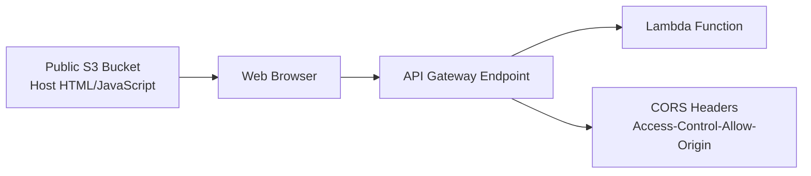

# 194. Sample Question 3

## 🎯 Giới thiệu
Bài này nói về một **HTML form** được host trên **public Amazon S3 bucket**. Form dùng **JavaScript** để gửi dữ liệu tới **Amazon API Gateway** và API Gateway được tích hợp với **Lambda**.

Điểm mấu chốt của câu hỏi là:
- Ứng dụng chạy trong **web browser**
- File HTML/JavaScript được lấy từ **S3**
- Request tiếp theo được gửi sang **API Gateway** ở **domain khác**
- Vì vậy cần xử lý đúng **CORS**

## 1. Luồng hoạt động chính
- Người dùng truy cập **public S3 bucket** để lấy:
  - HTML form
  - JavaScript file
- **Web browser** chạy JavaScript đó
- JavaScript gửi request đến **API Gateway endpoint**
- API Gateway gọi **Lambda function**
- Muốn request thành công, cần cấu hình đúng **web hosting** và **CORS**

## 2. Các bước cần chọn đúng
### ✅ Bắt buộc
- **Configure the S3 bucket for web hosting**
  - Vì form và JavaScript được phục vụ từ S3 dưới dạng website
- **Enable Cross-Origin Resource Sharing (CORS) in API Gateway**
  - Vì browser gọi từ website S3 sang một URL khác là API Gateway
  - Cần cho phép origin từ S3 website bằng header như **Access-Control-Allow-Origin**

### ❌ Không phù hợp
- Host form trên **Amazon EC2** thay vì S3
  - Có thể chạy được nhưng không phải lựa chọn phù hợp theo kiến trúc trong transcript
- Request a limit increase for API Gateway
  - Không có dấu hiệu nào cho thấy vấn đề do giới hạn tải
- Configure CORS trên **S3 bucket**
  - Theo transcript, **CORS cần đặt ở API Gateway**, không phải ở S3

## 3. Lý do kỹ thuật quan trọng
- Trình duyệt áp dụng **browser-based security**
- Request đầu tiên đến từ **S3 website**
- Request tiếp theo đi tới **API Gateway** với **URL khác domain**
- Vì vậy browser sẽ kiểm tra **CORS**
- API Gateway phải cho phép origin từ website S3 thì request mới nhận được phản hồi hợp lệ

## 📊 Bảng tóm tắt
| Tiêu chí | Mô tả |
|----------|------|
| Thành phần nguồn | Public Amazon S3 bucket chứa HTML form và JavaScript |
| Thành phần đích | Amazon API Gateway endpoint tích hợp với Lambda |
| Vấn đề chính | Request từ browser sang domain khác cần **CORS** |
| Cấu hình đúng | **S3 web hosting** + **CORS trên API Gateway** |
| Cấu hình sai / không cần | Host trên EC2, tăng limit API Gateway, đặt CORS ở S3 |

## 💡 Mẹo ghi nhớ cho kỳ thi AWS
- **S3 host website, API Gateway nhận request, CORS đặt ở nơi nhận request**
- Khi thấy **HTML form + browser + gọi sang API Gateway**, hãy nghĩ ngay đến **CORS**
- Nếu câu hỏi nhấn mạnh **public S3 bucket** và **JavaScript từ browser**, đáp án thường liên quan đến:
  - **Web hosting on S3**
  - **CORS on API Gateway**
- Đừng nhầm giữa:
  - **S3 bucket policy / web hosting**
  - **API Gateway CORS**

## ✅ Kết luận
Để form gửi dữ liệu thành công từ **public S3 bucket** sang **API Gateway** và nhận response hợp lệ, cần:
- **Configure the S3 bucket for web hosting**
- **Enable CORS in API Gateway**

Trọng tâm của câu này là hiểu luồng đi từ **S3 website -> browser -> API Gateway -> Lambda** và nhận ra rằng **CORS phải được cấu hình trên API Gateway**.
