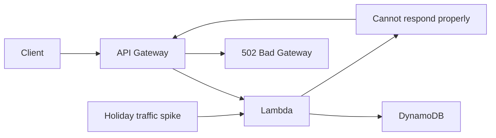

# 195. Sample Question 4

## 🎯 Giới thiệu
Bài này nói về một **serverless mobile app** chạy trên **Amazon API Gateway, Lambda, Cognito, DynamoDB**. Khi có **holiday traffic spike**, hệ thống bị **intermittent failures** và **API Gateway trả về 502 Bad Gateway** cho các request tưởng như hợp lệ.

Trọng tâm của câu hỏi là: lỗi nằm ở **backend** hay ở **API Gateway**, và cách xử lý đúng là gì.

## 1. Nhận diện lỗi 502 trong API Gateway 🚦
- **502** là tín hiệu cho thấy vấn đề ở **server/backend**, không phải lỗi phía client.
- Transcript nhắc lại phân biệt cơ bản:
  - **4xx**: client errors
    - Ví dụ: **400 Bad Request**
    - **403**: denied / bị WAF filter
    - **429**: quota exceeded / throttled
  - **5xx**: server errors
- Với **API Gateway**:
  - **502**: có thể liên quan đến **Lambda Proxy integration** bị out of order invocations hoặc bị **heavy load**
  - **503**: service unavailable exception
  - **504**: integration failure, request timeout sau tối đa **29 seconds**
- Trong câu hỏi này, dấu hiệu quan trọng là:
  - lỗi xảy ra khi tải tăng cao
  - API Gateway chỉ là nơi báo lỗi
  - nguyên nhân gốc ở backend, đặc biệt là **Lambda**

## 2. Cách xử lý đúng ✅
### Đáp án đúng: tăng Lambda concurrency limits
- **Increase the concurrency limits for Lambda functions**
- Tạo **CloudWatch alarm** theo metric **ConcurrentExecution** của Lambda
- Mục đích:
  - theo dõi khi Lambda chạm giới hạn concurrency
  - chủ động phát hiện khi traffic spike làm backend quá tải
  - nếu cần, tăng limit thủ công để xử lý tình huống tương lai

### Vì sao hợp lý
- Khi traffic tăng mạnh, Lambda có thể không đủ khả năng xử lý số lượng execution cần thiết
- Khi Lambda không trả lời kịp cho API Gateway, sẽ xuất hiện **502**
- Đây là một cách xử lý đúng vì giải quyết trực tiếp vấn đề ở backend

## 3. Các lựa chọn khác và lý do không đúng ❌
- **Tăng transaction per second limits của API Gateway**
  - Chỉ phù hợp nếu vấn đề là **API Gateway throttling / quota exceeded**
  - Transcript nói đây là kiến trúc tốt trong trường hợp API Gateway trả **429**
  - Nhưng không phải nguyên nhân của câu hỏi này
- **Shard users to Cognito pools / multiple regions**
  - Không phù hợp với bối cảnh lỗi đang được mô tả
  - Transcript xem đây là phương án không hợp lý cho câu hỏi này
- **Use DynamoDB strongly consistent reads**
  - Không có dấu hiệu cho thấy vấn đề là dữ liệu cũ
  - Tăng strongly consistent reads còn có thể làm tăng load lên DynamoDB
  - Vì vậy không giải quyết đúng gốc rễ

## 📊 Bảng tóm tắt
| Tiêu chí | Mô tả |
|----------|------|
| Bối cảnh | Serverless app dùng API Gateway, Lambda, Cognito, DynamoDB |
| Dấu hiệu lỗi | Holiday traffic spike gây intermittent failures và 502 Bad Gateway |
| Ý nghĩa 502 | Lỗi server/backend, không phải client error |
| Hướng xử lý đúng | Tăng **Lambda concurrency limits** |
| Cách theo dõi | Tạo **CloudWatch alarm** trên metric **ConcurrentExecution** |
| Điểm cần nhớ khi thi | API Gateway errors quan trọng: **429, 502, 504** |
| Lựa chọn loại trừ | Tăng API Gateway TPS, shard Cognito pools, strongly consistent reads |

## 💡 Mẹo ghi nhớ cho kỳ thi AWS
- Thấy **502** trong **API Gateway** thì hãy nghĩ ngay đến **backend/Lambda** trước.
- Nếu lỗi xuất hiện khi **traffic spike**, kiểm tra **Lambda concurrency**.
- Nếu đề bài nói **quota exceeded** hoặc **throttled**, khi đó mới nghiêng về **API Gateway 429**.
- Nhớ nhanh bộ mã lỗi:
  - **429** = throttled
  - **502** = backend / Lambda integration issue
  - **504** = timeout / integration failure

## ✅ Kết luận
Câu hỏi kiểm tra khả năng nhận diện rằng **502 Bad Gateway** trong mô hình serverless này là dấu hiệu của **backend quá tải**, cụ thể là **Lambda concurrency limit**. Cách xử lý đúng là **tăng Lambda concurrency limits** và dùng **CloudWatch alarm** theo dõi **ConcurrentExecution** để phát hiện sớm khi hệ thống bị áp lực tải.
