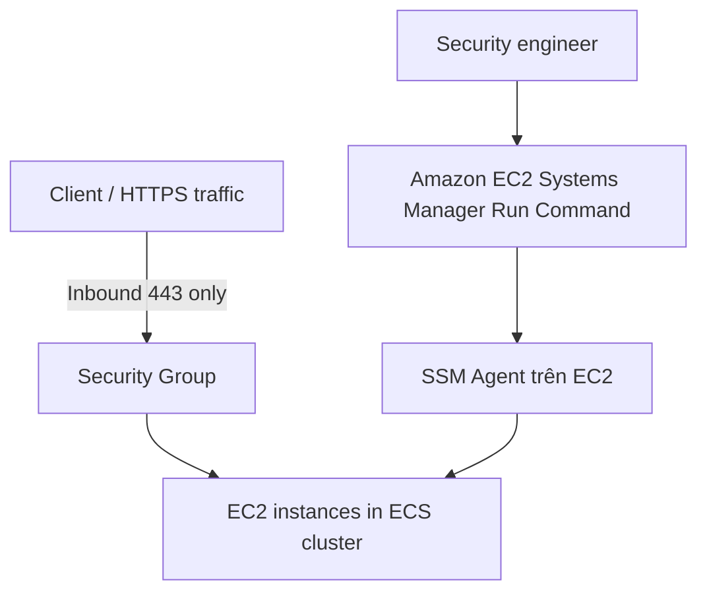

# 196. Sample Question 5

## 🎯 Giới thiệu
Bài này nói về việc quản lý các EC2 instances trong một Amazon ECS cluster khi **company policy** chỉ cho phép **inbound HTTPS trên port 443**. Mục tiêu là **quản lý và cập nhật hàng loạt EC2 instances** nhưng vẫn giữ security group cực kỳ chặt.

## 1. Bối cảnh và yêu cầu 🧩
- Ứng dụng web chạy trên **Amazon ECS cluster**.
- Cluster có khoảng **100 Amazon EC2 instances**.
- Security group của cluster instances:
  - **Không được cho phép inbound traffic nào ngoài HTTPS**
  - Chỉ mở **port 443**
- Đội security engineering nhỏ, nên cần **minimize management effort**.
- Câu hỏi trọng tâm:
  - Làm sao quản lý các EC2 instances mà **không mở thêm SSH inbound port**?

## 2. Phân tích các lựa chọn 🔍
- **Option A: đổi SSH port sang 2222 bằng user data, rồi SSH vào từng instance**
  - Có thể làm về mặt kỹ thuật.
  - Nhưng muốn SSH qua **2222** thì phải mở inbound port đó trong security group.
  - Điều này **vi phạm company policy**.
  - → **Loại**

- **Option B: đổi SSH port sang 2222, rồi dùng Trusted Advisor để manage instances**
  - Vẫn mắc lỗi như Option A vì cần mở thêm inbound port.
  - **Trusted Advisor** chỉ đưa ra:
    - cost recommendations
    - security recommendations
    - performance recommendations
  - Nó **không phải service để actively manage EC2 instances**.
  - → **Loại**

- **Option C: launch cluster instances with no SSH key pairs, rồi dùng Amazon EC2 Systems Manager Run Command**
  - Đây là **đáp án đúng**.
  - Có thể quản lý fleet EC2 instances mà **không cần mở thêm inbound port**.
  - SSM Agent sẽ **pull** Systems Manager service, không phải ngược lại.
  - → **Chọn**

- **Option D: launch instances with no SSH key và dùng Trusted Advisor để manage**
  - Trusted Advisor không dùng để quản lý instance.
  - → **Loại**

## 3. Điều kiện để Option C hoạt động ⚙️
Transcript nhấn mạnh Option C là đúng nhưng cần lưu ý 2 điều kiện:
- **SSM Agent** phải đang chạy trên EC2 instance
  - Không phải instance nào cũng có sẵn
  - Với **Amazon Linux 2** thì thường đã có sẵn
- EC2 instance cần có **IAM instance role** phù hợp
  - Role này cho phép instance truy cập **EC2 Systems Manager**

## 📊 Bảng tóm tắt
| Tiêu chí | Mô tả |
|----------|------|
| Mục tiêu | Quản lý 100 EC2 instances trong ECS cluster |
| Ràng buộc | Security group chỉ cho phép inbound **HTTPS/443** |
| Cách không phù hợp | SSH qua port 2222 vì phải mở thêm inbound port |
| Service không phù hợp | **Trusted Advisor** không dùng để actively manage EC2 |
| Đáp án đúng | **Option C**: dùng **Amazon EC2 Systems Manager Run Command** |
| Điều kiện kèm theo | Cần **SSM Agent** và **IAM instance role** phù hợp |

## 💡 Mẹo ghi nhớ cho kỳ thi AWS
- Khi đề bài nói **không được mở SSH inbound**, hãy nghĩ ngay tới **Systems Manager**.
- Nếu cần **manage nhiều EC2 instances cùng lúc** mà không mở port:
  - ưu tiên **SSM Run Command**
- **Trusted Advisor** chỉ là công cụ **recommendations**, không phải công cụ quản trị trực tiếp EC2.
- Trong exam, đáp án đúng đôi khi có thể **hơi thiếu điều kiện triển khai**, nhưng vẫn là lựa chọn đúng nhất theo ngữ cảnh câu hỏi.

## ✅ Kết luận
Đáp án đúng của câu này là **Option C**: dùng **Amazon EC2 Systems Manager Run Command** để quản lý cluster instances mà không cần mở thêm SSH inbound port. Tuy nhiên, để hoạt động đầy đủ, EC2 instances phải có **SSM Agent** và **IAM instance role** phù hợp.
