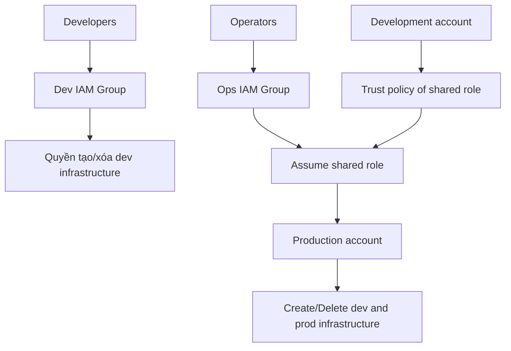

# 197. Sample Question 6

## 🎯 Giới thiệu
Câu hỏi này kiểm tra khả năng thiết kế **security strategy** cho 2 AWS accounts:

- Một account cho **production workloads**
- Một account cho **development workloads**
- Có 2 nhóm người dùng:
  - **Developers**
  - **Operators**

Mục tiêu cần đạt:
- Developers chỉ được tạo/xóa **development application infrastructure**
- Operators được tạo/xóa **cả development và production application infrastructure**
- Developers **không có quyền** vào production infrastructure
- Tất cả người dùng chỉ dùng **một bộ AWS credentials**

Điểm quan trọng của bài này là phải đọc rất kỹ các lựa chọn dài và loại bỏ các đáp án vi phạm yêu cầu.

## 1. Phân tích yêu cầu 🔍
Các ý bắt buộc trong đề:

- Chỉ có **single set of AWS credentials**
- Developers chỉ được thao tác trên **dev**
- Operators được thao tác trên **dev** và **prod**
- Không được cấp quyền trực tiếp cho developers vào production
- Phải dùng đúng cơ chế account/role/group phù hợp với AWS

Mermaid mô tả luồng đúng theo transcript:

## 2. Loại trừ các đáp án sai ❌
### Option A
- Tạo IAM user riêng trong cả **dev account** và **prod account**
- Sai vì vi phạm yêu cầu **chỉ có một set of AWS credentials**

### Option B
- Gán IAM user từ account này vào group của account khác
- Sai vì **IAM users and groups gắn với một account**
- Không thể dùng user ở dev account rồi assign vào group ở prod account

### Option C
- Tạo shared IAM role nhưng mô tả quyền quá trực tiếp sang account khác
- Sai vì không thể tạo role có quyền trực tiếp over another account theo cách này
- Muốn sang account khác phải **assume role**

## 3. Đáp án đúng: Option D ✅
Theo transcript, **Option D** là đáp án phù hợp nhất vì:

- Dùng **IAM users** và **IAM groups** đúng cách
- Có **shared role** để access sang account khác
- **Development account** được thêm vào **trust policy** của shared role
- Đáp ứng yêu cầu:
  - Developers không vào production trực tiếp
  - Operators có thể assume role để thao tác cần thiết
  - Chỉ cần một bộ credentials cho user

Ý chính cần nhớ:
- **Trust policy** là điểm then chốt cho việc **assume role**
- Đây là cách đúng để tách quyền giữa **dev** và **prod**

## 📊 Bảng tóm tắt
| Tiêu chí | Mô tả |
|----------|------|
| Bối cảnh | 2 AWS accounts: dev và prod |
| Vai trò | Developers và Operators |
| Yêu cầu bảo mật | Developers không được vào production |
| Credentials | Chỉ dùng một set of AWS credentials |
| Cơ chế đúng | IAM users, IAM groups, shared role, trust policy |
| Đáp án | Option D |
| Lý do loại A | Có user ở cả 2 accounts, vi phạm single credentials |
| Lý do loại B | Không thể gán user ở account này vào group của account khác |
| Lý do loại C | Không thể tạo role có quyền trực tiếp over another account như mô tả |

## 💡 Mẹo ghi nhớ cho kỳ thi AWS
- Khi gặp câu hỏi rất dài, hãy **flag và quay lại sau** nếu cần tiết kiệm thời gian.
- Luôn soi xem đáp án có vi phạm một trong các điểm sau không:
  - **single set of credentials**
  - **cross-account access**
  - **assume role**
  - **trust policy**
- Nếu thấy user/group bị đặt sai account, gần như chắc chắn đáp án đó sai.
- Với bài về phân quyền giữa nhiều account, hãy nghĩ ngay đến:
  - **IAM**
  - **role assumption**
  - **trust policy**

## ✅ Kết luận
Câu hỏi này chọn **Option D** vì nó là cách duy nhất phù hợp với yêu cầu: dùng **một bộ AWS credentials**, tách quyền giữa **developers** và **operators**, và dùng **shared role + trust policy** để truy cập sang account khác một cách đúng chuẩn AWS.
