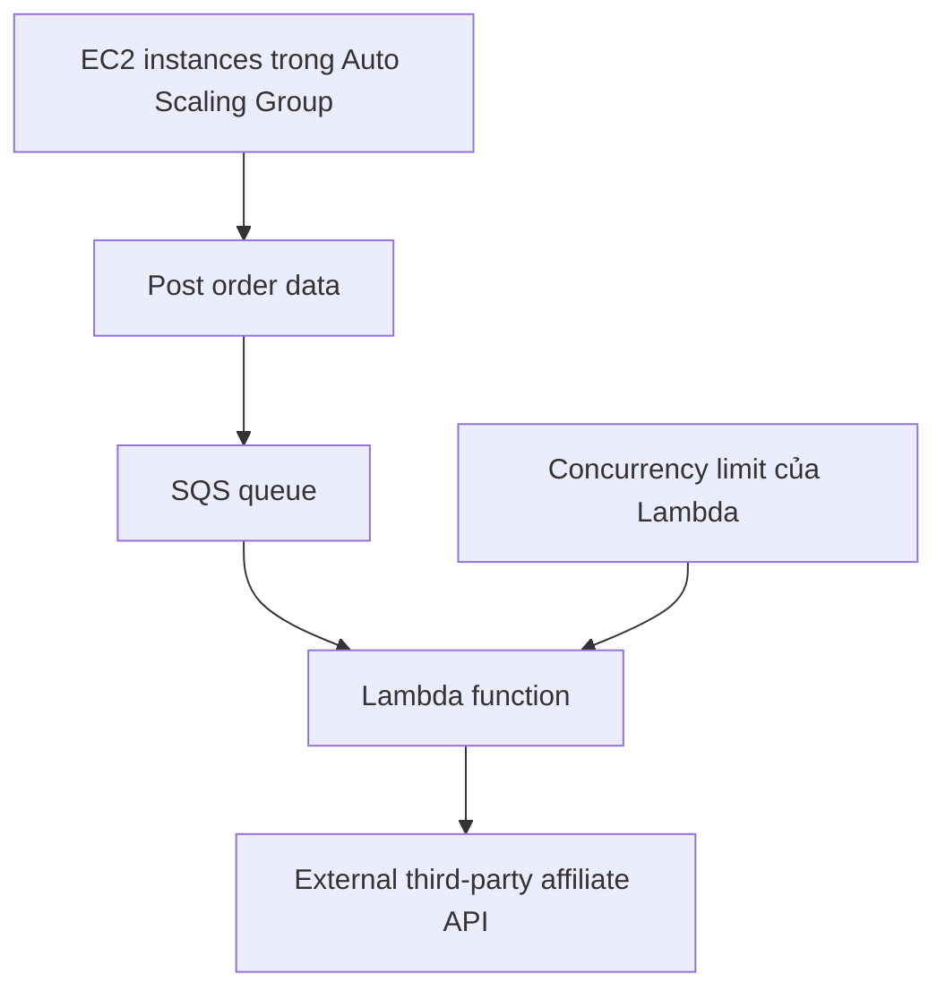

# 199. Sample Question 8

## 🎯 Giới thiệu
Bài này nói về một ứng dụng eCommerce chạy trên `EC2` sau `Application Load Balancer (ALB)` trong `Auto Scaling group` nhiều `AZ`.

- Khi đơn hàng được xử lý xong, ứng dụng sẽ gọi ngay hệ thống affiliate tracking bên thứ ba.
- Khi traffic tăng mạnh, số `EC2` tăng từ 2 lên 20.
- Ứng dụng vẫn chạy đúng, nhưng số request quá nhiều đã làm quá tải external API.
- Mục tiêu: đảm bảo toàn bộ luồng hoạt động ổn định dưới tải cao.

## 1. 🧩 Vấn đề cốt lõi
- `EC2` scale lên rất nhanh khi có marketing campaign.
- Mỗi instance đều gọi thẳng sang external affiliate system.
- Kết quả là:
  - request bị dồn quá mức,
  - external API bị overload,
  - phát sinh failed requests.

## 2. ✅ Kiến trúc đúng để chịu tải
### Giải pháp 1: Dùng `SQS` để buffer request
- Chuyển order data vào `SQS queue`.
- `Lambda` đọc message từ `SQS` rồi gọi external API.
- Lợi ích:
  - `SQS` đóng vai trò buffer, giúp decouple luồng xử lý.
  - Nếu xử lý lỗi, message có thể được đưa lại queue để xử lý lại.
  - Không làm mất request dễ dàng như gọi thẳng theo kiểu async.

### Giải pháp 2: Giới hạn `Lambda concurrency`
- Điều chỉnh `concurrency limit` của `Lambda`.
- Chỉ cho phép một số lượng `Lambda` nhất định chạy đồng thời, ví dụ 5.
- Lợi ích:
  - Giới hạn số request đi ra external API cùng lúc.
  - Tránh overload hệ thống bên thứ ba.
  - Dù queue có nhiều message, tốc độ gọi API vẫn được kiểm soát.

## 3. ❌ Vì sao các phương án khác không phù hợp
### Option A: Gọi `Lambda` asynchronously từ ứng dụng
- Không có phản hồi trực tiếp từ `Lambda`.
- Nếu `Lambda` fail sau các lần retry, request có thể bị mất.
- Vẫn có nguy cơ tạo ra quá nhiều call cùng lúc lên external API.

### Option C: Tăng `Lambda timeout`
- Chỉ cho `Lambda` nhiều thời gian hơn để xử lý.
- Không giải quyết gốc rễ là quá nhiều request đổ vào external API.
- Có thể chỉ làm lỗi được “chịu đựng” lâu hơn, không giảm tải đúng cách.

### Option E: Tăng memory của `Lambda`
- Tăng memory đồng thời tăng CPU.
- `Lambda` có thể chạy nhanh hơn, từ đó gọi external API còn nhanh hơn.
- Không giúp bảo vệ hệ thống bên ngoài khỏi bị overload.

## 📊 Bảng tóm tắt
| Tiêu chí | Mô tả |
|----------|------|
| Mô hình ban đầu | `EC2` sau `ALB` trong `Auto Scaling group` |
| Vấn đề | Nhiều instance cùng gọi external affiliate API gây quá tải |
| Giải pháp đúng 1 | Đưa order data vào `SQS queue` |
| Giải pháp đúng 2 | Điều chỉnh `Lambda concurrency` |
| Mục tiêu kiến trúc | `Decouple` xử lý và giới hạn tải lên external system |
| Điểm cần nhớ | Không để `EC2` scale kéo theo số request vượt kiểm soát |

## 💡 Mẹo ghi nhớ cho kỳ thi AWS
- Khi thấy keyword `overwhelm external API`, hãy nghĩ ngay đến:
  - `SQS` để buffer/decouple,
  - `Lambda concurrency` để giới hạn số request đồng thời.
- `Async Lambda` không phải lúc nào cũng an toàn vì có thể làm mất request.
- `Tăng timeout` hoặc `memory` thường không giải quyết vấn đề tải lên target system.
- Mấu chốt của bài là:
  - **buffer trước**
  - **giới hạn sau**

## ✅ Kết luận
Đáp án đúng theo transcript là:

- `SQS` để đệm và tách luồng xử lý
- `Adjust Lambda concurrency` để kiểm soát số request đồng thời tới external affiliate API

Hai thay đổi này giúp hệ thống vẫn hoạt động ổn định khi `Auto Scaling group` tăng mạnh dưới tải lớn.
