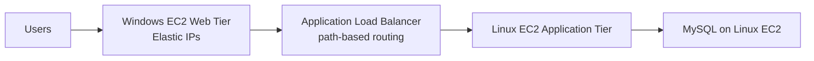

# 200. Sample Question 9

## 🎯 Giới thiệu
Bài giảng phân tích một bài toán **multi-tier web application** trên AWS với mục tiêu:
- **Tăng performance**
- **Giảm operational overhead**
- **Hiện đại hóa hạ tầng**

Kiến trúc hiện tại gồm:
- **Web tier**: Windows-based trên **Amazon EC2** với **Elastic IP**
- **Application tier**: Linux-based phía sau **ALB** dùng **path-based routing**
- **Database tier**: **MySQL** chạy trên **Linux EC2**

## 1. Kiến trúc hiện tại và vấn đề
- Web tier đang chạy trên nhiều **EC2 instances** Windows kèm **Elastic IPs**.
- Đây là cách triển khai không tối ưu cho một tier.
- Application tier đã tốt hơn vì có **ALB** làm một **single entry point**.
- Database tier dùng **MySQL trên EC2** là điểm yếu lớn vì tạo nhiều **management overhead**.
- Mục tiêu của đề bài là chuyển sang các **managed service** để giảm công vận hành.

## 2. Phân tích các lựa chọn
### ✅ Lựa chọn đúng trong nhóm 1: **C**
- Chuyển MySQL database sang **Aurora Serverless**
- Lý do:
  - Là **managed service**
  - Giảm **management overhead**
  - Có **good performance**
- Chuyển toàn bộ EC2 sang **Graviton2** tuy có thể tăng performance, nhưng **không phù hợp với Windows Instances** nên không dùng được trong kiến trúc này.

### ❌ Lựa chọn không phù hợp
- Chạy MySQL trên **multiple EC2 instances**:
  - Có thể tăng availability
  - Nhưng làm tăng phức tạp và headaches
  - Không phù hợp mục tiêu giảm overhead

### ✅ Lựa chọn đúng trong nhóm 2: **B**
- Đặt **web tier instances behind an ALB**
- Đây là cách triển khai modern và scalable
- Loại bỏ ý tưởng thay **ALB** bằng một **company managed load balancer** vì đây là **anti-pattern** trong AWS theo nội dung bài giảng

## 3. Bài học trọng tâm
- **ALB** phù hợp để đặt phía trước web tier, giúp kiến trúc rõ ràng và scalable.
- **Aurora Serverless** là lựa chọn tốt cho MySQL khi cần giảm quản trị.
- **Graviton2** chỉ là hướng tối ưu performance khi hệ thống phù hợp, nhưng **không dùng được cho Windows Instances** theo transcript.
- Ưu tiên **managed service** để giảm vận hành và hiện đại hóa hệ thống.

## 📊 Bảng tóm tắt
| Tiêu chí | Mô tả |
|----------|------|
| Mục tiêu | Tăng performance, giảm operational overhead, hiện đại hóa hạ tầng |
| Web tier | Windows EC2 + Elastic IP, không tối ưu |
| Application tier | Linux EC2 sau **ALB** với **path-based routing** |
| Database tier | MySQL trên EC2, nên chuyển sang managed service |
| Hướng cải thiện | Dùng **Aurora Serverless** cho database |
| Tối ưu CPU | **Graviton2** có thể tốt hơn nhưng không áp dụng cho Windows Instances |
| Đáp án được chọn | Nhóm 1: **C**, Nhóm 2: **B** |

## 💡 Mẹo ghi nhớ cho kỳ thi AWS
- Nhìn thấy **MySQL on EC2** thì hãy nghĩ ngay đến việc chuyển sang **managed database** để giảm overhead.
- Thấy **ALB** ở trước web tier là dấu hiệu của kiến trúc chuẩn và scalable.
- Nếu có **Windows Instances**, cẩn thận với lựa chọn **Graviton2** vì transcript nêu rõ là không dùng được.
- Trong câu hỏi tối ưu hóa hạ tầng, ưu tiên:
  - **managed service**
  - **better performance**
  - **less operational overhead**

## ✅ Kết luận
Bài giảng nhấn mạnh rằng kiến trúc cũ đang bị nặng về vận hành, đặc biệt ở database tier. Hướng đúng là dùng **Aurora Serverless** để thay MySQL trên EC2, và dùng **ALB** cho web tier. Trong phần phân tích, đáp án được chọn là **C** cho nhóm đầu và **B** cho nhóm sau.
