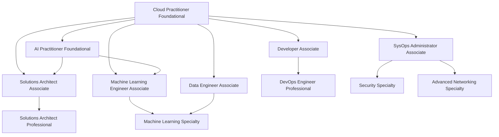

# 201. AWS Certification Paths

## 🎯 Giới thiệu
AWS certification paths được chia thành 4 mức chính: `foundational`, `associate`, `professional`, và `specialty`.  
Transcript nhấn mạnh rằng lộ trình nên chọn theo vai trò bạn muốn theo đuổi, không phải ai cũng cần đi cùng một đường. Nếu đã có nền tảng cloud/IT thì có thể không cần `Cloud Practitioner`, nhưng đây vẫn là điểm khởi đầu tốt.

## 1. 🧭 Các cấp chứng chỉ AWS
- `Foundational`: `Cloud Practitioner`, `AI Practitioner`
- `Associate`: `Solutions Architect Associate`, `Developer Associate`, `SysOps Administrator Associate`, `Machine Learning Engineer Associate`, `Data Engineer Associate`
- `Professional`: `Solutions Architect Professional`, `DevOps Engineer Professional`
- `Specialty`: `Security Specialty`, `Advanced Networking Specialty`, `Machine Learning Specialty`

## 2. 🎯 Lộ trình theo vai trò
- **Solutions Architect**: `Cloud Practitioner` -> `AI Practitioner Foundational` -> `Solutions Architect Associate` -> `Solutions Architect Professional` -> `Security Specialty`
- **Application Architecture**: giống lộ trình `Solutions Architect`, nhưng thêm `Developer Associate` trước `DevOps Engineer Professional`
- **Operations / Systems Administrator**: `Cloud Practitioner` -> `SysOps Administrator Associate` -> `DevOps Engineer Professional`
- **Cloud Engineer**: `Cloud Practitioner` -> `SysOps Administrator Associate` -> `Security Specialty` -> `DevOps Engineer Professional` -> `Advanced Networking Specialty`
- **DevOps**: `Cloud Practitioner` -> `Developer Associate` -> `DevOps Engineer`
- **Cloud DevOps Engineer**: `Cloud Practitioner` -> `Developer Associate` -> có thể thêm `SysOps Administrator`
- **Machine Learning**: `Cloud Practitioner` -> `AI Practitioner Foundational` -> `Machine Learning Engineer Associate` -> `DevOps Engineer Professional`
- **DevSecOps Engineer**: `Cloud Practitioner` -> `SysOps Administrator Associate` -> `Machine Learning Associate` nếu làm AI/ML -> `DevOps Engineer` -> `Security Specialty`
- **Cloud Security Engineer**: `Cloud Practitioner` -> `AI Practitioner Foundational` nếu làm AI/ML -> `SysOps Administrator` -> `Security Specialty` -> sâu hơn là `DevOps Engineer Professional` và `Advanced Networking Specialty`
- **Cloud Security Architect**: `Cloud Practitioner` -> `AI Practitioner Foundational` -> `Solutions Architect Associate` -> `Security Specialty` -> sâu hơn là `Solutions Architect Professional`
- **Development + Networking**:  
  - Development: `Cloud Practitioner` -> `AI Practitioner Foundational` -> `Developer Associate` -> `DevOps Engineer`  
  - Networking: `Cloud Practitioner` -> `Solutions Architect Associate` -> `Advanced Networking Specialty` -> sâu hơn là `Security Specialty`
- **Data Analytics / Data Engineer**: `Cloud Practitioner` -> `Solutions Architect Associate` -> `Data Engineer` -> sâu hơn là `Security Specialty`
- **AI / ML Engineer**: `Cloud Practitioner` -> `AI Practitioner Foundational` -> `Solutions Architect Associate` -> `Machine Learning Engineer Associate` -> sâu hơn là `Data Engineer Associate` và `Machine Learning Specialty`
- **Prompt Engineer**: `Cloud Practitioner` -> `AI Practitioner Foundational` -> `Machine Learning Engineer Associate` -> `Machine Learning Specialty`
- **Machine Learning Ops Engineer**: `Cloud Practitioner` -> `AI Practitioner` -> `Solutions Architect Associate` -> `Machine Learning Associate` -> sâu hơn là `Data Engineer` và `DevOps Engineer`
- **Data Scientist**: `Cloud Practitioner Foundational` -> `AI Practitioner Foundational` -> `Solutions Architect Associate` -> `Machine Learning Engineer Associate` -> `Machine Learning Specialty`

## 3. 📌 Điểm nhấn cho từng nhóm
- Nếu mục tiêu là **architecture**, trọng tâm là `Solutions Architect Associate` và `Solutions Architect Professional`
- Nếu mục tiêu là **operations**, trọng tâm là `SysOps Administrator Associate` và `DevOps Engineer Professional`
- Nếu mục tiêu là **security**, trọng tâm là `Security Specialty`
- Nếu mục tiêu là **networking**, trọng tâm là `Advanced Networking Specialty`
- Nếu mục tiêu là **AI/ML**, trọng tâm là `AI Practitioner Foundational`, `Machine Learning Engineer Associate`, và `Machine Learning Specialty`
- Nếu mục tiêu là **data**, trọng tâm là `Data Engineer` và `Data Engineer Associate`
- Nếu mục tiêu là **DevOps**, trọng tâm là `Developer Associate` và `DevOps Engineer Professional`

## 📊 Bảng tóm tắt
| Tiêu chí | Mô tả |
|----------|------|
| Mức chứng chỉ | `Foundational`, `Associate`, `Professional`, `Specialty` |
| Điểm bắt đầu phổ biến | `Cloud Practitioner`; thêm `AI Practitioner` nếu đi theo hướng AI/ML |
| Hướng Architecture | `Solutions Architect Associate` -> `Solutions Architect Professional` |
| Hướng DevOps | `Developer Associate` -> `DevOps Engineer Professional` |
| Hướng Operations | `SysOps Administrator Associate` -> `DevOps Engineer Professional` |
| Hướng Security | `Security Specialty` |
| Hướng Networking | `Advanced Networking Specialty` |
| Hướng AI/ML | `AI Practitioner Foundational` -> `Machine Learning Engineer Associate` -> `Machine Learning Specialty` |
| Hướng Data | `Data Engineer` / `Data Engineer Associate` |
| Nguyên tắc chọn path | Chọn theo vai trò mục tiêu, không cần học tất cả các path |

## 💡 Mẹo ghi nhớ cho kỳ thi AWS
- Nhớ 4 tầng chính: `Foundational` -> `Associate` -> `Professional` -> `Specialty`
- `Cloud Practitioner` là nền tảng chung, nhưng không phải lúc nào cũng bắt buộc nếu bạn đã có nền tảng cloud/IT
- `AI Practitioner Foundational` xuất hiện nhiều trong các path liên quan đến AI/ML
- `Solutions Architect Associate` thường là bước trung tâm cho nhiều lộ trình
- `DevOps Engineer Professional` thường là bước deep dive cho các path thiên về vận hành và tự động hóa
- `Security Specialty` và `Advanced Networking Specialty` là các nhánh deep dive rõ ràng
- Khi làm câu hỏi thi, hãy xác định trước vai trò của nhân vật trong đề để map đúng certification path

## ✅ Kết luận
Transcript này không dạy một lộ trình duy nhất, mà cho thấy AWS certification paths được thiết kế theo **vai trò công việc**.  
Nếu ôn thi AWS, hãy nhớ: xác định role trước, rồi chọn `Foundational` phù hợp, sau đó đi tiếp sang `Associate`, `Professional`, hoặc `Specialty` theo hướng chuyên sâu.
