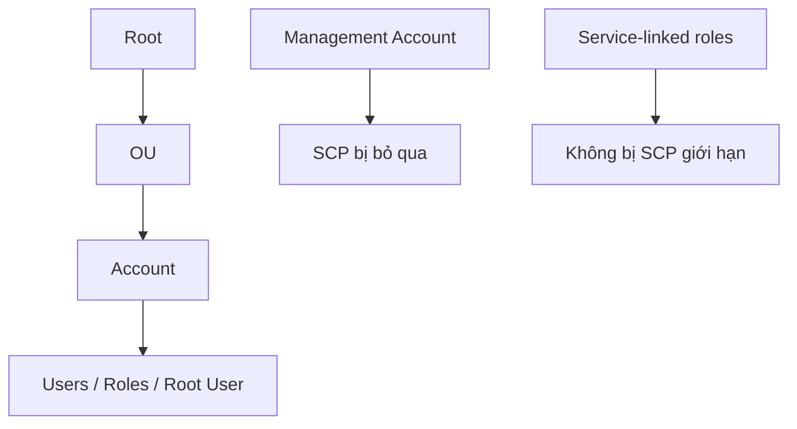
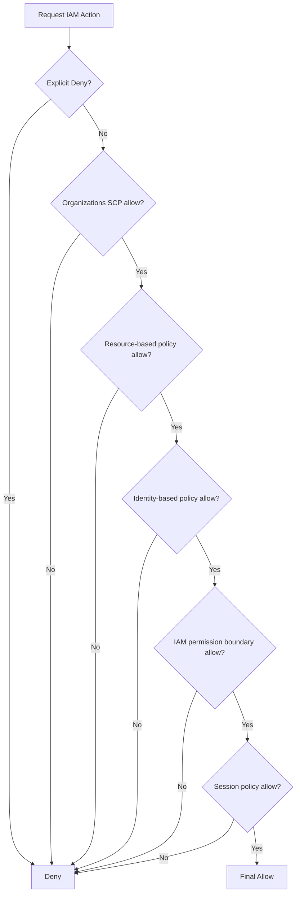

# 10. AWS Organizations Policies

## 🎯 Giới thiệu
Trong bài này, transcript nói về các loại policy trong **AWS Organizations** và cách chúng kiểm soát quyền trong organization. Trọng tâm gồm:

- **SCP (Service Control Policy)**
- Luồng **IAM policy evaluation**
- Policy để kiểm soát **tag**
- **TAG policies**
- **AI Services Opt-out Policy**
- **Backup policies**

Mục tiêu ôn thi là hiểu:
- Policy nào áp dụng ở cấp nào
- Policy nào gây **explicit deny**
- Khi nào cần **explicit allow**
- Cách tổ chức có thể kiểm soát service, region, tag và backup

## 1. **SCP (Service Control Policy)** 🔒
**SCP** dùng để tạo **allowlist** hoặc **blocklist** cho các **IAM actions** trong organization.

- Có thể áp dụng ở cấp:
  - **OU level**
  - **Account level**
- **Management account** không bị SCP áp dụng
  - SCP gán vào management account sẽ bị **disregard**
  - Mục đích là tránh lockout chính management account
- SCP áp dụng cho:
  - Tất cả **users**
  - Tất cả **roles**
  - Bao gồm cả **root user**
- **Không** ảnh hưởng đến **service-linked roles**

### Mermaid: Luồng áp dụng SCP

### Ý chính cần nhớ
- Muốn một action được phép trong organization, phải có **explicit allow** trên toàn đường đi:
  - từ **Root**
  - qua từng **OU**
  - xuống **target account**
- Nếu thiếu allow ở một điểm nào đó, action sẽ bị chặn
- **Explicit deny** luôn chặn ngay

### Use cases
- Chặn một số service cụ thể, ví dụ:
  - không cho dùng **EMR**
- Ép compliance, ví dụ:
  - tắt bớt service để phục vụ **PCI compliance**

### Ví dụ trong transcript
- `FullAWSAccess` có thể được gán để cho phép mọi thứ
- `Deny S3`
- `Deny EC2`
- `Allow EC2`

### Kết quả hành vi theo transcript
- **Management account**: luôn làm được mọi thứ
- **Account A**: bị chặn `S3` và `EC2` vì có các deny tương ứng
- **Account B/C**: không có SCP riêng, nhưng vẫn bị `Deny S3` từ OU
- **Account D**: chỉ dùng được `EC2` khi OU chỉ `Allow EC2`
- **Account E/F**: làm được mọi thứ khi có `FullAWSAccess`

## 2. **IAM Policy Evaluation & Tag Restrictions** ⚙️
Transcript nhấn mạnh luồng đánh giá quyền trong AWS là một chuỗi kiểm tra nhiều lớp.

### Mermaid: Luồng IAM policy evaluation

### Trình tự kiểm tra
- **Explicit deny**: nếu có deny rõ ràng thì bị chặn ngay
- **Organizations SCP**
  - có allow thì đi tiếp
  - không có allow thì là **implicit deny**
- **Resource-based policy**
- **Identity-based policy**
- **IAM permission boundaries**
- **Session policies**  
  - transcript nói phần này liên quan nhiều đến **STS**

### Ý chốt cho kỳ thi
- Chỉ khi tất cả lớp policy đều cho phép, action mới được thực hiện
- Chỉ cần một lớp **deny** là bị từ chối

### Kiểm soát tag bằng IAM/SCP
Transcript nêu cách dùng **AWS TagKeys Condition Key** để kiểm soát tag trên resource.

#### Ví dụ 1: bắt buộc đủ tag
- Muốn tạo **EBS volume** thì phải có:
  - `Env`
  - `CostCenter`
- Dùng:
  - `ForAllValues:StringEquals`
  - `TagKeys`

#### Ý nghĩa
- Cả hai tag phải tồn tại
- Nếu thiếu một trong hai, request không hợp lệ

#### Ví dụ 2: chỉ cần một trong các tag
- Dùng `ForAnyValue`
- Chỉ cần có ít nhất một tag trong danh sách là được

### Kiểm soát region bằng SCP
Transcript cũng nêu:
- Dùng condition `aws:RequestRegion`
- Có thể deny theo region, ví dụ:
  - `eu-central-1`
  - `eu-west-1`
- Có thể giới hạn theo service action như:
  - `EC2:*`
  - `RDS:*`
- Có thể có bypass bằng `ArnNotLike`
  - một số role được phép vượt qua SCP

### Chặn tạo resource không có tag
- Có thể deny việc tạo resource nếu thiếu tag bắt buộc
- Ví dụ transcript:
  - không cho launch **EC2 instance** nếu thiếu `Project` và `CostCenter`
- Dùng điều kiện kiểu:
  - `null` với `aws:RequestTag/Project`
  - và tương tự cho `CostCenter`

## 3. **TAG Policies** 🏷️
**TAG policies** được định nghĩa ở **organization level** để chuẩn hóa tag trên toàn organization.

### Mục đích
- Đảm bảo tag nhất quán
- Audit resource tag
- Phân loại resource đúng chuẩn
- Hỗ trợ:
  - **Cost Allocation Tags**
  - **Attributes Access Control**

### Cách hoạt động
- Định nghĩa:
  - tag key
  - allowed values
- Tag operation không tuân thủ sẽ bị ngăn chặn trên các service/resource đã chỉ định
- Có thể tạo report để liệt kê:
  - toàn bộ tags
  - non-compliant resources

### Ghi nhớ
- Muốn tìm tag không compliant:
  - dùng **Amazon EventBridge**

### Ví dụ trong transcript
- Với **Secrets Manager**
- `CostCenter` chỉ được phép có giá trị:
  - `100`
  - `200`

## 4. **AI Services Opt-out Policy** 🤖
Policy này liên quan đến việc các AI services của AWS có thể dùng content của bạn để cải thiện dịch vụ.

### Ý chính
- Một số dịch vụ như:
  - **Amazon Lex**
  - **Amazon Comprehend**
  - **Amazon Polly**
- Có thể dùng dữ liệu bạn cung cấp để cải thiện service
- Bạn có thể **opt out** để không cho content bị stored hoặc used cho mục đích cải tiến

### Phạm vi áp dụng
- Áp dụng cho:
  - tất cả **member accounts**
  - tất cả **AWS regions**
- Có thể:
  - opt out cho **all AI services**
  - hoặc chỉ một số service cụ thể

### Ví dụ trong transcript
- Opt out cho:
  - **Rekognition**
  - **Amazon Lex**

### Nơi gắn policy
- **Organization Root**
- Specific **OUs**
- Individual member accounts

## 5. **Backup Policies** 💾
**Backup policies** dùng để định nghĩa backup plan bằng **AWS Backup** ở cấp organization.

### Điểm chính
- Được viết bằng **JSON documents**
- Cho phép kiểm soát chi tiết:
  - frequency
  - time window
  - backup region
  - và các thông số khác

### Nơi áp dụng
- **Organization Root**
- Specific **OU**
- Individual member account

### Tính chất quan trọng
- Đây là **immutable backup plan**
- Trong member accounts, policy sẽ xuất hiện trong **AWS Backup**
- Nhưng chỉ là **view-only**
- Chỉ có thể quản lý từ **management account** của organization

## 📊 Bảng tóm tắt
| Tiêu chí | Mô tả |
|----------|------|
| **SCP** | Dùng để allowlist/blocklist IAM actions ở cấp OU hoặc account; áp dụng cho users, roles, root user; không áp dụng cho management account và service-linked roles |
| **IAM policy evaluation** | AWS kiểm tra nhiều lớp: explicit deny, SCP, resource-based policy, identity-based policy, permission boundaries, session policies |
| **Tag control** | Dùng `TagKeys`, `ForAllValues`, `ForAnyValue`, `aws:RequestTag` để bắt buộc hoặc giới hạn tag |
| **TAG policies** | Chuẩn hóa tag ở organization level; có report và có thể phát hiện non-compliant tags qua EventBridge |
| **AI Services Opt-out Policy** | Cho phép opt out việc AI services dùng content để cải tiến; áp dụng toàn organization hoặc theo service |
| **Backup policies** | Định nghĩa AWS Backup plan ở organization level; immutable và chỉ quản lý từ management account |

## 💡 Mẹo ghi nhớ cho kỳ thi AWS
- **SCP = chặn/cho phép ở cấp organization**, nhưng **management account** là ngoại lệ đặc biệt
- **Explicit deny** luôn thắng
- Muốn action được phép thì phải có **explicit allow trên toàn đường đi**
- `ForAllValues` = phải đủ tất cả tag yêu cầu
- `ForAnyValue` = chỉ cần một trong các tag
- `TAG policies` dùng để **chuẩn hóa tag**, không phải để kiểm soát quyền như SCP
- **AI Services Opt-out Policy** và **Backup policies** đều là policy cấp organization, nhưng mục đích rất khác nhau
- Khi thấy câu hỏi về tag compliance, nhớ tới:
  - `AWS TagKeys Condition Key`
  - `EventBridge`
  - `TAG policies`

## ✅ Kết luận
Transcript tập trung vào cách **AWS Organizations Policies** kiểm soát an toàn và chuẩn hóa trong organization:

- **SCP** dùng để khóa/mở quyền theo tổ chức
- **IAM policy evaluation** quyết định action cuối cùng dựa trên nhiều lớp kiểm tra
- **Tag-related conditions** giúp ép chuẩn tag và compliance
- **TAG policies** chuẩn hóa metadata
- **AI Services Opt-out Policy** kiểm soát việc dùng content cho AI services
- **Backup policies** chuẩn hóa và áp dụng backup plan ở cấp organization

Nếu học đúng các điểm trên, bạn sẽ nắm được phần trọng tâm của bài này cho kỳ thi AWS.
