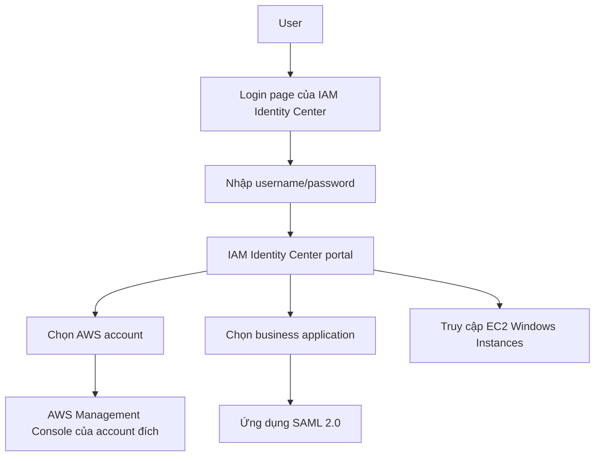
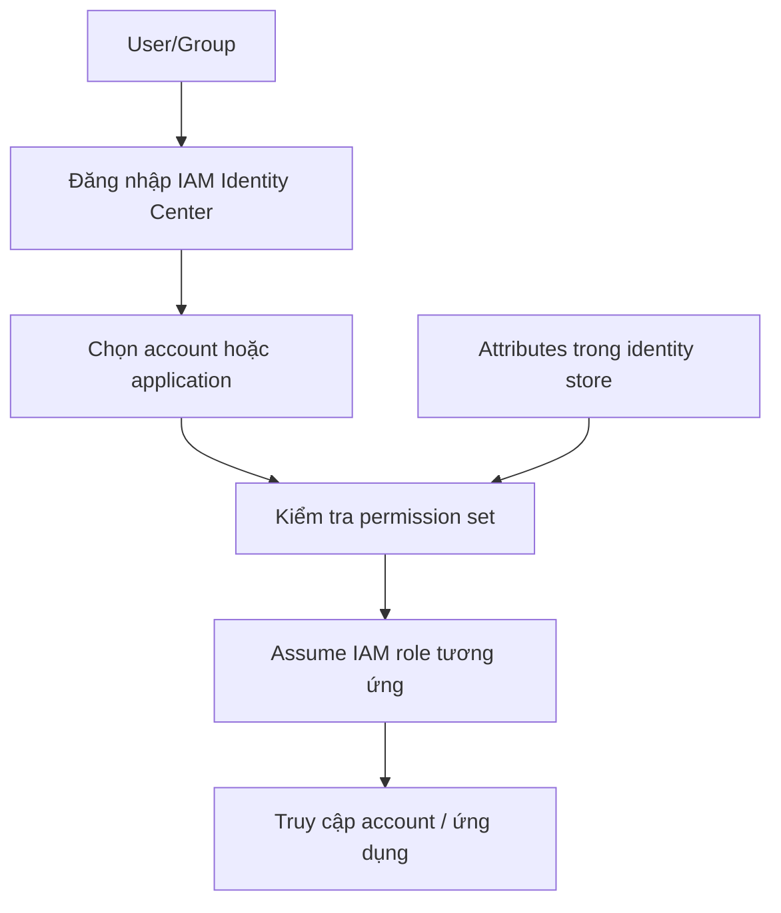

# 11. AWS IAM Identity Center

## 🎯 Giới thiệu
AWS IAM Identity Center là dịch vụ kế nhiệm của AWS Single Sign-On (AWS SSO).

- Mục tiêu chính: **one login** cho nhiều tài nguyên.
- Dùng để truy cập:
  - Nhiều AWS accounts trong AWS Organizations
  - Business cloud applications như Salesforce, Box, Microsoft 365
  - EC2 Windows Instances
- Điều kiện tích hợp với ứng dụng bên ngoài: hỗ trợ **SAML 2.0**
- Điểm hay bị hỏi trong kỳ thi: **một lần đăng nhập để vào nhiều AWS accounts**

## 1. Phạm vi sử dụng của IAM Identity Center
IAM Identity Center giúp tập trung đăng nhập vào một portal duy nhất.

- Người dùng đăng nhập vào trang của IAM Identity Center
- Từ đó chọn account hoặc application cần truy cập
- Không cần nhớ cách đăng nhập riêng cho từng console
- Phù hợp khi doanh nghiệp có nhiều AWS accounts

### Mermaid: luồng đăng nhập tổng quát

## 2. Identity Provider và nguồn người dùng
Nguồn lưu user cho IAM Identity Center có 2 kiểu:

- **Built-in identity store** trong IAM Identity Center
- **Third-party identity provider**
  - Active Directory
  - OneLogin
  - Okta

### Ý chính cần nhớ
- Có thể dùng IAM Identity Center để tự quản lý **users** và **groups**
- Hoặc tích hợp với hệ thống user sẵn có trong doanh nghiệp
- Quá trình này hỗ trợ cả on-premises lẫn cloud

## 3. Permission Sets, Assignments và ABAC
IAM Identity Center không cấp toàn quyền trực tiếp khi đăng nhập.

- Quyền truy cập được xác định bằng **permission sets**
- Permission set là tập hợp một hoặc nhiều **IAM policies**
- Permission set được:
  - Gán vào **specific accounts**
  - Gán cho **users** hoặc **groups**
- Khi user đăng nhập và mở account, hệ thống sẽ tự động tạo/assume **IAM role** tương ứng trong account đó

### Ví dụ trong transcript
- Nhóm developers gồm Bob và Alice
- Gán permission set **admin access** cho development accounts
- Gán permission set **read-only** cho production accounts
- Bob và Alice sau khi đăng nhập sẽ assume role phù hợp theo từng account

### Application assignments
Ngoài AWS accounts, IAM Identity Center còn hỗ trợ:

- Gán user/group vào ứng dụng
- Cung cấp sẵn:
  - URLs
  - certificates
  - metadata

### ABAC - Attribute-based access control
IAM Identity Center hỗ trợ **fine-grained permissions** dựa trên thuộc tính của user.

- Thuộc tính có thể là:
  - cost center
  - title như junior/senior
  - locale
  - region
- Cách dùng:
  - định nghĩa permission sets một lần
  - thay đổi quyền bằng cách cập nhật attribute của user/group
- Đây là use case nâng cao nhưng được hỗ trợ bởi IAM Identity Center

### Mermaid: flow quyền truy cập

## 📊 Bảng tóm tắt
| Tiêu chí | Mô tả |
|----------|------|
| Tên dịch vụ | AWS IAM Identity Center |
| Dịch vụ tiền nhiệm | AWS Single Sign-On (AWS SSO) |
| Mục đích | One login cho nhiều AWS accounts và ứng dụng |
| Nguồn danh tính | Built-in identity store hoặc third-party IdP như AD, OneLogin, Okta |
| Cơ chế phân quyền | Permission sets, map sang IAM policies |
| Kết quả khi truy cập account | Tự động assume IAM role phù hợp |
| Hỗ trợ ứng dụng | Business cloud applications qua SAML 2.0 |
| Tính năng nâng cao | ABAC dựa trên attributes trong store |

## 💡 Mẹo ghi nhớ cho kỳ thi AWS
- Nhớ cụm: **IAM Identity Center = one login cho nhiều AWS accounts**
- **Permission sets** là từ khóa rất quan trọng
- Permission set = tập hợp **IAM policies**, không phải quyền truy cập trực tiếp
- Khi user vào account đích, hệ thống sẽ **assume IAM role**
- IAM Identity Center có thể dùng cho:
  - AWS Organizations
  - Business applications
  - EC2 Windows Instances
- Nếu gặp câu hỏi về **AWS SSO**, hãy liên hệ với **AWS IAM Identity Center**

## ✅ Kết luận
AWS IAM Identity Center là giải pháp central login cho môi trường nhiều account và nhiều ứng dụng.

- Dùng để đơn giản hóa xác thực
- Hỗ trợ built-in identity store hoặc tích hợp IdP bên ngoài
- Dùng **permission sets** để kiểm soát truy cập
- Hỗ trợ **application assignments** và **ABAC**
- Là một chủ đề rất đáng chú ý cho kỳ thi AWS vì liên quan trực tiếp đến **multi-account access**
