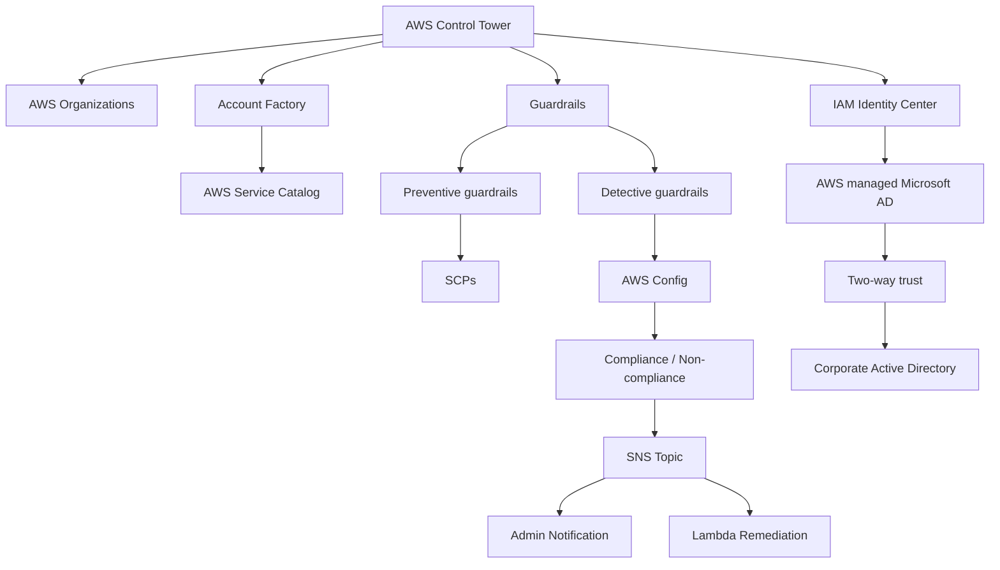

# 12. AWS Control Tower

## 🎯 Giới thiệu
- AWS Control Tower là cách **dễ dàng** để thiết lập và quản trị một **secure and compliant multi-account AWS environment** theo **best practices**.
- Dịch vụ này giúp:
  - Tự động hóa môi trường chỉ với vài cú click.
  - Quản lý policy liên tục bằng **guardrails**.
  - Phát hiện vi phạm policy và **remediate** tự động.
  - Theo dõi compliance qua **interactive dashboard**.
- Control Tower chạy trên nền **AWS Organizations** và tự động:
  - Tạo organization
  - Tổ chức các accounts
  - Triển khai các **Service Control Policies (SCPs)** cần thiết

## 1. Account Factory và Landing Zone
- **Account Factory** dùng để:
  - Tự động **account provisioning** và **deployments**
  - Tạo các **pre-approved baseline** và cấu hình chuẩn cho mọi account trong organization
- Ví dụ baseline/configuration:
  - Default VPC
  - Subnets
  - Regions
- Việc tạo account mới dựa trên dịch vụ nền tảng là **AWS Service Catalog**.
- Trong mô hình **landing zone**, Account Factory giúp tạo các accounts được cấu hình chuẩn để dùng ngay.

## 2. IAM Identity Center và tích hợp Active Directory
- Khi dùng Control Tower cùng **landing zone** và **Account Factory**, trung tâm xác thực là **IAM Identity Center**.
- Có thể tích hợp với **Microsoft Active Directory** trong corporate data center.
- Mô hình được mô tả:
  - Tạo **AWS managed Microsoft AD**
  - Dùng nó làm source cho **IAM Identity Center**
  - Thiết lập **two-way trust** giữa Active Directory on-premises và AWS
- Kết quả:
  - Các account tạo từ landing zone/account factory sẽ được cấu hình đúng để dùng authentication qua **IAM Identity Center**
  - Đồng thời tận dụng Active Directory ở cả cloud và corporate data center

## 3. Guardrails và Compliance
- **Guardrails** dùng để phát hiện và khắc phục **policy violations**, tạo nên **ongoing governance**.
- Có 2 loại guardrails:
  - **Preventive guardrails**: dùng **SCPs**
    - Ví dụ: chặn việc tạo **access keys** từ **root user**
  - **Detective guardrails**: dùng **Config**
    - Ví dụ: kiểm tra **MFA** có bật cho root user hay không
- **AWS Config** rất hữu ích vì cho biết resource đang **compliant** hay **non-compliant**.
- Ví dụ flow:
  - Control Tower dùng detective guardrail để theo dõi **untagged resources**
  - Nếu phát hiện non-compliance:
    - Kích hoạt **SNS topic**
    - SNS có thể notify admin
    - Có thể invoke **Lambda**
    - Lambda thực hiện remediation, ví dụ thêm tag cần thiết

## Mermaid

## 📊 Bảng tóm tắt
| Tiêu chí | Mô tả |
|----------|------|
| Mục tiêu | Thiết lập và quản trị **secure and compliant multi-account AWS environments** |
| Nền tảng | Chạy trên **AWS Organizations** |
| Tự động hóa | Tạo môi trường, account provisioning, baseline configuration, governance |
| Account Factory | Tạo account theo baseline có sẵn như VPC, subnet, region |
| IAM Identity Center | Trung tâm xác thực cho các account trong landing zone |
| Tích hợp AD | Hỗ trợ **AWS managed Microsoft AD** và **two-way trust** với corporate AD |
| Guardrails | Phát hiện và remediation policy violations |
| Preventive | Dùng **SCPs** để ngăn hành động không mong muốn |
| Detective | Dùng **AWS Config** để kiểm tra compliance |
| Remediation | Có thể dùng **SNS** và **Lambda** để xử lý tự động |

## 💡 Mẹo ghi nhớ cho kỳ thi AWS
- Nhớ công thức: **Control Tower = multi-account governance + guardrails + automation**.
- **Account Factory** gắn với việc tạo account chuẩn hóa, không phải tạo thủ công.
- **Preventive = SCPs**, **Detective = Config**.
- **IAM Identity Center** là trung tâm xác thực trong mô hình landing zone.
- Khi transcript nhắc tới **compliance dashboard**, hãy liên hệ ngay với khả năng theo dõi trạng thái governance của Control Tower.
- Nếu thấy luồng **Config -> SNS -> Lambda**, hãy hiểu đây là mô hình detective guardrail và remediation tự động.

## ✅ Kết luận
- AWS Control Tower giúp xây dựng và quản lý **multi-account AWS environment** theo best practices.
- Điểm cốt lõi cần nhớ là:
  - **AWS Organizations**
  - **Account Factory**
  - **IAM Identity Center**
  - **Guardrails**
  - **SCPs** và **AWS Config**
- Đây là dịch vụ tập trung vào **governance, compliance, và automation** cho môi trường AWS nhiều account.
