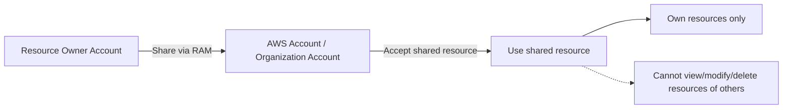

# 13. AWS Resource Access Manager - RAM

## 🎯 Giới thiệu
AWS Resource Access Manager (RAM) dùng để **chia sẻ AWS resources mà bạn sở hữu** với:
- Các AWS accounts khác
- Hoặc chỉ các accounts trong **AWS Organization**

Mục tiêu chính:
- Tránh **resource duplication**
- Cho phép dùng chung một số tài nguyên theo cách quản lý tập trung hơn

## 1. Các tài nguyên có thể chia sẻ
RAM có thể chia sẻ nhiều loại tài nguyên, trong transcript nhấn mạnh các nhóm sau:

- **VPC Subnets**: use case quan trọng nhất cho kỳ thi
- **Transit Gateway**
- **Route 53 Resolver Rules**
- **DNS Firewall Rule Groups**
- **License Manager configurations**
- **Aurora DB Clusters**
- **ACM Private Authority / Certificate Authority**
- **CodeBuild Projects**
- **EC2 Dedicated Hosts**
- **Capacity Reservations**
- **Glue Catalog, Database, Table**
- **Network Firewall Policies**
- **Resource Groups**
- **Systems Manager / Systems Manager Incidents**
- **Outpost**

Lưu ý:
- **Default security groups** và **default VPC** thì không thể share

## 2. Use case quan trọng: chia sẻ VPC Subnets
Đây là phần rất quan trọng trong bài thi.

### Cách hoạt động
- VPC owner có một **private subnet**
- VPC đó được share với các accounts khác, ví dụ:
  - account one
  - account two
- Mỗi account:
  - tự deploy resources của mình
  - không thể xem, sửa, xóa resources của account khác

### Ý nghĩa
- Các resources trong các accounts khác nhau vẫn có thể **communicate với nhau**
- Có thể dùng **private IPs** để giao tiếp
- Giảm nhu cầu phải dùng **VPC peering**
- Các applications trong cùng **trust boundaries** có thể nằm trong cùng một VPC
- Mạng trở nên đơn giản hơn khi các ứng dụng có mức độ kết nối cao

### Security Group
- **Security group** có thể được tham chiếu **cross-account**
- Điều này giúp tăng mức độ an toàn và quản lý linh hoạt hơn

## 3. Managed Prefix List và Route 53 Resolver Rules
### Managed Prefix List
Một **managed prefix list** là:
- tập hợp một hoặc nhiều **CIDR blocks**
- giúp dễ dàng quản lý và cấu hình:
  - **security group rules**
  - **route tables**

#### Cách dùng
- Tạo prefix list chứa các CIDRs, ví dụ đại diện cho internal network
- Dùng prefix list đó trong nhiều security groups thay vì nhập từng CIDR lặp lại
- Nếu share prefix list sang account khác qua RAM:
  - account khác có thể tham chiếu nó trong inbound rules
  - khi prefix list thay đổi, các security groups và route tables dùng nó sẽ được cập nhật đồng thời

#### AWS-Managed Prefix List
- CIDRs do **AWS** định nghĩa cho các services của họ
- Bạn **không thể**:
  - create
  - modify
  - share
  - delete

### Route 53 Outbound Resolver
RAM cũng có thể share **Route 53 Resolver Rules**:
- Dùng trong mô hình **hybrid setup**
- Có nhiều accounts và nhiều VPCs
- Main account định nghĩa forwarding rules:
  - domain names
  - target IPs
- Sau đó share sang các accounts khác
- Account nhận share có thể associate rules đó với VPC của mình
- Các VPC đó sẽ resolve các domain names đã được chỉ định

## 📊 Bảng tóm tắt
| Tiêu chí | Mô tả |
|----------|------|
| Mục đích | Chia sẻ AWS resources owned by you với các accounts khác hoặc trong AWS Organization |
| Lợi ích | Tránh resource duplication, quản lý tập trung hơn |
| Use case quan trọng | Share **VPC Subnets** để nhiều account dùng chung network |
| Quyền của participant | Chỉ quản lý resources của chính mình |
| Giới hạn | Không xem/sửa/xóa resources của account khác |
| Tài nguyên nổi bật | VPC Subnets, Transit Gateway, Route 53 Resolver Rules, managed prefix list, license manager configurations |
| Điểm cần nhớ | **Default VPC** và **default security groups** không share được |
| Prefix list | Dùng để gom CIDRs, simplify security group rules và route tables |
| DNS use case | Share Route 53 Resolver Rules để centralized DNS forwarding |

## 💡 Mẹo ghi nhớ cho kỳ thi AWS
- **RAM = Resource Access Manager**: nhớ ngay đến **sharing resources**
- Câu hỏi thi thường xoay quanh:
  - **VPC Subnets sharing**
  - **cross-account security group reference**
  - **managed prefix list**
  - **Route 53 Resolver Rules**
- Khi thấy mục tiêu là:
  - nhiều account dùng chung subnet
  - giảm VPC peering
  - centralize network/DNS rules
  thì nghĩ đến **RAM**
- Nhớ kỹ:
  - participant chỉ quản lý resource của mình
  - không được đụng vào resource của account khác
- **Prefix list** rất hay được dùng để:
  - tránh lặp CIDRs
  - cập nhật đồng loạt rules khi thay đổi

## ✅ Kết luận
AWS RAM cho phép **chia sẻ tài nguyên một cách có kiểm soát** giữa nhiều AWS accounts hoặc trong AWS Organization. Trong bối cảnh ôn thi, phần quan trọng nhất là **VPC Subnets**, cùng với **managed prefix list** và **Route 53 Resolver Rules** để đơn giản hóa network và DNS management.
