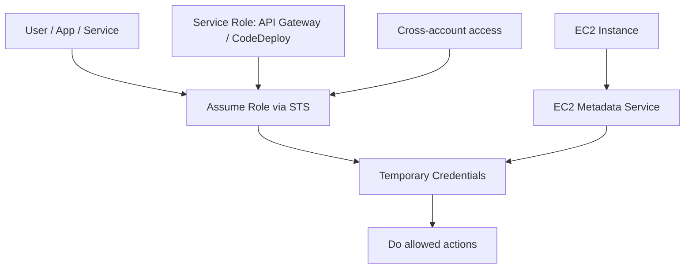
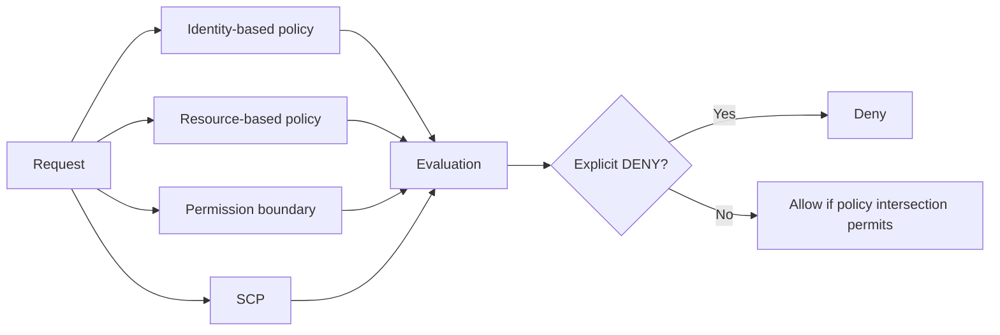
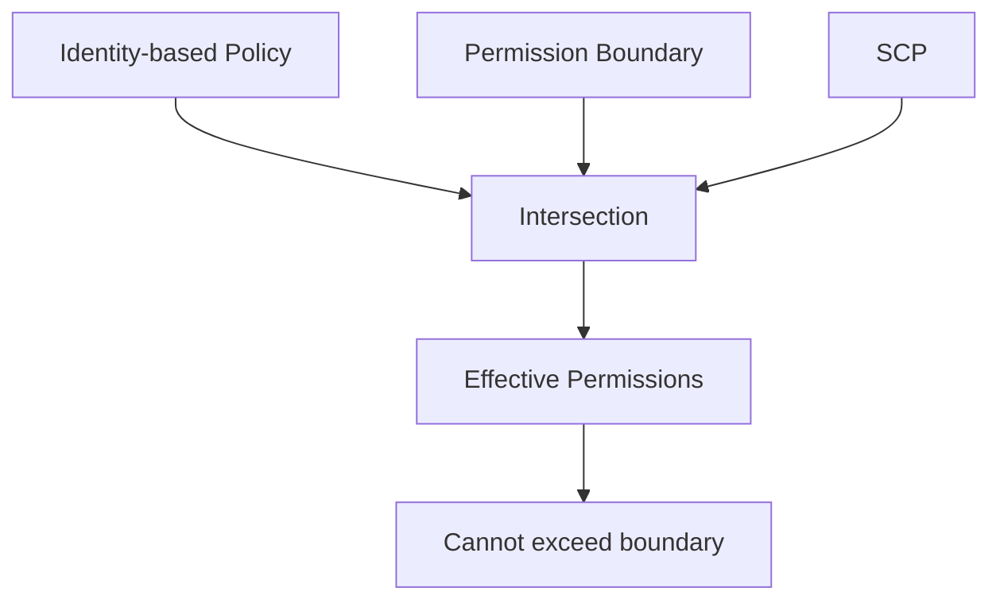

# 4. IAM

## 🎯 Giới thiệu
IAM là phần cốt lõi để quản lý **authentication** và **authorization** trong AWS. Transcript nhấn mạnh 3 ý chính:
- **Users** có **long-term credentials**
- **Roles** có **short-term credentials** và thường được cấp thông qua **STS**
- **Policies** xác định ai được làm gì trên tài nguyên nào

---

## 1. Identity, Role và Policy cơ bản
- **IAM Users**
  - Có **long-term credentials**
  - Có thể được group lại trong **IAM Group**
- **IAM Roles**
  - Dùng **temporary credentials**
  - Credentials được cấp bởi **STS**
  - Khi assume role, entity sẽ dùng quyền của role
- **EC2 instance role**
  - Một dạng role đặc biệt cho EC2
  - EC2 dùng **EC2 metadata service** để lấy short-term credentials
  - **Mỗi instance chỉ gắn được 1 role tại một thời điểm**
  - Giúp instance truy cập tài nguyên như **S3 Bucket** hoặc **DynamoDB table**
- **Service roles**
  - Gán trực tiếp cho service như **API Gateway** hoặc **CodeDeploy**
  - Dùng khi service cần thao tác lên **Auto Scaling Group**, **Lambda Function**, hoặc tài nguyên khác
- **Cross-account roles**
  - Dùng để truy cập sang **account khác**
  - Không share credentials giữa các account
  - Thay vào đó là **assume role**

### Loại IAM Policy
- **AWS Managed Policy**
  - AWS tạo sẵn
  - Có thể thay đổi theo thời gian
- **Customer Managed Policy**
  - Do bạn tự tạo
  - Có thể gán cho nhiều users/roles
  - Có thể version hóa
- **Inline Policy**
  - Gắn cho **1 user** hoặc **1 role** cụ thể
  - Không share qua nhiều users/roles được
- **Resource-based Policy**
  - Gắn trực tiếp lên resource như **S3 Bucket policy**, **SQS queue policy**
  - Hữu ích cho các pattern truy cập đặc biệt

### Mermaid: luồng role và policy

---

## 2. Cấu trúc Policy, Conditions và Policy Variables
- IAM policy là **JSON document**
- Các thành phần chính:
  - **Effect**
  - **Action**
  - **Resource**
  - **Condition**
  - đôi khi có **Policy Variables**
- Có thể viết policy rất cụ thể, ví dụ:
  - cho phép **EC2 attach/detach volume**
  - chỉ áp dụng lên resource có tag nhất định
- **Explicit DENY** luôn có **ưu tiên cao nhất**
  - Nếu policy có explicit deny, nó thắng mọi allow khác

### Best practice
- Dùng **least privilege**
- Mục tiêu: chỉ cấp đúng quyền cần thiết, không hơn

### Công cụ hỗ trợ
- **IAM Access Advisor**
  - Xem các permissions đã được cấp
  - Xem lần cuối từng permission được dùng
  - Có thể giúp phát hiện quyền không còn cần thiết
- **Access Analyzer**
  - Phân tích tài nguyên đang bị chia sẻ với bên ngoài
  - Ví dụ: kiểm tra **S3 Bucket** có bị account khác truy cập hay không

### Các kiểu Condition được nhắc đến
- **String**
- **Numeric**
- **Date**
- **Boolean**
  - Ví dụ: **SecureTransport: true**
  - Ví dụ: **MFA present: true**
- **IP address**
- **ArnEquals / ArnLike**
- **Null**

### Policy Variables và Tags
- Ví dụ dùng biến **`AWS username`** trong S3 bucket policy
- Mục tiêu: mỗi user có prefix riêng trong bucket
- Một số biến/tags được nhắc đến:
  - **CurrentTime**
  - **TokenIssueTime**
  - **principal type**
  - **secure transport**
  - **source IP**
  - **user ID**
  - **source instance ARN**
- Có **service-specific policy variables/tags**
  - Ví dụ: **S3 prefix**, **max keys**, **SNS endpoint**, **SNS protocol**
- Có thể dùng **tag-based policy variables**
  - Ví dụ: **resource tag / key name**
  - Ví dụ: **principal tag / key name**

### Mermaid: luồng đánh giá policy

---

## 3. Resource-based Policy vs Role, và Permission Boundaries
- Đây là phần rất quan trọng cho exam
- Có 2 cách để một user ở **account A** truy cập **S3 Bucket** ở **account B**:
  - **Assume role** ở account B
  - Dùng **S3 bucket policy** để cho phép truy cập trực tiếp

### Khác biệt cốt lõi
- Khi **assume role**
  - User/App/Service **từ bỏ quyền gốc**
  - Nhận quyền của **role**
- Khi dùng **resource-based policy**
  - Principal **không phải từ bỏ quyền gốc**
  - Quyền truy cập được mở ở phía resource

### Khi nào cần kết hợp nhiều cơ chế
- Ví dụ trong transcript:
  - User ở **account A** cần scan **DynamoDB** trong account A
  - Sau đó dump dữ liệu vào **S3 bucket** ở account B
- Trường hợp này cần:
  - **IAM role** ở account A
  - **Resource policy** trên S3 bucket ở account B

### Services hỗ trợ resource-based policy
- **S3 buckets**
- **SNS topics**
- **SQS queues**
- **Lambda functions**
- **ECR**
- **Backup**
- **EFS**
- **Glacier**
- **Cloud9**

### IAM Permission Boundaries
- Hỗ trợ cho:
  - **users**
  - **roles**
  - không hỗ trợ cho **groups**
- Mục tiêu:
  - đặt **maximum permissions** mà IAM entity có thể có
- Transcript nêu ví dụ:
  - permission boundary chỉ cho **S3 / CloudWatch / EC2**
  - nhưng policy identity chỉ cho **IAM create user**
  - kết quả là **không có permissions nào hiệu lực**
- Có thể kết hợp với **AWS Organizations SCP**
- Khi đó quyền hiệu lực là **intersection** của:
  - **SCP**
  - **permission boundary**
  - **identity-based policies**
- Dùng khi:
  - muốn giao quyền cho non-admin trong giới hạn rõ ràng
  - cho developer tự quản lý một phần permissions nhưng không được **escalate** quyền

### Mermaid: permission boundary và intersection

---

## 📊 Bảng tóm tắt
| Tiêu chí | Mô tả |
|----------|------|
| Users | Có **long-term credentials** |
| Roles | Có **temporary credentials**, cấp qua **STS** |
| EC2 instance role | EC2 lấy credentials từ **EC2 metadata service** |
| Service role | Gán trực tiếp cho service như **API Gateway**, **CodeDeploy** |
| Cross-account role | Dùng để truy cập account khác, không share credentials |
| Policy types | **AWS Managed**, **Customer Managed**, **Inline Policy**, **Resource-based Policy** |
| Policy rule | **Explicit DENY** luôn ưu tiên cao nhất |
| Best practice | Dùng **least privilege** |
| Tools | **IAM Access Advisor**, **Access Analyzer** |
| Conditions | String, Numeric, Date, Boolean, IP, ArnEquals/ArnLike, Null |
| Policy variables | **AWS username**, tag-based variables, service-specific variables |
| Resource vs Role | Resource-based policy giữ nguyên quyền gốc; assume role thì dùng quyền của role |
| Permission boundaries | Đặt **giới hạn tối đa** cho permissions của user/role |

---

## 💡 Mẹo ghi nhớ cho kỳ thi AWS
- **User = long-term**, **Role = temporary**, nhớ mốc này trước.
- **STS** là chìa khóa để cấp **temporary credentials** cho role.
- **Explicit DENY > ALLOW** luôn là quy tắc cần nhớ.
- **Least privilege** là best practice mặc định của IAM.
- **Resource-based policy** phù hợp khi muốn cấp quyền từ phía resource, đặc biệt trong **cross-account**.
- **Assume role** nghĩa là entity nhận quyền của role và **bỏ quyền gốc** trong lúc assume.
- **Permission boundary** là “trần quyền”, không cho vượt quá giới hạn đã đặt.
- **Access Advisor** xem quyền đã cấp và lần dùng gần nhất.
- **Access Analyzer** giúp phát hiện tài nguyên bị chia sẻ ra bên ngoài.

---

## ✅ Kết luận
IAM trong transcript tập trung vào 4 ý chính:
- **Identity**: users, groups, roles, service roles, cross-account roles
- **Policies**: managed, customer managed, inline, resource-based
- **Evaluation**: explicit deny, conditions, policy variables, least privilege
- **Advanced control**: resource-based policy và **permission boundaries** để kiểm soát truy cập tinh vi hơn

Nắm chắc các điểm này sẽ rất hữu ích cho phần ôn thi AWS, đặc biệt các câu hỏi về **cross-account access**, **STS**, **resource-based policy**, và **permission boundary**.
