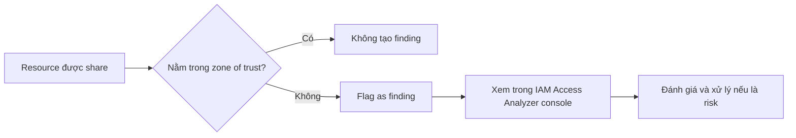

# 5. IAM Access Analyzer

## 🎯 Giới thiệu
IAM Access Analyzer là một service trong IAM console dùng để phát hiện các **resources đang bị chia sẻ ra bên ngoài**.  
Nó giúp phát hiện sớm rủi ro bảo mật khi một resource vô tình bị truy cập từ bên ngoài **zone of trust**.

Các resource được nhắc đến trong transcript:
- `S3 buckets`
- `IAM roles`
- `KMS keys`
- `Lambda functions` và `layers`
- `SQS queues`
- `Secrets Manager Secrets`

## 1. Phát hiện chia sẻ ngoài zone of trust 🔍
IAM Access Analyzer hoạt động dựa trên khái niệm **zone of trust**:
- Zone of trust có thể là:
  - các `AWS accounts` của bạn
  - hoặc toàn bộ `AWS organization`
- Bất kỳ quyền truy cập nào **nằm ngoài zone of trust** vào các resource trên sẽ được báo cáo thành **findings**

Ví dụ trong transcript:
- Một `S3 bucket` có thể được share với:
  - `role`
  - `user`
  - `account`
  - `external client by IP`
  - `VPC endpoint`
- Nếu zone of trust chỉ gồm các account của bạn:
  - `role`, `user`, `VPC endpoints` trong account của bạn là hợp lệ
  - `account` và `external clients` sẽ bị flag là **finding**

## 2. Policy validation 🧾
IAM Access Analyzer còn dùng để **validate policy**:
- Kiểm tra policy theo:
  - `policy grammar`
  - `best practices`
- Trả về:
  - `general warnings`
  - `security warnings`
  - `errors`
  - `suggestions`
  - `actionable recommendations`

Mục tiêu là giúp cải thiện policy trước khi đưa vào sử dụng.

## 3. Generate policy từ access activity ⚙️
IAM Access Analyzer có thể **generate IAM policy** dựa trên hoạt động truy cập thực tế:
- Phân tích `API calls`
- Dữ liệu được lấy từ `CloudTrail logs`
- Có thể review tối đa **90 days of logs**
- Từ đó tạo ra IAM policy với:
  - đúng `actions`
  - đúng `services`
  - quyền theo kiểu `fine-grained permissions`

Ví dụ trong transcript:
- `Lambda function` gọi API vào `S3 bucket` hoặc `Kinesis Data Stream`
- Các API calls này được ghi vào `CloudTrail`
- IAM Access Analyzer đọc logs và sinh policy phù hợp với access activity của application

## 📊 Bảng tóm tắt
| Tiêu chí | Mô tả |
|----------|------|
| Mục đích | Phát hiện resource bị chia sẻ ngoài zone of trust |
| Resource áp dụng | `S3`, `IAM roles`, `KMS keys`, `Lambda`, `SQS`, `Secrets Manager` |
| Zone of trust | `AWS accounts` hoặc toàn bộ `AWS organization` |
| Findings | Bất kỳ access nào ngoài zone of trust |
| Policy validation | Kiểm tra grammar, best practices, warnings, errors, suggestions |
| Generate policy | Tạo `IAM policy` từ `CloudTrail logs` và `API calls` |
| Thời gian phân tích | Tối đa `90 days of logs` |

## 💡 Mẹo ghi nhớ cho kỳ thi AWS
- **Access Analyzer = phát hiện chia sẻ ngoài ý muốn**
- **Zone of trust** là khái niệm then chốt để xác định `finding`
- Nhớ rằng IAM Access Analyzer không chỉ để phát hiện, mà còn:
  - **validate policy**
  - **generate policy**
- Khi đề bài nhắc đến:
  - tài nguyên bị share ra ngoài
  - audit quyền truy cập
  - tạo policy từ access activity
  thì nghĩ ngay đến `IAM Access Analyzer`
- `CloudTrail` là nguồn log được dùng để generate policy

## ✅ Kết luận
IAM Access Analyzer giúp:
- phát hiện resource bị chia sẻ ngoài `zone of trust`
- kiểm tra và cải thiện `IAM policy`
- tạo policy dựa trên `CloudTrail logs` và hoạt động truy cập thực tế

Đây là một service quan trọng để tăng cường bảo mật và quản lý quyền truy cập trong AWS.
