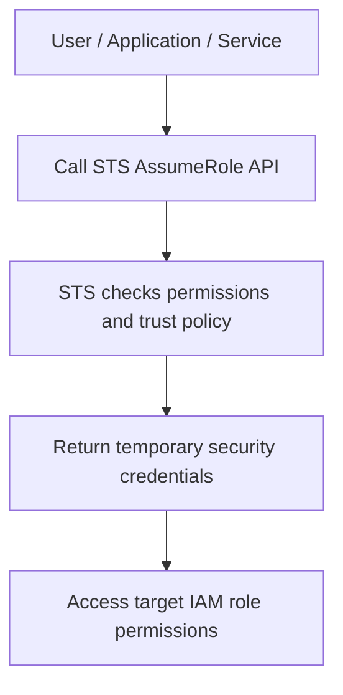
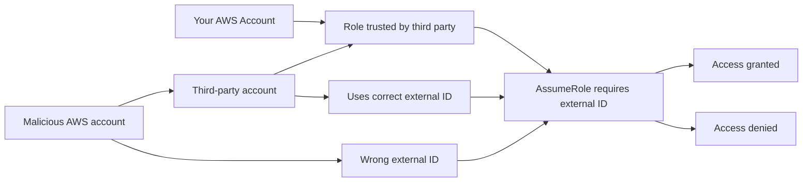

# 6. STS

## 🎯 Giới thiệu
STS (Security Token Service) là dịch vụ cực kỳ quan trọng trong AWS, dùng để:
- `AssumeRole` giữa các account hoặc trong cùng account
- Cấp **temporary security credentials**
- Hỗ trợ **identity federation**

Khi dùng STS để assume role:
- Bạn **từ bỏ permissions gốc**
- Và nhận **permissions của IAM role** được assume
- Credential nhận về có thời hạn, thường từ **15 phút đến 12 giờ**

## 1. Cách STS AssumeRole hoạt động
Luồng cơ bản:
- Tạo `IAM role` trong account cần truy cập
- Chỉ định các `principals` nào được phép assume role đó
- User/application/service gọi `STS AssumeRole API`
- STS kiểm tra permissions và cấu hình trust
- STS trả về `temporary security credentials`
- Dùng credentials này để truy cập tài nguyên theo quyền của role

Khi nào nên dùng:
- Cấp quyền cho IAM user trong account của bạn
- Cấp quyền cho user từ account khác
- Cho service AWS dùng service role
- Thực hiện identity federation

## 2. Cross-account access và security tăng cường
Một pattern rất phổ biến:
- Trong production account, admin tạo role cho development account
- Trong development account, chỉ một nhóm user nhất định được phép assume role đó
- Developers gọi STS để lấy temporary credentials
- Dùng credentials này để truy cập tài nguyên như `S3 bucket`

Lợi ích bảo mật:
- Phải **explicitly grant** quyền assume role
- Có thể bắt người dùng switch role qua Console hoặc CLI
- Có thể thêm `MFA` để chỉ user đã xác thực MFA mới assume được role
- Tăng `least privilege`
- Có thể audit qua `CloudTrail`

### External ID và confused deputy
Khi cấp quyền cho **third-party accounts** ngoài zone of trust:
- Cần dùng `external ID`
- `external ID` là bí mật giữa bạn và bên thứ ba
- Bên thứ ba phải cung cấp `external ID` khi assume role
- Giúp chống tấn công `confused deputy`

Ý chính của `confused deputy`:
- Bên trung gian có thể bị “lừa” dùng role không đúng account
- Nếu không có `external ID`, trung gian có thể assume nhầm role và thực hiện hành động trên account của bạn
- `external ID` giúp xác minh đúng bên thứ ba và chặn truy cập sai

Ngoài ra:
- Có thể dùng `IAM Access Analyzer` để tìm tài nguyên ngoài zone of trust

## 3. Session tags và các API quan trọng của STS
### Session tags
STS cho phép truyền `session tag` khi assume role, ví dụ:
- `Department=HR`

Sau đó, trong `IAM policy` có thể dùng condition:
- `aws:PrincipalTag`

Ví dụ:
- Nếu bucket policy kiểm tra `PrincipalTag/Department = HR`
- Chỉ principal có session tag phù hợp mới truy cập được `S3 bucket`

Cách này hữu ích khi:
- Federation user qua STS
- Muốn ràng buộc quyền theo tag trong policy

### Các STS API quan trọng
- `AssumeRole`: assume role trong cùng account hoặc cross-account
- `AssumeRoleWithSAML`: dùng khi federation với `SAML`
- `AssumeRoleWithWebIdentity`: dùng với `IdP` như Amazon Cognito, Login with Amazon, Facebook, Google, hoặc OpenID Connect-compatible IdP
- `GetSessionToken`: dùng cho `MFA`
- `GetFederationToken`: dùng khi federation qua proxy app / corporate network

Lưu ý từ transcript:
- AWS **không khuyến nghị** dùng `AssumeRoleWithWebIdentity` nữa
- Thay vào đó, AWS khuyến nghị dùng `Cognito`

## 📊 Bảng tóm tắt
| Tiêu chí | Mô tả |
|----------|------|
| Mục đích STS | Cấp `temporary security credentials` để assume role và federation |
| Thời hạn credential | Từ `15 minutes` đến `12 hours` |
| Cơ chế chính | `AssumeRole` qua `STS API` |
| Cross-account | Dùng để cấp quyền giữa các account, kể cả third-party khi có `external ID` |
| Bảo mật bổ sung | `MFA`, `CloudTrail`, `least privilege`, `external ID` |
| Chống confused deputy | Bắt buộc `external ID` khi làm việc với third-party |
| Session tags | Truyền tag qua STS và dùng `aws:PrincipalTag` trong IAM policy |
| API cần nhớ | `AssumeRole`, `AssumeRoleWithSAML`, `AssumeRoleWithWebIdentity`, `GetSessionToken`, `GetFederationToken` |

## 💡 Mẹo ghi nhớ cho kỳ thi AWS
- `STS = Security Token Service` → nhớ ngay đến **temporary credentials**
- `AssumeRole` là API cốt lõi nhất trong STS
- Khi hỏi về **third-party access**, nghĩ ngay đến:
  - `AssumeRole`
  - `external ID`
- Khi hỏi về **MFA**, nhớ `GetSessionToken`
- Khi hỏi về **SAML federation**, nhớ `AssumeRoleWithSAML`
- Khi hỏi về **tag-based access control**, nhớ `session tag` và `aws:PrincipalTag`
- Nếu thấy `confused deputy`, đáp án đúng thường liên quan đến `external ID`
- `AssumeRoleWithWebIdentity` không còn là lựa chọn được AWS khuyến nghị, transcript nói nên dùng `Cognito`

## ✅ Kết luận
STS là dịch vụ trung tâm cho việc:
- `AssumeRole`
- cấp `temporary credentials`
- hỗ trợ `cross-account access`
- hỗ trợ `identity federation`

Điểm thi quan trọng nhất:
- Hiểu luồng `AssumeRole`
- Phân biệt `external ID` cho third-party
- Nhớ `session tags`
- Nhớ các API STS phổ biến và mục đích của từng API
