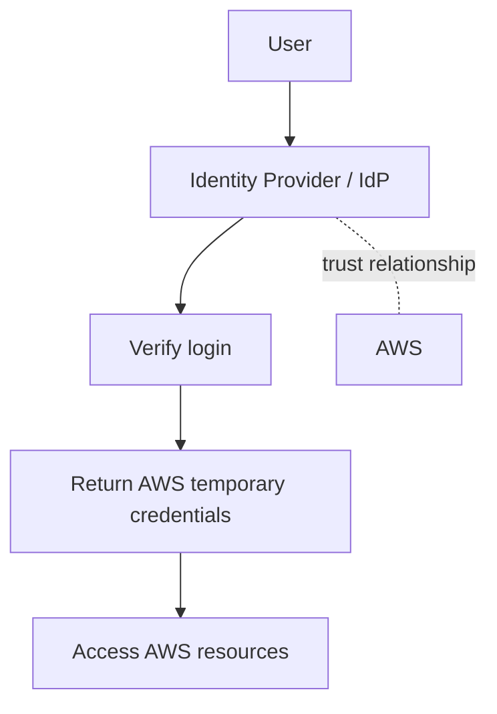
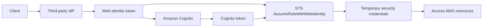

# 7. Identity Federation & Cognito

## 🎯 Giới thiệu
Identity Federation trong AWS dùng để cấp quyền truy cập AWS resources cho người dùng nằm ngoài AWS mà không cần tạo riêng IAM user cho từng người.

- Mục tiêu chính:
  - Quản lý user ở bên ngoài AWS, ví dụ trong corporate directory
  - Dùng **temporary credentials** thay vì IAM user cố định
- Use case được nhắc đến:
  - Doanh nghiệp có hệ thống identity riêng như **Active Directory**
  - Web/mobile application cần truy cập AWS resources

### Mermaid: Flow tổng quát

## 1. SAML 2.0 Federation
**SAML 2.0** là cách federation truyền thống, dùng chuẩn mở **Security Assertion Markup Language**.

- Hỗ trợ:
  - **ADFS**
  - **Microsoft Active Directory**
  - Bất kỳ **SAML 2.0-compatible IDP**
- Có thể truy cập:
  - AWS console
  - AWS CLI
  - AWS APIs
- Không cần tạo IAM user cho từng nhân viên
- Cần thiết lập trust relationship giữa AWS và identity provider

### Luồng SAML 2.0
- User đăng nhập vào **IdP**
- IdP kiểm tra qua identity store như **LDAP**
- Nếu hợp lệ, IdP trả về **SAML assertion**
- User gọi **STS AssumeRoleWithSAML**
- STS xác thực assertion và trả về **temporary security credentials**
- User dùng credentials đó để gọi AWS APIs

### Console flow
- Tương tự API flow
- User được chuyển tới endpoint **AWS sign-in /SAML**
- STS trả về **sign-in URL**
- User được redirect vào **AWS Management Console**

### ADFS
- **ADFS** là **Identity Provider**
- **Active Directory** là directory/identity store phía dưới
- Đây là cùng cơ chế, chỉ khác vai trò giữa IdP và directory

## 2. Custom Identity Broker
Cách này dùng khi identity provider **không tương thích SAML 2.0**.

- User đăng nhập vào **custom identity broker**
- Broker tự xác thực user
- Broker trực tiếp yêu cầu AWS cấp temporary credentials
- Broker phải tự quyết định **IAM role** phù hợp cho user

### Điểm chính
- Không có AWS API kiểu SAML để dùng trực tiếp
- Broker gọi thẳng **STS**
- API được nhắc đến:
  - **AssumeRole**
  - **GetFederationToken**
- Sau khi nhận credentials:
  - Gửi lại cho user
  - User truy cập AWS APIs hoặc được redirect vào console

## 3. Web Identity Federation & Cognito
Web Identity Federation dùng khi user đến từ môi trường không thuộc doanh nghiệp nội bộ, và xác thực qua bên thứ ba.

### Web Identity Federation không dùng Cognito
- IdP có thể là:
  - Amazon
  - Google
  - Facebook
  - Bất kỳ **OpenID Connect-compatible IDP**
- Flow:
  - Client login vào third-party IdP
  - Nhận **web identity token**
  - Gọi **STS AssumeRoleWithWebIdentity**
  - Nhận **temporary security credentials**
  - Dùng credentials để truy cập AWS resources

### Web Identity Federation với Cognito
AWS khuyến nghị dùng **Cognito** thay vì bản không Cognito.

- Lý do theo transcript:
  - **More secure**
  - **More simple**
  - Hỗ trợ **least privilege**
- Flow:
  - Client authenticate với third-party IdP
  - Nhận token
  - Token được exchange với **Amazon Cognito**
  - Cognito trả về **Cognito token**
  - Cognito token được exchange với **STS**
  - STS trả về temporary security credentials
  - Client truy cập AWS resources trực tiếp

### Cognito mang lại
- Hỗ trợ **anonymous users**
- Hỗ trợ **MFA**
- Hỗ trợ **data synchronization**
- Cognito hoạt động như một **token vending machine**
  - Exchange token lấy credentials

### IAM policy restriction trong Web Identity Federation
Có thể dùng **IAM policy variables** để giới hạn truy cập theo user.

- Ví dụ ý tưởng:
  - Chỉ cho user list bucket theo prefix tương ứng với **user ID**
  - Chỉ cho **get / put / update objects** trong prefix đó
- Các biến được nhắc đến:
  - `identity.amazon.com:sub`
  - `amazon.com:user_id`
- Mục tiêu:
  - Ràng buộc quyền theo từng user
  - Bảo đảm giới hạn đúng phạm vi cần thiết

### Mermaid: Web Identity / Cognito flow

## 📊 Bảng tóm tắt
| Tiêu chí | Mô tả |
|----------|------|
| Mục tiêu | Cho user bên ngoài AWS truy cập AWS resources mà không cần IAM user riêng |
| Cơ chế chung | User đăng nhập IdP, nhận **temporary credentials**, rồi truy cập AWS |
| SAML 2.0 Federation | Dùng **SAML assertion** và **STS AssumeRoleWithSAML** |
| Custom Identity Broker | Dùng khi IdP không hỗ trợ SAML 2.0; broker gọi **STS AssumeRole / GetFederationToken** |
| Web Identity Federation | Dùng token từ third-party IdP và **STS AssumeRoleWithWebIdentity** |
| Cognito | Phương án được khuyến nghị; exchange token sang credentials, hỗ trợ anonymous users, MFA, data synchronization |
| IAM Policy Variables | Dùng để giới hạn quyền theo user, ví dụ theo prefix trong S3 |

## 💡 Mẹo ghi nhớ cho kỳ thi AWS
- **SAML 2.0 = enterprise federation cổ điển**
  - Nhớ **STS AssumeRoleWithSAML**
- **Custom Identity Broker = IdP không hỗ trợ SAML**
  - Broker chịu trách nhiệm chọn role và xin credentials từ STS
- **Web Identity Federation = bên thứ ba**
  - Nhớ **STS AssumeRoleWithWebIdentity**
- **Cognito = recommended way**
  - “Token vending machine” theo transcript
- Khi cần giới hạn theo từng user trong S3:
  - Nghĩ đến **IAM policy variables** và **prefix theo user ID**
- Nếu thấy **ADFS**:
  - **ADFS** là IdP
  - **Active Directory** là directory phía dưới

## ✅ Kết luận
Identity Federation giúp user ngoài AWS truy cập AWS resources bằng **temporary credentials** thay vì IAM user cố định. Ba cơ chế chính trong transcript là **SAML 2.0 Federation**, **Custom Identity Broker**, và **Web Identity Federation**. Trong đó, **Cognito** là cách được khuyến nghị hơn cho web identity, còn **STS** là dịch vụ trung tâm cấp credentials trong toàn bộ các flow này.
