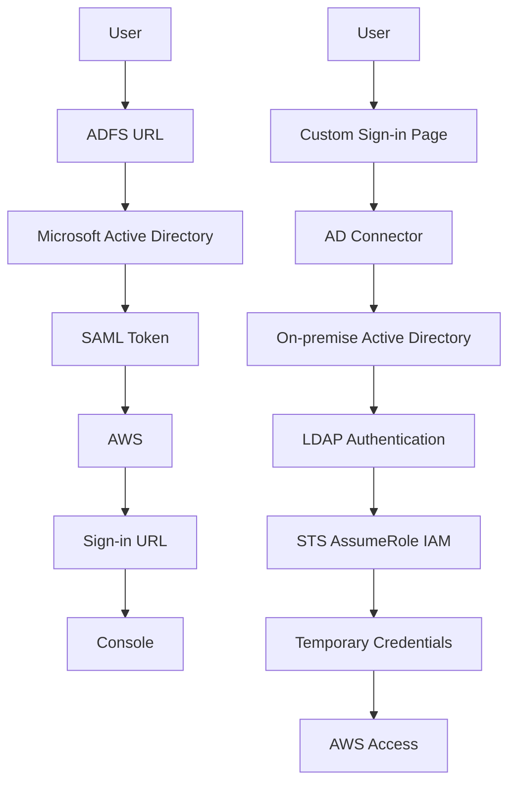
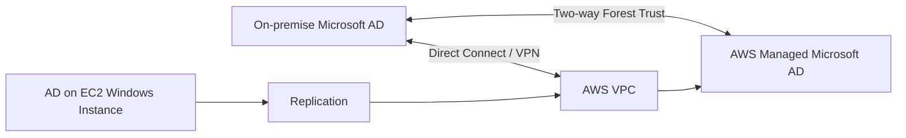

# 8. AWS Directory Services

## 🎯 Giới thiệu
AWS Directory Services là nhóm dịch vụ **managed service** của AWS để làm việc với **Microsoft Active Directory (AD)** và các mô hình directory liên quan.

Điểm cần nhớ cho kỳ thi:
- AWS exam rất hay hỏi về **Microsoft AD**, **AD Connector**, **Simple AD**
- Phải phân biệt rõ:
  - **Users được quản lý ở đâu**
  - **Có trust hay không**
  - **Có support MFA, SSO, seamless domain join hay không**
  - **Có cần Direct Connect / VPN hay không**

## 1. Microsoft Active Directory và ADFS

### Microsoft AD là gì
- Chạy trên Windows Server có **AD Domain Services**
- Là một **database of objects**:
  - user accounts
  - computers
  - printers
  - file shares
  - security groups
- Dùng để **centralized security management**
- Các object được tổ chức thành:
  - **tree**
  - nhiều tree tạo thành **forest**

### Cách hoạt động ở mức cao
- Có **domain controller**
- User đăng nhập bằng username/password
- Domain controller kiểm tra login cho các máy trong domain
- Giúp đồng bộ đăng nhập trong môi trường Microsoft

### ADFS là gì
- **ADFS** cung cấp **Single-Sign On**
- Dùng **SAML** với third-party applications như:
  - Console
  - Dropbox
  - Office 365
- Flow trong transcript:
  - User truy cập URL
  - Xác thực qua Microsoft AD
  - Nhận **SAML Token**
  - Đổi token với AWS để lấy **sign-in URL** cho Console

## 2. AWS Directory Services: 3 lựa chọn chính

### 1) AWS Managed Microsoft AD
- Microsoft AD chạy trong AWS
- Có thể:
  - tạo AD trong Cloud
  - manage users locally
  - hỗ trợ **MFA**
- Có thể thiết lập **trust** với on-premise AD
- Deploy trong **VPC**
- Thường có:
  - **2 AZ**
  - **2 AD Domain Controllers** để high availability
- Có thể tăng scale bằng cách thêm Domain Controllers
- Có:
  - **automated backups**
  - **automated multi-region replication** nếu cần
- Tích hợp tốt với:
  - **RDS for SQL Server**
  - **WorkSpaces**
  - **QuickSight**
  - **Connect**
  - **WorkDocs**
  - **Single Sign-On**
  - traditional AD apps như .NET Apps, SharePoint, SQL Server trên EC2
- Có **seamless domain join** từ EC2 instances ở nhiều accounts/VPCs

### 2) AD Connector
- Là **proxy/gateway**
- Dùng để chuyển request từ Cloud về **on-premise AD**
- Users **chỉ được quản lý ở on-premise**
- Không có caching capability
- Không có trust setup
- Cần **VPN** hoặc **Direct Connect**
- Flow trong transcript:
  - user nhập credentials trên custom sign-in page
  - page gọi AD Connector
  - AD Connector proxy request về on-premise AD
  - thực hiện **LDAP authentication**
  - nếu hợp lệ, dùng **STS AssumeRole IAM**
  - trả về temporary credentials để user vào AWS
- Nếu connection down thì AD Connector gần như **useless**

### 3) Simple AD
- Là lựa chọn **rẻ hơn**, **đơn giản hơn**
- **Không phải Microsoft AD**
- Là **AD-compatible API** dựa trên **Samba**
- Managed trong AWS nhưng **standalone**
- Không thể join với on-premise AD
- Chỉ có các tính năng cơ bản:
  - join EC2 instances
  - manage users and groups
- Không hỗ trợ:
  - **MFA**
  - **RDS SQL Server integration**
  - **SSO**
  - trust với on-premise Microsoft AD
- Phù hợp cho:
  - ít user
  - quy mô nhỏ, khoảng **500 đến 5,000 users** tùy tier

## 3. Trust, replication và kiến trúc thường gặp

### Trust giữa on-premise AD và AWS Managed Microsoft AD
- Cần **Direct Connect** hoặc **VPN**
- Có 3 kiểu trust:
  - one-way: AWS trust on-premise
  - one-way: on-premise trust AWS
  - **two-way forest trust**: hai bên trust lẫn nhau
- Điểm quan trọng:
  - **forest trust khác synchronization**
  - transcript nói **replication không được support**
  - user vẫn sống độc lập ở mỗi Microsoft AD
  - nhờ trust, hai bên có thể hỏi lẫn nhau khi thiếu user

### Kiến trúc replication trong transcript
- Nếu muốn replica on-premise AD lên AWS để:
  - giảm latency
  - có disaster recovery khi Direct Connect / VPN down
- Theo transcript:
  - phải deploy AD trên **EC2 Windows instance**
  - tự set up replication
  - sau đó có thể thiết lập **two-way forest trust** giữa EC2-based AD và AWS Managed Microsoft AD DC

## 📊 Bảng tóm tắt
| Tiêu chí | Mô tả |
|----------|------|
| AWS Managed Microsoft AD | Microsoft AD trong AWS, support MFA, trust với on-premise, tích hợp nhiều dịch vụ AWS |
| AD Connector | Proxy đến on-premise AD, không cache, không trust, cần VPN/Direct Connect |
| Simple AD | Rẻ, đơn giản, Samba-based, chỉ có tính năng cơ bản, không join được on-premise AD |
| Managed Microsoft AD + on-premise | Có thể dùng trust, nhưng transcript nhấn mạnh không phải synchronization |
| Triển khai high availability | 2 AZ tối thiểu, có thể thêm Domain Controllers |
| Tích hợp mạnh nhất | AWS Managed Microsoft AD |
| Phù hợp quy mô nhỏ | Simple AD |
| Xác thực qua proxy | AD Connector |

## 💡 Mẹo ghi nhớ cho kỳ thi AWS
- **Managed Microsoft AD** = lựa chọn mạnh nhất, tích hợp nhiều nhất, có **MFA**, có **trust**, có **seamless domain join**
- **AD Connector** = chỉ là **proxy**, user vẫn ở **on-premise**
- **Simple AD** = **rẻ nhất** và **đơn giản nhất**, nhưng ít tính năng nhất
- Nhớ câu:
  - **Managed = chạy trong AWS**
  - **Connector = nối về on-premise**
  - **Simple = basic, low cost**
- Nếu đề bài nhấn mạnh:
  - **SSO / MFA / trust / AWS integration** -> nghĩ tới **AWS Managed Microsoft AD**
  - **không muốn di chuyển user lên cloud** -> nghĩ tới **AD Connector**
  - **chi phí thấp, nhu cầu cơ bản** -> nghĩ tới **Simple AD**
- Với trust, nhớ rõ:
  - **trust != replication**
  - transcript nói **replication không được support** giữa hai Microsoft AD theo cách đó

## ✅ Kết luận
AWS Directory Services có 3 lựa chọn chính:
- **AWS Managed Microsoft AD**: mạnh nhất, nhiều tích hợp nhất
- **AD Connector**: proxy về on-premise AD
- **Simple AD**: đơn giản, chi phí thấp, tính năng cơ bản

Trong kỳ thi, trọng tâm là xác định đúng:
- user được quản lý ở đâu
- có trust hay không
- có cần VPN / Direct Connect hay không
- có yêu cầu MFA, SSO, seamless domain join hay không
