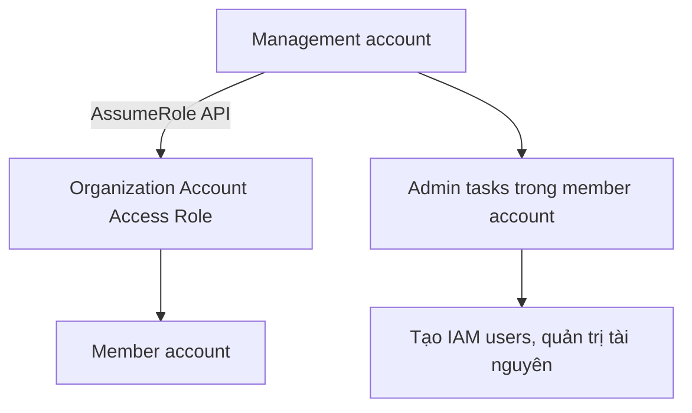
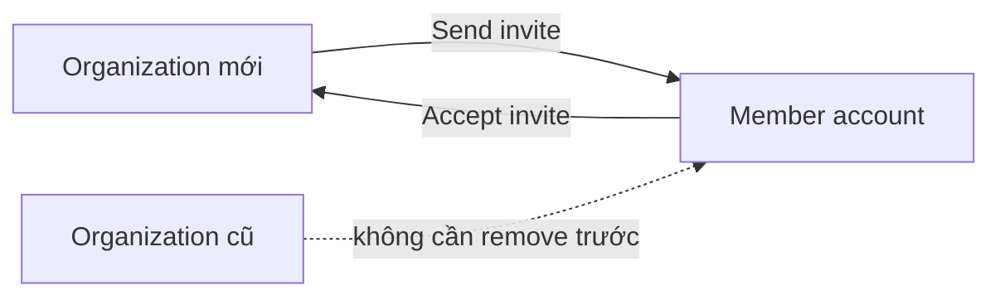

# 9. AWS Organizations

## 🎯 Giới thiệu
- **AWS Organizations** là cách quản lý **nhiều AWS accounts** cùng lúc.
- Cấu trúc chính:
  - **Root OU** ở trên cùng
  - **Management account**: tài khoản dùng cho mọi tác vụ quản trị
  - **Member accounts**: các AWS account bình thường thuộc tổ chức
  - Có thể có **OU within OU** như `prod -> HR OU`, `finance OU`, v.v.
- AWS Organizations phù hợp khi muốn tổ chức account theo:
  - **department**
  - **cost center**
  - **environment**: dev / test / prod
  - **regulatory restrictions**
  - **resource isolation**
  - **logging** hoặc **security account** trung tâm

## 1. 🏗️ Cấu trúc tổ chức và chiến lược nhiều account
- Một tổ chức có thể có:
  - **OU cho dev**
  - **OU cho prod**
  - nhiều **member accounts** bên trong từng OU
- Có nhiều cách thiết kế:
  - **one account per department**
  - **one account per environment**
  - **one account per project**
  - **one account per VPC**
- Mục tiêu của kiến trúc nhiều account:
  - tách biệt tài nguyên tốt hơn
  - có **per-account service limits** riêng
  - dễ quản lý billing bằng **tagging standards**
  - gom log về **central account**:
    - **CloudTrail logs** đẩy vào **Amazon S3 bucket** trung tâm
    - có thể gom **CloudWatch logs** về tài khoản logging trung tâm
- Không có một guideline duy nhất, tùy kiến trúc bạn chọn.

## 2. 🔐 Organization Account Access Role
- Khi tạo **member account** bằng **AWS Organizations API**:
  - một IAM role được tạo tự động trong member account
  - role này là **Organization Account Access Role**
- **Management account** dùng **AssumeRole API** để assume role này và thực hiện admin task trên member account.
- Role này cấp **full administrator permissions** trong member account cho management account.
- Role cũng có thể được **IAM users** trong management account assume nếu được phép.
- Nếu **invite** một account đã tồn tại sẵn vào organization:
  - phải **tạo role này thủ công**
  - nếu không, sẽ không hoạt động đúng

## 3. 💰 Billing, sharing và chuyển account giữa organizations
- AWS Organizations có **2 feature modes** quan trọng:

### a) Consolidated billing
- Gom billing của tất cả accounts thành **một payment method** từ **management account**
- Lợi ích:
  - tận dụng **aggregated usage**
  - nhận **volume discounts**
  - ví dụ: **EC2**, **Amazon S3**, và các dịch vụ khác
- Tất cả accounts được xem như một khối cho mục đích billing

### b) All features
- Bao gồm **consolidated billing**
- Thêm **SCP feature** để kiểm soát member accounts
- Account được invite phải **approve** chế độ all features trước
- Khi đã bật all features:
  - có thể dùng **SCP**
  - có thể ngăn member account rời khỏi organization
  - **không thể quay lại** chế độ chỉ consolidated billing

### c) Shared RI / Savings Plans
- Trong consolidated billing, **reserved instances** được tính chia sẻ giữa các accounts trong organization
- Nghĩa là:
  - một account mua RI
  - account khác trong organization vẫn có thể nhận benefit theo giờ
- **Management account / payer account** có thể tắt:
  - **RI sharing**
  - **Savings Plan discount sharing**
- Để discount được chia sẻ giữa 2 accounts:
  - **cả hai account** phải bật sharing
- Đây là điểm dễ bị hỏi trong exam

### d) Chuyển account giữa 2 organizations
- Quy trình:
  1. Gửi **invite** từ organization mới đến member account
  2. Member account **accept invite**
- Không cần bước cũ là phải xóa account khỏi organization trước đó.

## 📊 Bảng tóm tắt
| Tiêu chí | Mô tả |
|----------|------|
| Mục đích | Quản lý nhiều AWS accounts cùng lúc |
| Cấu trúc | Root OU, management account, member accounts, OU within OU |
| Quản trị | Management account assume **Organization Account Access Role** bằng **AssumeRole API** |
| Billing | **Consolidated billing** gom hóa đơn và thanh toán |
| Chế độ nâng cao | **All features** thêm **SCP** và cần account được invite approve trước |
| Sharing | **RI** và **Savings Plan** có thể chia sẻ giữa accounts nếu bật sharing |
| Chuyển organization | Invite account vào org mới rồi accept, không cần remove khỏi org cũ trước |

## 💡 Mẹo ghi nhớ cho kỳ thi AWS
- **Management account** là tài khoản quản trị, không nhầm với **member account**.
- **Organization Account Access Role** là role quan trọng nhất để management account quản trị member account.
- Nếu account được **create bằng Organizations API** thì role được tạo tự động.
- Nếu account được **invite từ bên ngoài** thì phải **create role thủ công**.
- **Consolidated billing** = gom billing + nhận lợi ích từ usage tổng hợp.
- **All features** = consolidated billing + **SCP**.
- Muốn chia sẻ **RI / Savings Plan** thì **cả hai account** phải bật sharing.
- Chuyển account giữa organizations: **invite → accept**.

## ✅ Kết luận
- AWS Organizations giúp tổ chức **multi-account strategy** rõ ràng, tách biệt theo **dev/prod**, **department**, **project** hoặc **security/logging**.
- Điểm cần nhớ nhất cho exam là:
  - cấu trúc **root OU / management account / member accounts**
  - **Organization Account Access Role**
  - **consolidated billing**
  - **all features + SCP**
  - quy tắc **RI / Savings Plan sharing**
  - quy trình **move account** giữa organizations
