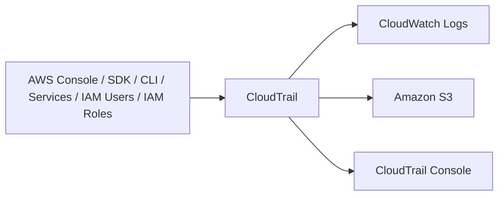
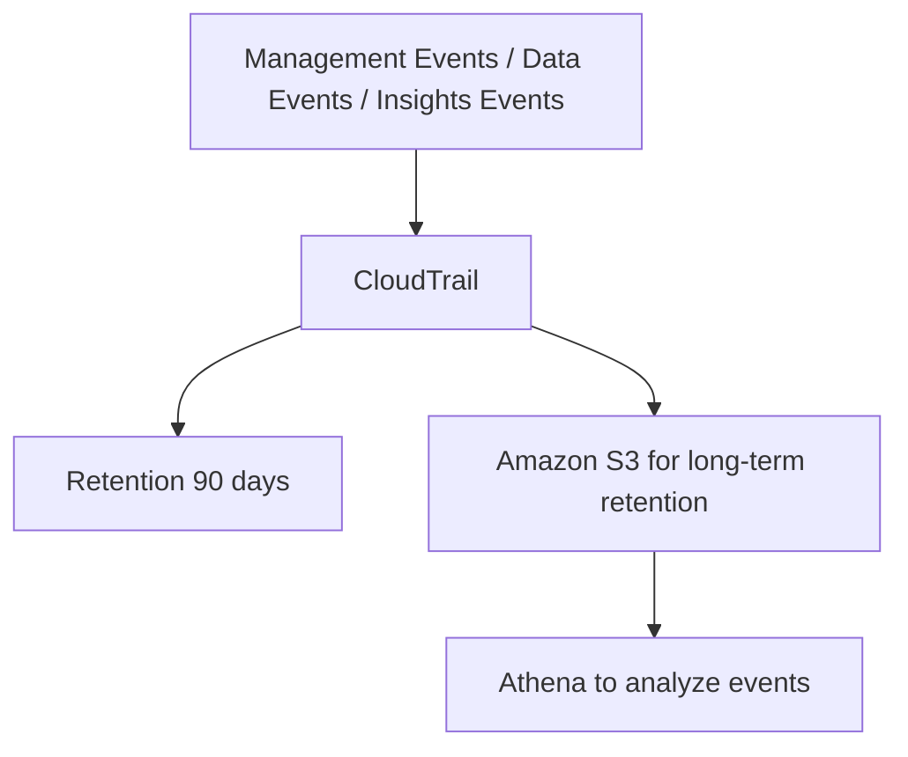

# 15. CloudTrail

## 🎯 Giới thiệu
CloudTrail là dịch vụ dùng để theo dõi **governance, compliance, audit** cho AWS Accounts.

- **Enabled by default**
- Ghi lại lịch sử của:
  - **events**
  - **API Calls**
- Nguồn tạo log:
  - AWS Console
  - SDK
  - CLI
  - Other AWS services
  - IAM Users
  - IAM Roles

CloudTrail giúp bạn trả lời các câu hỏi như:
- Ai đã làm gì?
- Làm khi nào?
- Từ đâu phát sinh action đó?

## 1. CloudTrail log và lưu trữ
CloudTrail có thể gửi log sang:
- **CloudWatch Logs**
- **Amazon S3**

Bạn có thể tạo **trail** để:
- Áp dụng cho **all regions**
- Hoặc **single region**

Mục đích là gom lịch sử events từ nhiều region về một nơi, ví dụ một **S3 bucket**.

### 🔁 Luồng tổng quát

## 2. Các loại events trong CloudTrail
CloudTrail có **3 kinds of events**:

### a. Management Events
- Là các operations được thực hiện trên resources trong AWS Accounts
- Mặc định **trail** luôn log **Management Events**
- Ví dụ:
  - `IAM AttachRolePolicy`
  - Tạo subnet
  - Set up logging
- Gồm 2 loại:
  - **Read Events**: không modify resources, ví dụ list users, list EC2 instances
  - **Write Events**: có thể modify resources, ví dụ delete DynamoDB table

### b. Data Events
- Mặc định **không được log**
- Lý do: high volume operations
- Ví dụ:
  - S3 object-level activity
  - `GetObject`
  - `PutObject`
  - `DeleteObject`
- Cũng chia thành:
  - **Read Event**: `GetObject`
  - **Write Event**: `PutObject`, `DeleteObject`

### c. Lambda function execution activities
- Ghi nhận hoạt động khi dùng **Invoke API**
- Giúp biết Lambda function được invoke bao nhiêu lần
- Đây cũng có thể là high volume

## 3. CloudTrail Insights và retention
### a. CloudTrail Insights
CloudTrail Insights phải:
- **Enable**
- **Pay for it**

Nó phân tích event để phát hiện **unusual activity**.

Ví dụ các dấu hiệu bất thường:
- Inaccurate resource provisioning
- Hitting service limits
- Burst of AWS IAM actions
- Gaps in periodic maintenance activity

Cách hoạt động:
- CloudTrail phân tích normal management activities để tạo **baseline**
- Sau đó liên tục phân tích các thay đổi để phát hiện pattern bất thường
- Khi có bất thường, nó tạo **Insights Event**

Insights Event sẽ xuất hiện ở:
- **CloudTrail console**
- **Amazon industry** theo transcript
- **EventBridge Event**
- Và có thể dùng để automate, ví dụ gửi email

### b. CloudTrail Event Retention
- Mặc định events được lưu **90 days** trong CloudTrail
- Sau đó sẽ bị xóa
- Nếu muốn giữ lâu hơn:
  - Log events vào **S3**
  - Dùng **Athena** để query và phân tích dữ liệu trong S3

### 🔁 Luồng retention và phân tích

## 📊 Bảng tóm tắt
| Tiêu chí | Mô tả |
|----------|------|
| Mục đích | Governance, compliance, audit cho AWS Accounts |
| Trạng thái mặc định | Enabled by default |
| Nguồn log | Console, SDK, CLI, AWS services, IAM Users, IAM Roles |
| Lưu trữ | CloudWatch Logs, Amazon S3 |
| Trail scope | All regions hoặc single region |
| Management Events | Log mặc định, gồm Read Events và Write Events |
| Data Events | Không log mặc định, high volume, gồm S3 object-level activity |
| Lambda events | Ghi nhận Invoke API và execution activities |
| CloudTrail Insights | Phát hiện unusual activity, cần enable và trả phí |
| Retention | 90 days mặc định, muốn lâu hơn thì lưu vào S3 và query bằng Athena |

## 💡 Mẹo ghi nhớ cho kỳ thi AWS
- **CloudTrail = ai làm gì, khi nào, từ đâu**
- **Management Events**: mặc định được log
- **Data Events**: không log mặc định vì high volume
- **Write Events** thường quan trọng hơn **Read Events** vì có thể làm thay đổi resource
- Muốn giữ log **hơn 90 days** thì đẩy sang **S3**
- Muốn query log lâu dài thì dùng **Athena**
- **CloudTrail Insights** dùng để phát hiện hành vi bất thường và phải **enable** riêng

## ✅ Kết luận
CloudTrail là dịch vụ cốt lõi để **audit và track activity** trong AWS. Bạn cần nhớ rõ:
- nó ghi lại **API Calls và events**
- có **Management Events, Data Events, Lambda events, Insights Events**
- mặc định lưu **90 days**
- muốn phân tích lâu dài thì dùng **S3 + Athena**
- muốn phát hiện bất thường thì dùng **CloudTrail Insights**
