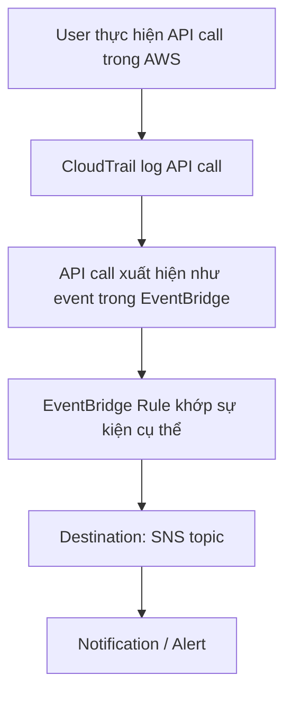

# 16. CloudTrail - EventBridge Integration

## 🎯 Giới thiệu
- Một tích hợp rất quan trọng cần nhớ là **CloudTrail** kết hợp với **Amazon EventBridge** để **intercept các API calls**.
- Ý chính:
  - Mọi API call trong AWS đều được **log trong CloudTrail**.
  - Các API call đó cũng sẽ xuất hiện dưới dạng **events trong Amazon EventBridge**.
  - Từ đó có thể tạo **rule** để phát hiện một API call rất cụ thể và gửi cảnh báo qua **SNS**.

## 1. Cơ chế hoạt động
- Khi một API call xảy ra trong AWS:
  - CloudTrail ghi nhận API call đó.
  - EventBridge nhận event tương ứng từ API call đó.
- Có thể lọc theo một API call rất cụ thể để tạo rule.
- Rule sau đó sẽ chuyển sự kiện đến destination như **Amazon SNS** để tạo alert.

## 2. Các ví dụ trong transcript
- **DeleteTable API call** trên **DynamoDB**
  - Có thể nhận SNS notification khi user xóa table.
- **AssumeRole** trong **IAM**
  - Đây là API trong IAM và sẽ được CloudTrail log.
  - EventBridge có thể dùng để gửi message vào **SNS topic**.
- **AuthorizeSecurityGroupIngress** trong **EC2**
  - Đây là API call thay đổi **Security Group inbound rules**.
  - CloudTrail log API call này.
  - EventBridge có thể trigger notification trong SNS.

## 3. Ý nghĩa khi học AWS
- Tích hợp này giúp theo dõi các hành động quan trọng ở mức **API call**.
- Có thể dùng để:
  - phát hiện thay đổi nhạy cảm,
  - tạo cảnh báo tức thì,
  - theo dõi hành động quản trị trong account.
- Transcript nhấn mạnh rằng khả năng áp dụng là rất rộng, miễn là API call đó được CloudTrail ghi lại và EventBridge bắt được event tương ứng.

## 📊 Bảng tóm tắt
| Tiêu chí | Mô tả |
|----------|------|
| Thành phần chính | CloudTrail, EventBridge, SNS |
| Dữ liệu đầu vào | API calls trong AWS |
| Vai trò của CloudTrail | Log mọi API call |
| Vai trò của EventBridge | Nhận API calls dưới dạng events và tạo rule |
| Destination | SNS topic để gửi notification |
| Ví dụ API | `DeleteTable`, `AssumeRole`, `AuthorizeSecurityGroupIngress` |

## 💡 Mẹo ghi nhớ cho kỳ thi AWS
- Nhớ chuỗi này: **API call -> CloudTrail log -> EventBridge event -> Rule -> SNS alert**.
- Nếu đề bài nói về **cảnh báo khi có API call cụ thể**, hãy nghĩ ngay đến **CloudTrail + EventBridge + SNS**.
- Các ví dụ hay gặp trong transcript:
  - **DynamoDB DeleteTable**
  - **IAM AssumeRole**
  - **EC2 AuthorizeSecurityGroupIngress**

## ✅ Kết luận
- **CloudTrail** ghi nhận API calls.
- **EventBridge** nhận các API calls đó như events.
- Có thể tạo **rule** để phát hiện hành vi cụ thể và gửi cảnh báo qua **SNS**.
- Đây là một tích hợp rất quan trọng để theo dõi và phản ứng với các API actions trong AWS.
