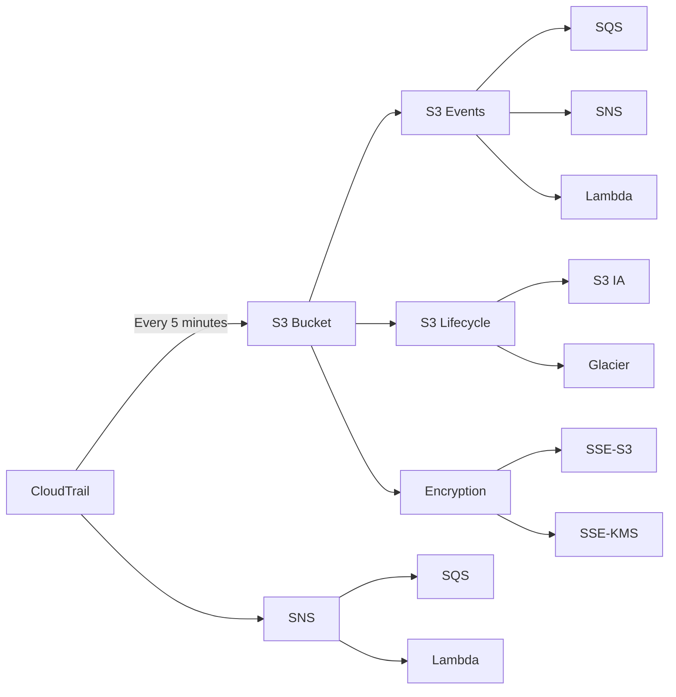

# 17. CloudTrail - SA Pro

## 🎯 Giới thiệu
- **CloudTrail** thường được dùng cùng **S3, CloudWatch Logs, EventBridge, SNS, SQS, Lambda** để tạo nhiều kiến trúc khác nhau.
- Trọng tâm của bài này là:
  - **Lưu trữ log**
  - **Phát hiện hành vi/API bất thường**
  - **Thiết kế multi-account / organization**
  - **Chọn đúng dịch vụ theo mục tiêu phản ứng**

## 1. CloudTrail + S3: lưu trữ, bảo vệ và phân tích log
- CloudTrail có thể **đổ log vào S3 mỗi 5 phút**.
- Mã hóa:
  - Mặc định: **SSE-S3**
  - Có thể cấu hình thủ công: **SSE-KMS**
- Khi log nằm trong S3, có thể tận dụng thêm các tính năng:
  - **Versioning** để tránh xóa nhầm
  - **MFA Delete** để tăng bảo vệ xóa
  - **S3 Lifecycle Policy** để chuyển sang **S3 IA** hoặc **Glacier**
  - **S3 Object Lock** để ngăn xóa và sửa object
  - **CloudTrail log file integrity validation** để kiểm tra log không bị thay đổi
- Có thể dùng **S3 events** để kích hoạt:
  - **SQS**
  - **SNS**
  - **Lambda**
- Ngoài ra, CloudTrail cũng có thể **gửi notifications trực tiếp vào SNS**, rồi từ SNS kích hoạt tiếp **SQS** hoặc **Lambda**.

## 2. Multi-account / Organizational trail
- CloudTrail có thể là **multi-account** và **multi-region**.
- Với **AWS Organizations**:
  - **Organizational trail** được tạo ở **management account**
  - Không tạo ở member accounts
- Tất cả events từ các member accounts sẽ được monitor bởi trail này.
- Log được gửi về **S3 bucket trong management account**.
- Nếu cần đọc log từ account khác:
  - Có thể dùng **cross-account role**
  - Hoặc chỉnh **S3 bucket policy** để cho phép đọc
- Với cross-account delivery, **S3 bucket policy** là phần cần thiết và dễ quản lý để CloudTrail ghi log vào S3 của security account.
- Mô hình này phù hợp khi muốn có một **security account** trung tâm để giữ log an toàn lâu dài.

## 3. Cảnh báo và phản ứng sự kiện
- **CloudTrail event delivery** có thể mất tới **15 phút**.
- Nếu muốn phản ứng nhanh nhất với API call:
  - Dùng **EventBridge**
- Nếu muốn phân tích, đếm, phát hiện bất thường:
  - Dùng **CloudWatch Logs**
  - Tạo **metric filter**
  - Tạo **CloudWatch alarm**
- Một số use case của metric filter:
  - Đếm số lần gọi một API cụ thể, ví dụ **terminate EC2 instances**
  - Đếm API calls theo user
  - Phát hiện số lượng lớn **denied API calls**
  - Phát hiện mức độ API activity cao bất thường
- Khi alarm kích hoạt, có thể đẩy sang:
  - **SNS**
  - Sau đó từ SNS sang **Lambda** hoặc **SQS**
- Nếu muốn analytics và lưu trữ quy mô lớn:
  - Dùng **Amazon S3**
- So sánh theo mục tiêu:
  - **Nhanh nhất để phản ứng**: **EventBridge**
  - **Đếm / phát hiện anomaly**: **CloudWatch Logs**
  - **Analytics scale lớn / lưu trữ dài hạn**: **Amazon S3**

## 📊 Bảng tóm tắt
| Tiêu chí | Mô tả |
|----------|------|
| CloudTrail → S3 | Log được đổ vào S3 mỗi **5 phút** |
| Mã hóa | Mặc định **SSE-S3**, có thể dùng **SSE-KMS** |
| Bảo vệ log | **Versioning**, **MFA Delete**, **Object Lock**, **Integrity validation** |
| Lưu trữ dài hạn | **S3 Lifecycle** chuyển sang **S3 IA** hoặc **Glacier** |
| Phản ứng nhanh | **EventBridge** là lựa chọn nhanh nhất |
| Cảnh báo / anomaly | **CloudWatch Logs + metric filter + alarm** |
| Multi-account | **Organizational trail** tạo ở **management account** |
| Cross-account delivery | Dùng **S3 bucket policy** hoặc **cross-account role** |
| Mục tiêu analytics | **Amazon S3** phù hợp cho phân tích và lưu trữ quy mô lớn |

## 💡 Mẹo ghi nhớ cho kỳ thi AWS
- **CloudTrail → S3**: nhớ mốc **5 minutes**.
- **CloudTrail event delivery**: nhớ có thể mất tới **15 minutes**.
- Muốn **react fastest** với API call: chọn **EventBridge**.
- Muốn **count / detect anomalies**: chọn **CloudWatch Logs**.
- Muốn **long-term storage + analytics**: chọn **S3**.
- Với **AWS Organizations**, **organizational trail** luôn nằm ở **management account**.
- Khi đọc log cross-account, nghĩ đến **S3 bucket policy** hoặc **cross-account role**.
- Với bảo vệ log trong S3, nhớ bộ từ khóa:
  - **Versioning**
  - **MFA Delete**
  - **Object Lock**
  - **SSE-S3 / SSE-KMS**
  - **Integrity validation**

## ✅ Kết luận
- CloudTrail không chỉ dùng để ghi audit log, mà còn là điểm khởi đầu cho nhiều kiến trúc với **S3, CloudWatch Logs, EventBridge, SNS, SQS, Lambda**.
- Khi ôn thi, hãy luôn gắn **mục tiêu use case** với đúng dịch vụ:
  - **Nhanh nhất** → **EventBridge**
  - **Theo dõi và đếm** → **CloudWatch Logs**
  - **Lưu trữ và phân tích lớn** → **S3**
- Với **Organizations**, nhớ rõ **organizational trail** được tạo ở **management account** và có thể gom log từ nhiều account về một nơi an toàn.
