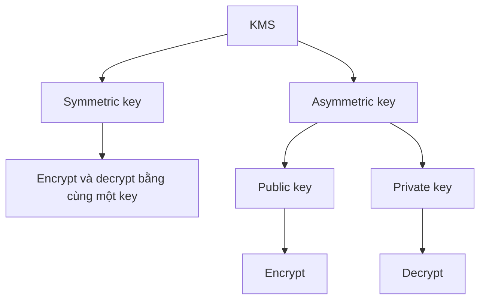
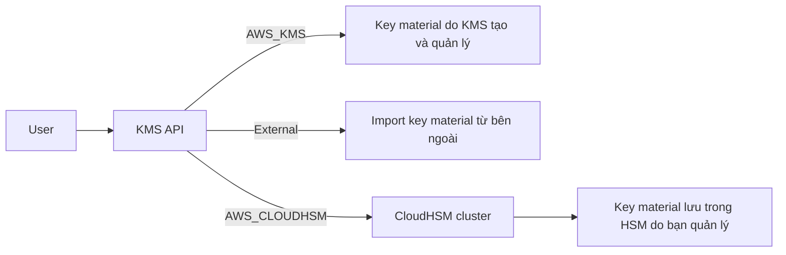
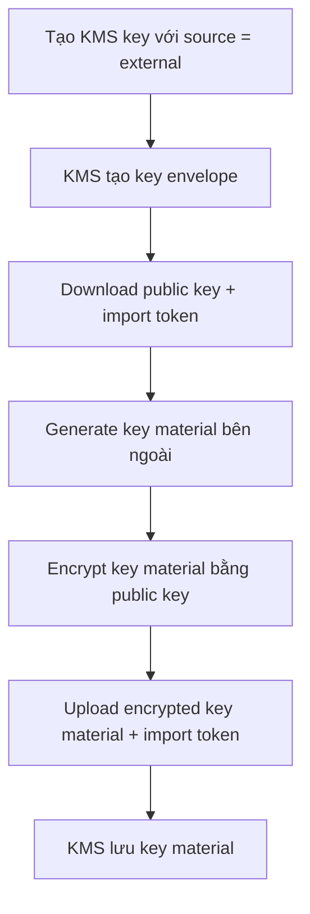

# 18. KMS

## 🎯 Giới thiệu
AWS KMS (Key Management Service) là dịch vụ quản lý khóa mã hóa trong AWS. Khi nhắc đến encryption trong AWS, cần nghĩ ngay đến KMS.

- KMS giúp kiểm soát truy cập vào dữ liệu và để AWS quản lý encryption keys.
- Tích hợp chặt với IAM để authorization.
- Tích hợp mượt với nhiều dịch vụ AWS như: `EBS`, `S3`, `Redshift`, `RDS`, `SSM`, ...
- `KMS keys` là **regional**: key chỉ dùng được trong region nơi nó được tạo.

## 1. Loại KMS key
KMS có 2 loại key chính: `symmetric keys` và `asymmetric keys`.

### `Symmetric keys`
- Là kiểu key đầu tiên của KMS.
- Dùng **một encryption key duy nhất** để cả encrypt và decrypt.
- Các dịch vụ tích hợp với AWS KMS đều dùng `symmetric KMS keys`.
- Cần thiết cho `envelope encryption`.
- Không bao giờ lấy được key ở dạng unencrypted hay truy cập trực tiếp vào key material.
- Phải dùng qua `KMS API call`.

### `Asymmetric keys`
- Là kiểu key mới hơn.
- Là một key pair gồm:
  - `public key` để encrypt
  - `private key` để decrypt
- Hữu ích cho các thao tác:
  - `encrypt/decrypt`
  - `sign/verify`
- Có thể download `public key`.
- Có thể dùng `public key` ở môi trường không tin cậy.
- `private key` vẫn không thể dùng trực tiếp; phải thông qua `KMS API`.
- Use case chính: encryption bên ngoài AWS bởi người dùng không thể gọi trực tiếp KMS API.

## 2. Các loại KMS key theo quyền sở hữu
### `Customer-managed keys`
- Do bạn tạo trực tiếp trong KMS.
- Bạn có thể:
  - create
  - manage
  - use
  - enable/disable
- Có thể bật `rotation policy` để rotate mỗi năm, key cũ vẫn được giữ lại.
- Có thể thêm `key policy` (resource policy cho KMS key).
- Có thể audit usage trong `CloudTrail`.
- Dùng cho `envelope encryption`.
- Đây là loại key bạn tự quản lý.

### `AWS-managed keys`
- Dùng riêng bởi các AWS services, ví dụ `aws/s3`, `aws/ebs`, ...
- Managed bởi AWS.
- Tự động rotate mỗi năm.
- Có thể xem key policy và audit trong `CloudTrail`.
- Không thể dùng cho encryption operations của riêng bạn.

### `AWS-owned keys`
- Do AWS tạo và quản lý.
- Dùng để bảo vệ resources của bạn.
- Có thể dùng across multiple AWS accounts.
- Không nằm trong account của bạn.
- Không thể view, use, track, hoặc audit.

| Loại key | Quản lý | Dùng trong account của bạn | Rotation | Audit |
|----------|---------|----------------------------|----------|-------|
| `Customer-managed key` | Bạn quản lý | Có | Có, hằng năm | Có, `CloudTrail` |
| `AWS-managed key` | AWS quản lý | Có | Có, tự động hằng năm | Có, `CloudTrail` |
| `AWS-owned key` | AWS quản lý | Không | Không nêu trong transcript | Không thể |

## 3. Key material origin, custom key store, và import external key
Khi tạo KMS key, phải chọn `key material origin`, và giá trị này **không thể đổi sau khi tạo**.

### `AWS_KMS`
- AWS tự động tạo, sinh, và quản lý key trong key store của KMS.

### `External`
- Bạn import key material vào KMS key.
- Bạn chịu trách nhiệm bảo mật và quản lý key material bên ngoài AWS.
- Có thể tạo key material bên ngoài rồi import vào KMS.

### `AWS_CLOUDHSM` custom key store
- Key material được tạo trực tiếp trong `HSM cluster` của bạn.
- KMS tích hợp với `CloudHSM`.
- Key nằm trong HSM cluster do bạn sở hữu và quản lý.
- KMS vẫn là nơi dùng để create, view, manage key qua `KMS API`.
- Mọi cryptographic operations diễn ra trong HSM.
- Use case:
  - cần direct control over HSMs
  - yêu cầu bảo mật cao hơn
  - cần lưu KMS keys trong một HSM environment riêng

### Quy trình import external key
- Tạo KMS key trong KMS với `source = external`.
- KMS tạo key envelope nhưng chưa có key material.
- Download `public key` và `import token`.
- Dùng `public key` với key material sinh bên ngoài để tạo encrypted key material.
- Gửi encrypted key material về KMS kèm `import token`.
- KMS decrypt và lưu key material vào KMS key.

## 4. `KMS multi-Region key`
- Có thể tạo key ở một region, ví dụ `us-east-1`, rồi replicate sang nhiều region khác.
- Các replica có:
  - cùng `key material`
  - cùng `key ID`
  - cùng `automatic rotation`
- Không phải global key.
- Có một `primary key` tại một region, các key khác là `replicas`.
- Mỗi key có thể được quản lý độc lập.
- Có thể promote một replica thành primary key.

### Use cases
- `disaster recovery`
- `global data management`
- `DynamoDB global tables`
- `active-active application` chạy trên nhiều region
- distributed signing applications

## 📊 Bảng tóm tắt
| Tiêu chí | Mô tả |
|----------|------|
| Mục đích | Quản lý encryption keys trong AWS |
| Phạm vi | `Regional`, key chỉ dùng được trong region tạo ra |
| Loại key | `Symmetric` và `Asymmetric` |
| Tích hợp | `IAM`, `EBS`, `S3`, `Redshift`, `RDS`, `SSM`, ... |
| Quản lý key | `Customer-managed`, `AWS-managed`, `AWS-owned` |
| Key material origin | `AWS_KMS`, `External`, `AWS_CLOUDHSM` |
| Import external key | Có, qua public key và import token |
| Multi-Region | Có, với `primary key` và `replicas` |
| Audit | Có thể audit trong `CloudTrail` với một số loại key |

## 💡 Mẹo ghi nhớ cho kỳ thi AWS
- `KMS = encryption + key management`.
- Gặp câu hỏi về AWS encryption, nghĩ ngay đến `KMS`.
- `KMS keys` là **regional**, không phải global.
- `Symmetric key` là mặc định và được các AWS services tích hợp sử dụng.
- `Asymmetric key` có `public key` và `private key`, phù hợp cho encrypt/decrypt hoặc sign/verify.
- `Customer-managed key` là loại bạn kiểm soát nhiều nhất.
- `AWS-managed key` do AWS quản lý, tự rotate hằng năm.
- `AWS-owned key` là key AWS dùng nội bộ, bạn không xem hay audit được.
- `External` source nghĩa là key material đến từ bên ngoài AWS.
- `AWS_CLOUDHSM` = dùng HSM cluster của bạn làm custom key store.
- `Multi-Region key` hữu ích cho `disaster recovery` và workload đa region.

## ✅ Kết luận
AWS KMS là dịch vụ trung tâm cho encryption trong AWS. Điểm cần nhớ nhất là: KMS quản lý key thay bạn, key là `regional`, có `symmetric` và `asymmetric` keys, có nhiều kiểu ownership khác nhau, và hỗ trợ `multi-Region key` cho các nhu cầu đa vùng như disaster recovery hay active-active architecture.
