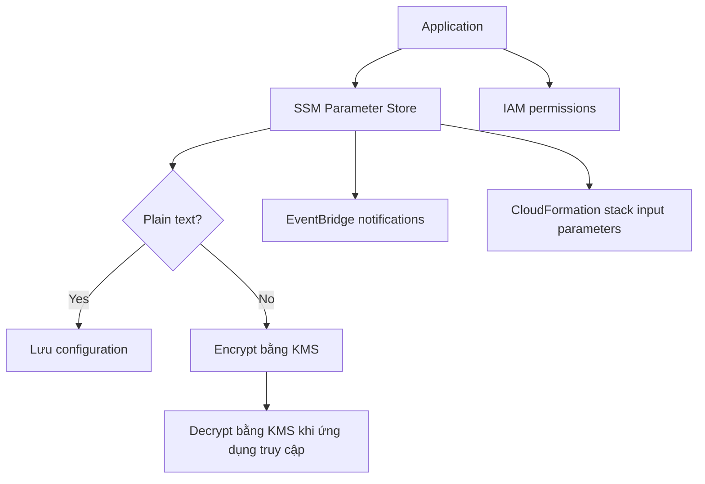
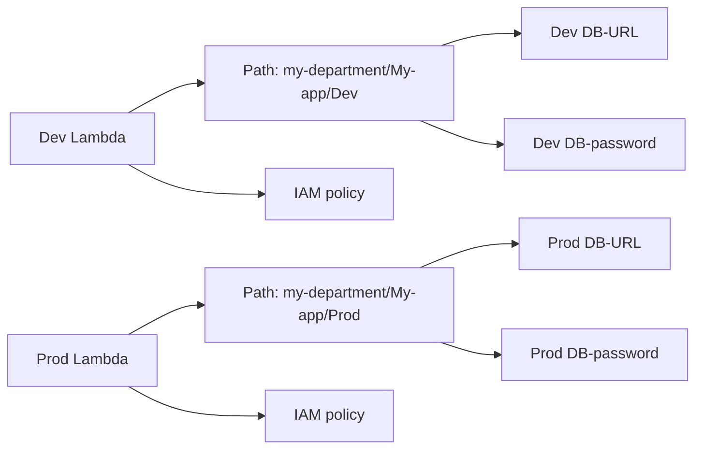
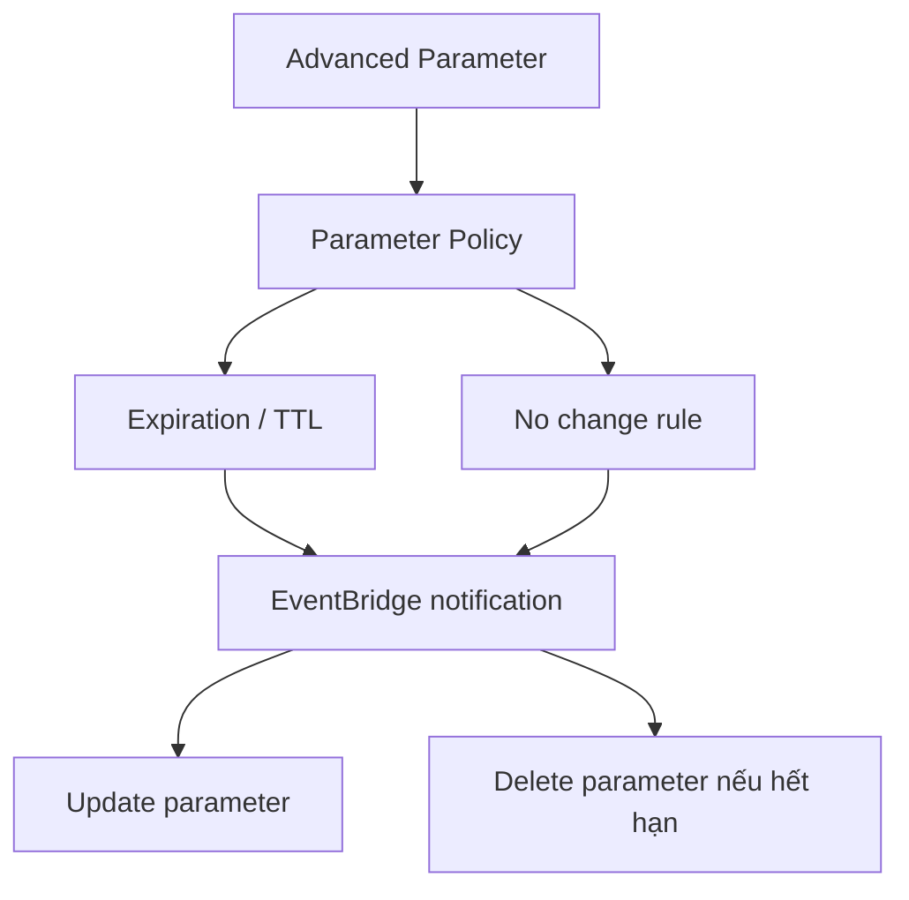

# 19. Parameter Store

## 🎯 Giới thiệu
SSM Parameter Store là nơi lưu trữ an toàn cho **configuration** và **secrets**.

- Có thể lưu **plain text configuration** hoặc **encrypted configuration**
- Nếu cần mã hóa, có thể dùng **KMS** để encrypt/decrypt
- Dịch vụ này là **serverless**, **scalable**, **durable**
- SDK rất dễ sử dụng
- Hỗ trợ **version tracking** khi parameter được update
- Bảo mật thông qua **IAM**
- Có thể nhận notification qua **Amazon EventBridge**
- Tích hợp tốt với **CloudFormation**

## 1. Tổng quan về cách hoạt động
Parameter Store có thể được dùng như một kho cấu hình trung tâm cho ứng dụng.

- Ứng dụng truy cập Parameter Store sẽ bị kiểm tra bởi **IAM permissions**
- Với cấu hình mã hóa, **SSM Parameter Store** dùng **KMS** để mã hóa và giải mã
- Ứng dụng phải có quyền trên **KMS key** tương ứng để thực hiện thao tác này
- **CloudFormation** có thể lấy parameter từ Parameter Store làm **input parameters** cho stack

## 2. Cách tổ chức và truy cập parameter
Parameter Store hỗ trợ cấu trúc **hierarchy**, giúp tổ chức parameter theo path.

Ví dụ cấu trúc:
- `my-department/My-app/Dev/Dev DB-URL`
- `my-department/My-app/Dev/DB-password`
- `my-department/My-app/Prod/Prod DB-URL`
- `my-department/My-app/Prod/Prod DB-password`

Lợi ích:
- Tổ chức parameter theo kiểu có cấu trúc
- Dễ quản lý theo **department**, **app**, **environment**
- Giúp **IAM policies** đơn giản hơn:
  - cấp quyền theo toàn bộ department
  - theo toàn bộ app
  - hoặc theo path cụ thể của môi trường

Ứng dụng thực tế trong transcript:
- **Dev Lambda** có IAM role cho phép truy cập `Dev DB-URL` và `Dev DB-password`
- **Prod Lambda Function** có IAM policy khác, truy cập `Prod DB-URL` và `Prod DB-password`

### Mermaid: flow truy cập theo environment

Ngoài ra:
- Có thể truy cập **Secrets of Secrets Manager** thông qua Parameter Store bằng reference
- Có **Public Parameters** do AWS cung cấp
- Ví dụ: lấy **latest AMI** cho **Amazon Linux 2** theo từng region bằng API call trong Parameter Store

## 3. Parameter tiers và Parameter policies
Trong Systems Manager, có 2 loại tier:

| Tier | Đặc điểm |
|------|----------|
| **Standard** | Free, không có parameter policy |
| **Advanced** | Có policy, kích thước lớn hơn, tốn **$0.05 per month** |

Điểm khác nhau chính:
- **Standard**: size **4KB**
- **Advanced**: size **8KB**
- **Parameter policy** chỉ có ở **Advanced**

### Parameter policies
Parameter policy cho phép:
- Gán **TTL / expiration date** cho parameter
- Buộc người dùng phải update hoặc delete dữ liệu nhạy cảm như password
- Gán **multiple policies** cùng lúc

Ví dụ trong transcript:
- Có **expiration policy** để delete parameter tại một timestamp xác định
- Qua tích hợp với **EventBridge**, hệ thống nhận notification trước khi parameter hết hạn
- Ví dụ:
  - trước **15 ngày** hết hạn sẽ có notification trên EventBridge
  - nếu parameter không được update trong **20 ngày**, cũng có thể nhận notification kiểu **no change**

### Mermaid: policy & notification flow

## 📊 Bảng tóm tắt

| Tiêu chí | Mô tả |
|----------|------|
| Mục đích | Lưu **configuration** và **secrets** an toàn |
| Mã hóa | Dùng **KMS** cho encrypt/decrypt nếu cần |
| Tính chất | **Serverless**, **scalable**, **durable** |
| Quản lý truy cập | Dựa trên **IAM** |
| Theo dõi thay đổi | Có **version tracking** |
| Tổ chức dữ liệu | Hỗ trợ **hierarchy** theo path |
| Tích hợp | **CloudFormation**, **EventBridge** |
| Public data | Có **Public Parameters** như latest AMI |
| Tier | **Standard** và **Advanced** |
| Standard | **4KB**, free, không có policy |
| Advanced | **8KB**, **$0.05/month**, có policy |
| Parameter policy | TTL, expiration, no change notification |

## 💡 Mẹo ghi nhớ cho kỳ thi AWS
- Nhớ: **Parameter Store = config + secrets**
- Nếu đề bài nhắc đến **encryption**, hãy nghĩ tới **KMS**
- Nếu nhắc đến **access control**, hãy nghĩ tới **IAM**
- Nếu nhắc đến **notification / expiration / no change**, hãy nghĩ tới **EventBridge**
- Nếu nhắc đến **stack input parameters**, hãy nghĩ tới **CloudFormation**
- **Advanced** thì có **parameter policy**
- **Standard** là **free** và không có policy
- Dùng **hierarchy path** để cấp quyền theo **department / app / environment**

## ✅ Kết luận
SSM Parameter Store là dịch vụ lưu trữ an toàn cho **configuration** và **secrets**, hỗ trợ **KMS encryption**, **IAM-based security**, **hierarchy**, **version tracking**, và **EventBridge notifications**. Khi ôn thi AWS, cần đặc biệt nhớ sự khác nhau giữa **Standard** và **Advanced**, cùng vai trò của **parameter policy**, **CloudFormation**, và **Public Parameters**.
