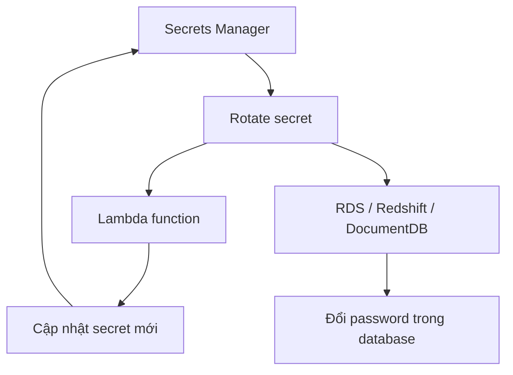
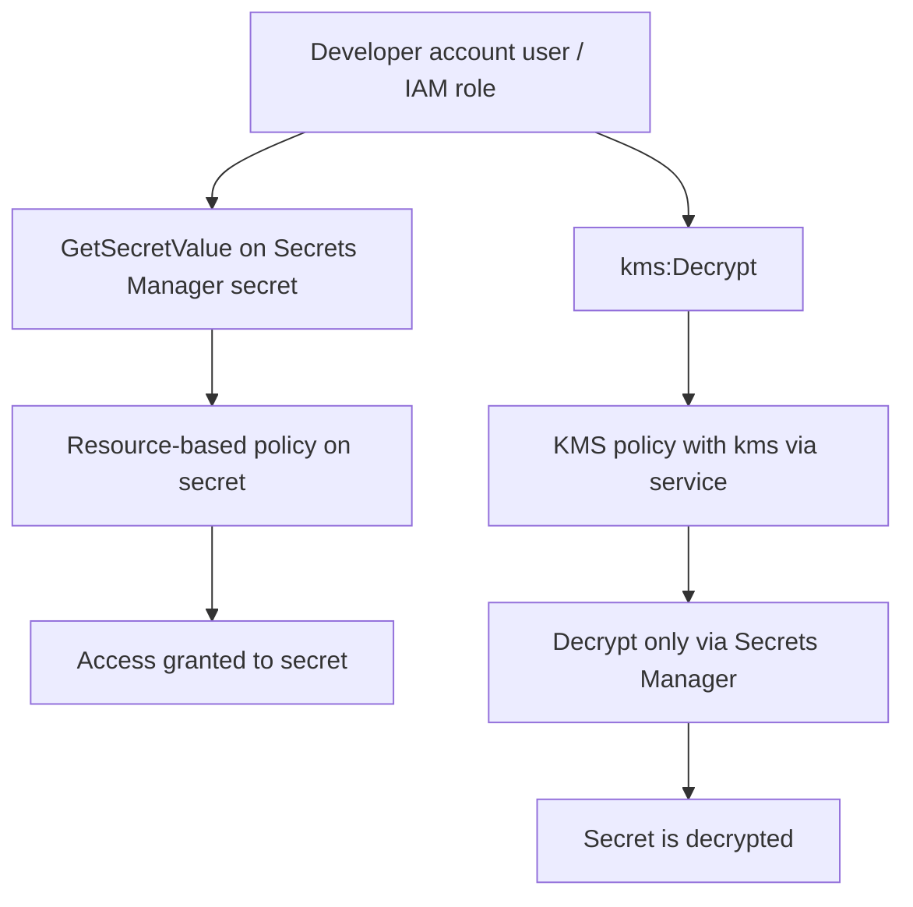

# 20. Secrets Manager

## 🎯 Giới thiệu
AWS Secrets Manager là dịch vụ dùng để **lưu trữ secrets** như:
- `password`
- `API keys`
- các thông tin nhạy cảm khác

Điểm nổi bật của dịch vụ này là:
- **Tự động rotate secrets** theo chu kỳ `X` ngày
- Có thể rotate **on-demand** hoặc **automatic**
- Có thể dùng `Lambda` để tạo và cập nhật secret
- Có **native integration** với nhiều dịch vụ AWS

---

## 1. Lưu trữ và rotate secrets tự động 🔄
Secrets Manager không chỉ lưu secret mà còn hỗ trợ **rotation** rất mạnh.

- Secret có thể được rotate tự động theo lịch
- Secret mới có thể được tạo tự động bằng `Lambda`
- Với một số dịch vụ, AWS đã cung cấp sẵn cơ chế rotate
- Với dịch vụ khác, bạn phải tự viết `custom Lambda function` để:
  - tạo secret mới
  - cập nhật secret vào Secrets Manager

Các dịch vụ có **native integration** được nhắc trong transcript:
- `RDS`
- `Redshift`
- `DocumentDB`

### Mermaid: Rotation flow

---

## 2. Tích hợp với dịch vụ AWS và ứng dụng 🧩
Secrets Manager được tích hợp sâu với nhiều dịch vụ để tự động lấy secret.

Các ví dụ được đề cập:
- `CloudFormation`: reference secret trong template
- `CodeBuild`
- `ECS`: inject secret vào `environment variable`
- `EMR`
- `Fargate`
- `EKS`
- `Parameter Store`

### Ví dụ với ECS
- Khi `ECS task` khởi động, nó có thể tự động pull secret từ Secrets Manager
- Secret được inject vào `environment variable`
- Ứng dụng trong task dùng biến môi trường đó để truy cập `RDS` an toàn

### Ví dụ với CloudFormation
Quá trình tạo secret trong CloudFormation gồm 3 phần:
1. Generate secret
2. Reference secret trong `RDS DB instance`
3. Tạo `secret attachment` để liên kết secret với database

`secret attachment` giúp:
- báo cho Secrets Manager biết
- khi rotation xảy ra thì password trong `RDS` cũng phải đổi theo

---

## 3. Chia sẻ secret giữa các account và so sánh với Parameter Store 🔐

### Chia sẻ cross-account
Transcript mô tả tình huống:
- `security account` chứa secret
- `developer account` cần dùng secret đó

Điểm quan trọng:
- **Không thể** dùng `Resource Access Manager` để share secret
- Phải dùng:
  - `KMS policy` trên key
  - `resource-based policy` trên secret

### Luồng quyền truy cập
- Đầu tiên, cho phép user ở `dev account` làm `kms:Decrypt`
- Trong `KMS policy`, có điều kiện `kms via service`
- Điều kiện này chỉ cho phép decrypt nếu request đi **through Secrets Manager**
- Sau đó, gắn `resource-based policy` lên Secrets Manager secret
- Policy này cho phép user hoặc `IAM role` ở `dev account` gọi `GetSecretValue`

### Mermaid: Cross-account access flow

### Kết luận về quyền
Muốn truy cập secret cross-account cần:
- quyền đọc secret qua `resource-based policy`
- quyền decrypt qua `KMS policy`

---

## 4. Secrets Manager vs SSM Parameter Store ⚖️

| Tiêu chí | Secrets Manager | SSM Parameter Store |
|----------|------------------|---------------------|
| Giá | Đắt hơn | Rẻ hơn / đơn giản hơn |
| Rotation | Có automatic rotation | Không có rotation sẵn |
| Lambda integration | Có sẵn cho `RDS`, `Redshift`, `DocumentDB` | Nếu cần rotation thì tự dựng bằng `EventBridge + Lambda` |
| Encryption bằng KMS | Bắt buộc | Tùy chọn |
| Loại dữ liệu | Secrets | Cả secret lẫn non-secret |
| CloudFormation integration | Có | Có |
| API | Phục vụ quản lý secret chuyên biệt | API đơn giản hơn |
| Truy cập secret | Có thể pull secret trực tiếp theo trick qua Parameter Store API | Dùng trực tiếp với parameter |

### Ý chính cần nhớ
- `Secrets Manager` = chuyên cho secret, có rotation tự động
- `Parameter Store` = đơn giản hơn, không có rotation sẵn
- Nếu dùng `Parameter Store` để xoay password thì phải tự dựng `EventBridge` rule + `Lambda`

---

## 📊 Bảng tóm tắt

| Tiêu chí | Mô tả |
|----------|------|
| Mục đích | Lưu trữ `password`, `API keys`, và các secrets khác |
| Rotation | Tự động rotate theo chu kỳ, có thể on-demand |
| Tích hợp | `RDS`, `Redshift`, `DocumentDB`, `CloudFormation`, `CodeBuild`, `ECS`, `EMR`, `Fargate`, `EKS` |
| Cách dùng trong ECS | Tự động pull secret lúc boot và inject vào `environment variable` |
| CloudFormation | Có thể tạo secret, reference secret, và tạo `secret attachment` cho RDS |
| Cross-account | Không dùng `RAM`; dùng `KMS policy` + `resource-based policy` |
| So với Parameter Store | Đắt hơn nhưng mạnh hơn về rotation và quản lý secret |

---

## 💡 Mẹo ghi nhớ cho kỳ thi AWS
- `Secrets Manager` = **secret + rotation + Lambda**
- `Parameter Store` = **đơn giản hơn, không có rotation sẵn**
- Cross-account secret:
  - **secret policy** để `GetSecretValue`
  - **KMS policy** để `kms:Decrypt`
- Nếu thấy `RDS`, `Redshift`, `DocumentDB` và rotation tự động, nghĩ ngay đến `Secrets Manager`
- `ECS` có thể tự lấy secret lúc khởi động và đưa vào `environment variable`

---

## ✅ Kết luận
`Secrets Manager` là dịch vụ chuyên dụng để lưu và rotate secrets một cách tự động, đặc biệt mạnh khi kết hợp với `RDS`, `CloudFormation`, và `ECS`. So với `SSM Parameter Store`, nó đắt hơn nhưng cung cấp rotation tự động và tích hợp sâu hơn, rất quan trọng cho các câu hỏi ôn thi AWS về secret management, KMS, và cross-account access.
