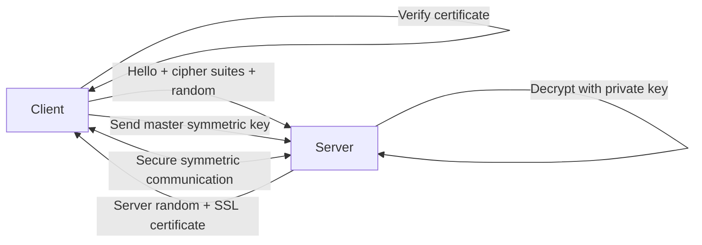
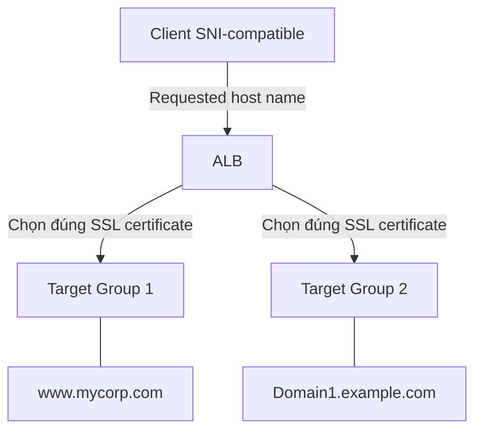
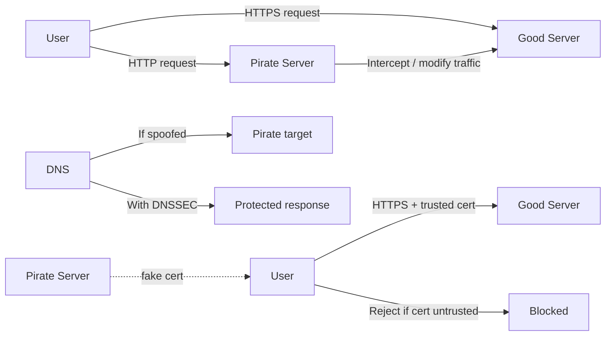

# 22. SSL Encryption, SNI & MITM

## 🎯 Giới thiệu
- Bài này giải thích cách **SSL/TLS** hoạt động ở mức khái quát.
- Trọng tâm ôn thi:
  - Cơ chế **handshake** giữa client và server
  - **SNI (Server Name Indication)** để dùng nhiều SSL certificates trên một web server
  - Cách chống **Man-in-the-Middle (MITM)** bằng **HTTPS** và **DNSSEC**

## 1. SSL/TLS Encryption
- **SSL** = Secure Socket Layer, dùng để mã hóa kết nối.
- **TLS** = Transport Layer Security, là phiên bản mới hơn của SSL.
- Trong thực tế, dù nói “SSL”, người ta thường đang ám chỉ **TLS certificates**.

### Chứng chỉ SSL công khai
- Public SSL certificates được cấp bởi **Certificate Authority (CA)**.
- Ví dụ: **Comodo, Symantec, GoDaddy, GlobalSign, Digicert, Letsencrypt**.
- Certificate có **expiration date** và phải được **renew** trước khi hết hạn.

### Cách handshake hoạt động
- SSL dùng **asymmetric encryption** cho bước bắt tay ban đầu.
- Sau handshake, client và server dùng **symmetric key** để giao tiếp vì rẻ hơn về CPU cycles.
- Ý chính:
  - **Asymmetric**: chỉ dùng cho handshake
  - **Symmetric**: dùng cho trao đổi dữ liệu sau đó

### Hai chiều chứng chỉ
- Nếu client cũng có SSL certificate, client có thể gửi certificate ở bước handshake.
- Đây là mô hình **two-way certificate**.
- Sau khi xác thực xong, kết nối được chuyển sang **symmetric communication**.

## 2. SNI (Server Name Indication)
- **SNI** giải quyết bài toán:
  - 1 web server nhưng có **nhiều SSL certificates**
  - Từ đó phục vụ **nhiều websites** trên cùng server
- Trong initial SSL handshake, client phải chỉ ra **host name** mà nó muốn kết nối.
- Server sẽ:
  - Chọn đúng certificate tương ứng
  - Hoặc trả về **default certificate** nếu không tìm thấy

### Dịch vụ hỗ trợ SNI
- **ALB**
- **NLB**
- **CloudFront**
- **Classic Load Balancer (CLB)**: **không hỗ trợ SNI**

### Ý nghĩa kiến trúc
- Với **ALB/NLB/CloudFront**, bạn có thể gắn nhiều certificates và map chúng theo host name.
- Với **CLB**, không thể dùng SNI nên không thể dùng 1 CLB cho nhiều ứng dụng theo kiểu này.

## 3. Chống Man-in-the-Middle (MITM)
- Khi dùng **HTTP**, kẻ tấn công có thể đứng giữa client và server:
  - đọc packet
  - sửa packet
  - chuyển hướng traffic
- Cách chống MITM trong bài:
  - **Không dùng public-facing HTTP**
  - Dùng **HTTPS** để mã hóa nội dung giữa client và server

### MITM qua SSL certificate giả
- Pirate Server có thể cố gửi **fake SSL certificate**.
- Nếu máy người dùng **không bị nhiễm**, trình duyệt sẽ phát hiện certificate không đáng tin cậy.
- Nếu pirate certificate đã được làm cho **trustable** trên máy người dùng, MITM có thể thành công.

### Chống tấn công DNS
- HTTPS chỉ bảo vệ đường truyền, chưa chặn được **DNS attack**.
- Nếu DNS bị giả mạo, client có thể bị chuyển đến **wrong target server**.
- Giải pháp là dùng **DNSSEC**.

### Route 53 và DNSSEC
- **Amazon Route 53** hỗ trợ **DNSSEC** cho:
  - **domain registration**
  - **DNS service itself**
- Theo transcript:
  - Tính năng này với DNS service dùng **KMS**
  - Có từ **December 2020**
- Ngoài ra có thể chạy **custom DNS server on EC2** và tự cấu hình DNSSEC.
- Ví dụ DNS server được nhắc tới:
  - **Bind**
  - **dnsmasq**
  - **KnotDNS**
  - **PowerDNS**

## 📊 Bảng tóm tắt
| Tiêu chí | Mô tả |
|----------|------|
| SSL/TLS | SSL là tên thường gọi; thực tế hiện nay chủ yếu là **TLS** |
| Public Certificate | Được cấp bởi **Certificate Authority** và có **expiration date** |
| Handshake | Dùng **asymmetric encryption** ban đầu, sau đó chuyển sang **symmetric key** |
| SNI | Cho phép 1 server dùng nhiều certificates theo **host name** |
| Hỗ trợ SNI | **ALB, NLB, CloudFront**; **CLB không hỗ trợ** |
| MITM | Nguy cơ xảy ra mạnh khi dùng **HTTP** public-facing |
| Chống MITM | Dùng **HTTPS** và xác thực certificate |
| DNS protection | Dùng **DNSSEC** để chống giả mạo DNS response |
| Route 53 | Hỗ trợ DNSSEC cho **domain registration** và **DNS service** |
| Custom DNS | Có thể dùng **EC2** với **Bind, dnsmasq, KnotDNS, PowerDNS** |

## 💡 Mẹo ghi nhớ cho kỳ thi AWS
- **SSL/TLS**: nhớ rằng “SSL” thường là cách gọi quen miệng, còn thực tế là **TLS**.
- **Handshake**: nhớ logic **asymmetric lúc đầu, symmetric về sau**.
- **SNI**: nhớ câu hỏi kiểu “nhiều certificates trên 1 load balancer” thì nghĩ ngay đến **SNI**.
- **ALB/NLB/CloudFront** có SNI, **CLB không có**.
- **MITM**: muốn giảm rủi ro thì phải dùng **HTTPS**, và nếu có nguy cơ DNS spoofing thì thêm **DNSSEC**.
- **Route 53 + DNSSEC** là điểm hay bị hỏi cùng với **KMS**.

## ✅ Kết luận
- SSL/TLS tạo kênh bảo mật bằng cơ chế handshake và chuyển sang **symmetric encryption** để truyền dữ liệu hiệu quả.
- **SNI** giải quyết bài toán nhiều SSL certificates trên cùng một web server, đặc biệt với **ALB/NLB/CloudFront**.
- Để chống **Man-in-the-Middle**, cần dùng **HTTPS** và bảo vệ DNS bằng **DNSSEC**, trong đó **Route 53** hỗ trợ DNSSEC cho cả domain registration và DNS service.
