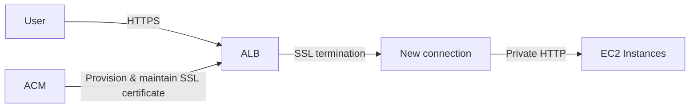

# 23. AWS Certificate Manager - ACM

## 🎯 Giới thiệu
AWS Certificate Manager (ACM) dùng để quản lý **SSL certificates** trong AWS một cách dễ dàng hơn.

- Có 2 cách làm việc với public SSL certificates:
  - Tự mua certificate rồi **upload vào ACM** bằng CLI
  - Để **ACM provision certificate** tự động và **renew miễn phí**
- ACM tích hợp với nhiều dịch vụ như:
  - **Load Balancers**
  - **Elastic Beanstalk**
  - **CloudFront distributions**
  - **API Gateway**

## 1. ACM và SSL termination
ACM hỗ trợ mô hình **SSL termination** ở tầng load balancer.

- User kết nối vào **ALB** qua **HTTPS**
- **ALB** sẽ thực hiện **SSL termination**
- Sau đó ALB mở một kết nối mới tới backend instances
- ALB forwarding request xuống **EC2** bằng **private HTTP**
- EC2 không cần tự xử lý SSL encryption/decryption

Lợi ích theo transcript:
- Giảm **CPU cost** trên EC2
- Không phải tự quản lý certificate thủ công ở phía backend
- Dễ vận hành hơn rất nhiều

## 2. Loại certificate và renewal
Transcript nêu 2 loại certificate:

### Public certificates
- Có thể **create your own public certificates**
- Cần:
  - **verify public DNS**
  - certificate phải được cấp bởi **trusted public certificate authority**

### Private certificates
- Dùng cho **internal applications**
- Có thể tạo **private CA**
- Ứng dụng phải được cấu hình để **trust private CA**
- Nếu ứng dụng dùng certificate được tạo từ private CA, thì ứng dụng cần tin cậy certificate của CA đó

### Renewal
- Nếu certificate được **ACM provision**
  - ACM sẽ **auto-renew**
- Nếu certificate được **manually uploaded** vào ACM
  - Bạn phải **renew manually**

## 3. ACM là regional service
Đây là điểm rất quan trọng cho kỳ thi:

- **ACM là regional service**
- Không phải global service
- Nếu application chạy ở nhiều AWS regions:
  - cần issue **SSL certificate trong từng region**
  - không thể **copy certificate across regions**
- Nếu có nhiều **ALB** ở nhiều region:
  - phải có certificate ở từng region tương ứng
- Với **CloudFront**:
  - vì là **global distribution**
  - không cần triển khai theo cách multi-region như ALB

## 📊 Bảng tóm tắt
| Tiêu chí | Mô tả |
|----------|------|
| Mục đích | Quản lý **SSL certificates** trong AWS |
| Cách dùng | Tự upload certificate hoặc để **ACM provision** tự động |
| Renewal | ACM provision thì **auto-renew**; upload thủ công thì tự renew |
| SSL termination | Thường xảy ra ở **ALB**, sau đó ALB chuyển tiếp request đến backend |
| Tích hợp | **Load Balancers**, **Elastic Beanstalk**, **CloudFront**, **API Gateway** |
| Public certificate | Cần **public DNS verification** và **trusted public CA** |
| Private certificate | Dùng cho **internal applications**, cần **private CA** và trust cấu hình phù hợp |
| Phạm vi | **Regional service** |
| Giới hạn | Không dùng như service global, không copy certificate across regions |

## 💡 Mẹo ghi nhớ cho kỳ thi AWS
- Nhớ câu: **ACM = SSL certificates + automatic renewal**
- Gắn với **ALB** là kịch bản rất hay gặp:
  - user vào bằng **HTTPS**
  - ALB terminate SSL
  - backend đi bằng **HTTP**
- **ACM là regional**:
  - nhiều region thì phải có certificate ở từng region
- **CloudFront** là ngoại lệ dễ nhầm:
  - do là **global distribution**, không cần nghĩ theo kiểu ALB multi-region
- Nếu thấy đề bài nói:
  - certificate tự renew
  - tích hợp với load balancer
  - giảm gánh nặng quản lý SSL
  - thì nghĩ ngay đến **ACM**

## ✅ Kết luận
ACM là dịch vụ giúp quản lý **SSL certificates** trong AWS rất tiện lợi, đặc biệt khi kết hợp với **ALB** và các dịch vụ AWS khác. Điểm cần nhớ nhất cho kỳ thi là: **ACM có auto-renew nếu ACM provision certificate**, và **ACM là regional service**, không phải global.
