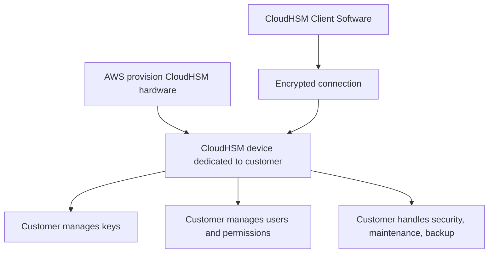
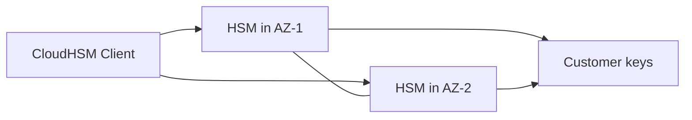

# 24. CloudHSM

## 🎯 Giới thiệu
CloudHSM là dịch vụ AWS cung cấp **dedicated encryption hardware** với **HSM (Hardware Security Module)** cho từng khách hàng.

- Điểm khác biệt lớn với **KMS**:
  - **KMS**: AWS quản lý software for encryption và encryption keys.
  - **CloudHSM**: AWS chỉ provision **hardware**, còn bạn tự quản lý toàn bộ **encryption keys**.
- CloudHSM phù hợp khi bạn cần:
  - kiểm soát key hoàn toàn,
  - xử lý **symmetric** và **asymmetric encryption**,
  - hỗ trợ **TLS/SSL offloading**,
  - dùng cho các nhu cầu như **database encryption**, **key management**, hoặc tạo key cho **SSE-C** trên S3.

## 1. Mô hình quản trị trong CloudHSM
Với CloudHSM, trách nhiệm được chuyển sang phía bạn.

- AWS chỉ quản lý:
  - tạo, mô tả, và xóa **CloudHSM cluster** qua IAM permissions.
- Bạn quản lý:
  - **create, read, update, delete** keys,
  - user nào được access keys,
  - security, maintenance, backup của keys.
- Nếu mất encryption keys hoặc có sự cố bên trong device:
  - AWS **không thể recover** cho bạn.

## 2. Tính năng và cách sử dụng
CloudHSM có một số đặc điểm quan trọng cần nhớ cho kỳ thi.

- **Tamper resistant**:
  - thiết bị có cơ chế chống can thiệp vật lý.
- Hỗ trợ:
  - **symmetric encryption**,
  - **asymmetric encryption**,
  - **hashing**,
  - **digital signing**.
- Dùng với:
  - **CloudHSM Client Software**,
  - không phải thao tác chủ yếu qua API calls.
- Tích hợp được với:
  - **Redshift** cho database encryption và key management.
- Một pattern phổ biến:
  - dùng CloudHSM để generate encryption key cho **SSE-C** trong S3.

## 3. High Availability và so sánh với KMS
Để đảm bảo **high availability**, CloudHSM nên được triển khai thành **cluster** trải rộng qua nhiều **AZ**.

- Mục tiêu:
  - tăng **availability**,
  - tăng **durability**.
- Nếu mất một AZ:
  - vẫn còn AZ khác để tiếp tục sử dụng.
- CloudHSM client sẽ kết nối tới các HSM devices trong cluster.

### So sánh nhanh với KMS
| Tiêu chí | KMS | CloudHSM |
|----------|-----|----------|
| Mô hình | Multi-tenant | Single-tenant device |
| Key management | AWS quản lý phần lớn | Bạn tự quản lý hoàn toàn |
| Master keys | AWS Owned Keys, AWS Managed Keys, Customer Managed KMS Keys | Customer Managed CMK |
| Key accessibility | Scoped per region, có thể replication | Deploy trong specific VPC, có thể share qua VPC peering |
| Authorization | IAM | Own users trong CloudHSM device |
| High availability | Embedded trong service | Phải tạo nhiều HSM devices qua nhiều AZ |
| Audit | CloudTrail, CloudWatch | CloudTrail, CloudWatch, thêm MFA support |
| Free tier | Có | Không có |

## 📊 Bảng tóm tắt
| Tiêu chí | Mô tả |
|----------|------|
| Bản chất dịch vụ | AWS chỉ cung cấp **hardware**, không quản lý keys thay bạn |
| Trách nhiệm chính | Bạn tự quản lý **encryption keys**, users, security, backup |
| Kết nối sử dụng | Qua **CloudHSM Client Software** với encrypted connection |
| Loại encryption | Hỗ trợ **symmetric**, **asymmetric**, **hashing**, **digital signing** |
| Tính sẵn sàng | Nên dùng **cluster** qua nhiều **AZ** |
| IAM | AWS chỉ giúp tạo/describe/delete cluster |
| Bảo mật vật lý | **Tamper resistant** |
| Tích hợp | **Redshift**, **S3 SSE-C** |
| Free tier | Không có |
| Điểm nhớ thi | CloudHSM = **full control of keys**, KMS = **AWS-managed service** |

## 💡 Mẹo ghi nhớ cho kỳ thi AWS
- **KMS = AWS quản lý keys**, còn **CloudHSM = bạn quản lý keys**.
- **CloudHSM = dedicated hardware + single-tenant**.
- Nếu đề bài nhấn mạnh:
  - **full control**, **compliance**, **tamper resistant**, **TLS/SSL offloading**, **SSE-C**, **client software**  
  thì nghĩ đến **CloudHSM**.
- Nếu hỏi về **high availability**, nhớ:
  - CloudHSM **không tự có sẵn** như KMS,
  - bạn phải dựng **cluster across multiple AZ**.
- Điểm dễ sai:
  - CloudHSM **không** phải kiểu thao tác chính bằng API calls,
  - AWS **không** cứu được keys nếu bạn mất chúng.

## ✅ Kết luận
CloudHSM là lựa chọn khi bạn cần **kiểm soát toàn bộ encryption keys** trên **dedicated hardware** và chấp nhận tự chịu trách nhiệm cho **security, maintenance, backup**, cũng như **high availability** của hệ thống. Đây là điểm khác cốt lõi so với **KMS**, nơi AWS quản lý phần lớn hạ tầng và key handling cho bạn.
