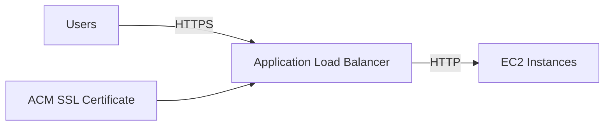
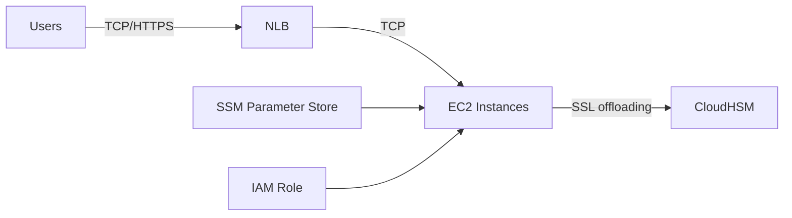

# 25. Solution Architecture - SSL on ELB

## 🎯 Giới thiệu
Bài giảng nói về các cách triển khai **SSL/TLS** trong kiến trúc AWS khi dùng **Load Balancer** và **EC2**. Có 3 hướng chính:
- **SSL terminate tại Load Balancer**
- **HTTPS trực tiếp trên EC2 instances**
- **SSL offloading bằng CloudHSM**

## 1. SSL trên Load Balancer
Đây là kiến trúc cổ điển, đơn giản và dễ scale:
- User kết nối tới **Application Load Balancer** bằng **HTTPS**
- **SSL certificate** được gắn lên Load Balancer thông qua **ACM**
- Load Balancer sau đó giao tiếp với **EC2 instances** bằng **HTTP**

Điểm chính:
- Phù hợp cho kiến trúc đơn giản
- Dễ vận hành
- SSL được xử lý ở lớp Load Balancer, không cần cài cert trên từng EC2 instance

## 2. SSL trực tiếp trên EC2 instances
Trong một số trường hợp, SSL được triển khai ngay trên **web server EC2 instances**:
- User kết nối tới **NLB**
- NLB chuyển traffic dạng **TCP** tới EC2
- EC2 tự xử lý **HTTPS**

Để làm được điều này:
- Cần lấy **SSL certificates** vào EC2 instances
- Có thể dùng **user data scripts** lúc EC2 boot time để lấy cert từ **SSM Parameter Store**
- EC2 cần được gắn **IAM role** phù hợp để truy cập SSM Parameter Store

Nhược điểm được nhắc đến:
- **SSL encryption/decryption** tiêu tốn **CPU resources** trên EC2
- Việc trích xuất cert từ **SSM Parameter Store** có thể là một rủi ro nếu ai đó SSH vào EC2

## 3. SSL Offloading với CloudHSM
Một cách khác là dùng **CloudHSM** để thực hiện **SSL offloading / SSL acceleration**:
- User kết nối tới **NLB**
- NLB chuyển **TCP traffic** tới EC2
- EC2 vẫn phục vụ **HTTPS**
- Phần xử lý SSL được offload sang **CloudHSM**

Transcript nêu rõ:
- Cách này được hỗ trợ bởi **NGINX**, **Apache Web servers**, và **IIS** trên Windows Server
- **CloudHSM** thực hiện SSL acceleration ở backend
- Giúp tiết kiệm tài nguyên CPU cho EC2
- **SSL private key** không bao giờ rời khỏi **HSM device**, nên bảo mật cao hơn

Điều kiện để hoạt động:
- Cần tạo **cryptographic user (CU)** trên CloudHSM
- EC2 instances phải dùng được user đó
- Có thể lưu **username/password** trong **SSM Parameter Store**

## 📊 Bảng tóm tắt
| Tiêu chí | Mô tả |
|----------|------|
| SSL trên Load Balancer | User dùng HTTPS tới Load Balancer, Load Balancer đi HTTP tới EC2 |
| ACM | Dùng để gắn SSL certificate lên Load Balancer |
| SSL trên EC2 | EC2 tự xử lý HTTPS, cần lấy cert vào instance |
| SSM Parameter Store | Nơi có thể lưu certificate hoặc username/password |
| IAM role | Cần để EC2 truy cập SSM Parameter Store |
| Nhược điểm SSL trên EC2 | Tốn CPU và có rủi ro nếu cert bị lộ trên instance |
| CloudHSM SSL Offloading | Offload SSL encryption/decryption sang HSM |
| Lợi ích CloudHSM | Giảm tải CPU, private key không rời HSM, bảo mật cao hơn |
| Hỗ trợ | NGINX, Apache, IIS |

## 💡 Mẹo ghi nhớ cho kỳ thi AWS
- **ALB + ACM + HTTPS từ user, HTTP tới EC2**: mô hình cổ điển, đơn giản, dễ scale.
- **SSL trên EC2**: nhớ đến **user data**, **SSM Parameter Store**, và **IAM role**.
- **CloudHSM**: dùng khi cần **SSL offloading** và muốn **private key không rời HSM**.
- Nếu thấy câu hỏi nói về **tiết kiệm CPU trên EC2** và **bảo mật cao hơn**, hãy nghĩ tới **CloudHSM**.
- Nếu câu hỏi nói về cert được quản lý ở lớp Load Balancer, hãy nghĩ tới **ACM**.

## ✅ Kết luận
Bài giảng giới thiệu 3 cách xử lý SSL trong kiến trúc AWS:
- SSL terminate ở **Load Balancer**
- SSL chạy trực tiếp trên **EC2 instances**
- SSL offloading bằng **CloudHSM**

Điểm cần nhớ khi ôn thi là:
- **ACM** thường gắn với Load Balancer
- **SSM Parameter Store** và **IAM role** được dùng khi EC2 tự lấy certificate
- **CloudHSM** giúp offload SSL, giảm CPU và tăng bảo mật cho private key
