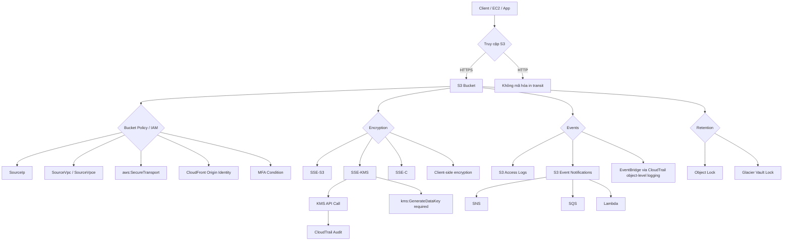

# 26. S3 Security

## 🎯 Giới thiệu
- Chủ đề này tập trung vào các cách bảo vệ **S3** theo 3 hướng chính:
  - **Encryption** cho dữ liệu at rest và in transit
  - **Bucket security** qua **IAM policy**, **bucket policy**, ACL, và **pre-signed URL**
  - **Networking + retention** với **VPC Endpoint**, **Object Lock**, **Glacier Vault Lock**
- Điểm quan trọng khi ôn thi AWS:
  - Nắm rõ **khi nào dùng loại security nào**
  - Phân biệt các điều kiện trong **bucket policy**
  - Ghi nhớ các dịch vụ liên quan như **KMS**, **CloudTrail**, **SNS**, **SQS**, **Lambda**, **EventBridge**

## 1. S3 Encryption 🔐
- **SSE-S3**
  - S3 tự quản lý key để encrypt S3 objects.
- **SSE-KMS**
  - Dùng **KMS** để quản lý encryption keys.
  - Mỗi API call qua **SSE-KMS** sẽ xuất hiện trong **KMS**.
  - Key usage được ghi nhận trong **CloudTrail**, rất hữu ích cho audit.
  - Nếu bucket/object bị public thì object vẫn không đọc được nếu đang encrypt bằng **SSE-KMS**, vì user anonymous không có quyền với KMS key.
  - Khi upload bằng **SSE-KMS**, cần quyền IAM: `kms:GenerateDataKey`.
- **SSE-C**
  - Bạn tự quản lý key, nhưng đưa key cho **Amazon S3** để server-side encryption.
- **Client-side encryption**
  - Bạn tự encrypt và decrypt ở phía client.
- **Glacier**
  - Dữ liệu mặc định được encrypt bằng **AES-256**, key do AWS kiểm soát.

## 2. Encryption in Transit + Bucket Security 🚚
- **Encryption in transit**
  - S3 có 2 endpoint:
    - **HTTP**: không mã hóa
    - **HTTPS**: mặc định client dùng, đảm bảo encryption in flight bằng **SSL/TLS**
  - **HTTPS** là bắt buộc nếu dùng **SSE-C**
  - Nếu muốn ép user dùng HTTPS, dùng **bucket policy** với condition:
    - `aws:SecureTransport`
- **Các kiểu security cho S3**
  - **User-based security**: dùng **IAM policies**
  - **Resource-based policy**: dùng **bucket policies**
    - Rất hữu ích cho **cross-account access**
    - Giúp account truy cập không cần assume role để lấy quyền
  - **Object ACL**: fine-grained
  - **Bucket ACL**: ít dùng hơn, không phải trọng tâm exam
- **Bucket policy dùng để**
  - Grant public access
  - Force object phải được encrypt khi upload
  - Grant cross-account access

### Các condition quan trọng trong S3 bucket policy
- `SourceIp`
  - Dùng cho **public IP** hoặc **elastic IP**
- `VpcSourceIp`
  - Dùng cho **private IP**, nhưng chỉ khi đi qua **VPC endpoint**
- `SourceVpc` / `SourceVpce`
  - Giới hạn theo **VPC** hoặc **VPC Endpoint**
- **CloudFront Origin Identity**
  - Chỉ cho phép **CloudFront distribution** có origin identity truy cập bucket
- **MFA condition**
  - Có thể thêm điều kiện liên quan đến **multi-factor authentication**

## 3. Requests, Events, VPC Endpoint, Object Lock 📡
- **Pre-signed URLs**
  - Tạo bằng **SDK** hoặc **CLI**
  - Dùng cho cả **download (GET)** và **upload (PUT)**
  - URL được ký bằng **IAM credentials**
  - Người giữ URL có đúng quyền như lúc URL được tạo
  - Mặc định hết hạn sau **1 giờ**, có thể đổi bằng `expires-in`
  - Use case:
    - Cho user đăng nhập tải premium content trên S3
    - Cho danh sách user thay đổi liên tục tải file qua URL động
    - Cho user upload tạm thời vào đúng vị trí cụ thể trong bucket
- **S3 bucket events**
  - **S3 Access Logs**
    - Ghi chi tiết request vào bucket
    - Có thể mất vài giờ để được delivery
    - Có thể delivery sang bucket khác
    - Có thể incomplete, nhưng vẫn rất hữu ích
  - **S3 Event Notifications**
    - Trigger khi:
      - object created
      - object removed
      - object restored
      - replication event
    - Destination:
      - **SNS**
      - **SQS**
      - **Lambda**
    - Thường delivery trong vài giây, đôi khi 1-2 phút
    - Nếu bật **versioning**, sẽ có notification cho từng object
    - Nếu không bật versioning và có 2 writes cùng lúc lên cùng object, có thể chỉ nhận 1 notification
  - **Trusted Advisor**
    - Có thể kiểm tra bucket permissions để phát hiện bucket public
  - **Amazon EventBridge**
    - Cần bật **CloudTrail object-level logging** trên S3 trước
    - Target có thể là **Lambda**, **SQS**, **SNS**, etc.
- **VPC Endpoint Gateway for S3**
  - Dùng khi muốn truy cập S3 mà traffic không đi qua public internet
  - Traffic vẫn ở trong **AWS network**
  - Quan trọng nhất trong bucket policy:
    - `aws:SourceVpce`
    - `aws:SourceVpc`
- **Object Lock** và **Glacier Vault Lock**
  - Cả hai đều hướng tới **WORM** = *write once, read many*
  - **S3 Object Lock**
    - Chặn xóa object version trong một khoảng thời gian xác định
  - **Glacier Vault Lock**
    - Khóa policy cho các chỉnh sửa tương lai
    - Object trong Glacier sẽ không thể bị xóa
  - Rất hữu ích cho:
    - compliance
    - data retention
    - chứng minh với auditors

### Mermaid: luồng truy cập S3 và kiểm soát bảo mật

## 📊 Bảng tóm tắt
| Tiêu chí | Mô tả |
|----------|------|
| SSE-S3 | S3 tự quản lý key để encrypt object |
| SSE-KMS | Dùng KMS, có CloudTrail audit, cần `kms:GenerateDataKey` khi upload |
| SSE-C | Tự quản lý key, đưa key cho S3 để server-side encryption |
| Client-side encryption | Encrypt/decrypt ở phía client |
| Encryption in transit | Ưu tiên HTTPS, có thể ép bằng `aws:SecureTransport` |
| Bucket policy | Dùng cho public access, encrypt at upload, cross-account access |
| Condition quan trọng | `SourceIp`, `VpcSourceIp`, `SourceVpc`, `SourceVpce` |
| Pre-signed URL | Dùng cho GET/PUT tạm thời, hết hạn mặc định 1 giờ |
| S3 Event Notifications | Gửi đến SNS, SQS, Lambda khi object thay đổi |
| Object Lock / Glacier Vault Lock | WORM, ngăn xóa dữ liệu để đáp ứng compliance |

## 💡 Mẹo ghi nhớ cho kỳ thi AWS
- **SSE-KMS = audit + security mạnh hơn** vì có **KMS API call** và **CloudTrail**
- Muốn ép truy cập từ internet công khai thì nhớ **`SourceIp`**
- Muốn ép truy cập từ mạng private qua endpoint thì nhớ **`SourceVpc` / `SourceVpce`**
- Muốn ép HTTPS thì nhớ **`aws:SecureTransport`**
- **Pre-signed URL** = cấp quyền tạm thời cho **GET/PUT**, rất hay ra exam
- **S3 Event Notifications** đi nhanh, còn **S3 Access Logs** là log chi tiết nhưng có thể chậm
- **Object Lock** và **Glacier Vault Lock** đều gắn với ý tưởng **WORM**
- Nếu thấy câu hỏi về **public bucket nhưng object vẫn không đọc được**, hãy nghĩ đến **SSE-KMS**

## ✅ Kết luận
- S3 Security xoay quanh 4 mảng chính:
  - **Encryption**
  - **Access control**
  - **Event/Logging**
  - **Retention**
- Khi ôn thi, hãy tập trung vào các keyword như **SSE-KMS**, **bucket policy**, **`SourceVpce`**, **`aws:SecureTransport`**, **pre-signed URL**, **Object Lock**
- Đây là các chi tiết rất dễ xuất hiện trong câu hỏi tình huống của AWS Certified Solutions Architect Professional
