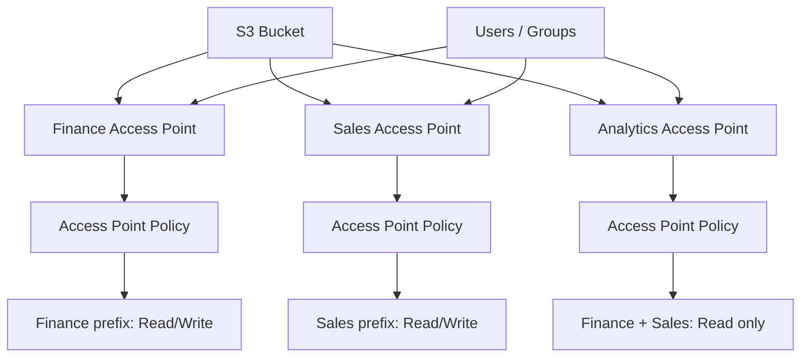
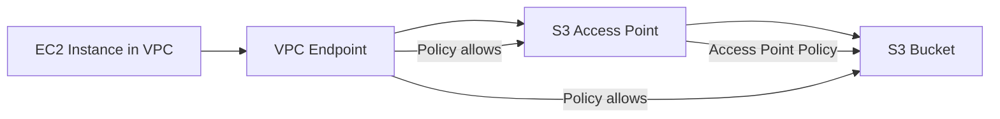

# 27. S3 Access Points

## 🎯 Giới thiệu
- Khi một S3 bucket chứa nhiều loại dữ liệu như `finance`, `sales`, và nhiều nhóm người dùng khác nhau cần truy cập riêng biệt, việc quản lý bằng một `S3 bucket policy` lớn sẽ ngày càng phức tạp.
- `S3 Access Points` được dùng để tách cách truy cập theo từng nhóm dữ liệu, giúp đơn giản hóa quản lý security và mở rộng dễ hơn.

## 1. Vấn đề khi dùng một bucket policy duy nhất
- Nếu số lượng user, data và quyền truy cập tăng lên, `S3 bucket policy` sẽ trở nên khó quản lý.
- Một bucket có thể phục vụ nhiều luồng truy cập khác nhau:
  - `finance` chỉ truy cập dữ liệu finance
  - `sales` chỉ truy cập dữ liệu sales
  - `analytics` có thể truy cập cả finance và sales nhưng chỉ ở chế độ `read only`

## 2. Cách hoạt động của S3 Access Points
- Tạo nhiều `access point` cho cùng một bucket:
  - `finance access point`
  - `sales access point`
  - `analytics access point`
- Mỗi `access point` có một `access point policy` riêng, rất giống `S3 bucket policy`.
- Policy của từng access point sẽ quyết định:
  - `finance` → `read write` vào `finance prefix`
  - `sales` → `read write` vào `sales prefix`
  - `analytics` → `read only` với cả finance và sales
- Security management được đẩy từ level bucket sang từng access point, giúp quản lý theo từng mục đích sử dụng.

## 3. Truy cập qua DNS name và VPC origin
- Mỗi `access point` có một `DNS name` riêng để kết nối.
- `Access point` có thể được cấu hình:
  - kết nối qua `internet` như một `origin`
  - hoặc dùng `VPC` cho private traffic
- Với `VPC origin`, một `EC2 instance` trong `VPC` có thể truy cập S3 một cách private, không đi qua internet.
- Để truy cập private này, cần tạo `VPC endpoint` để kết nối vào access point.
- `VPC endpoint` cũng có `policy`, và policy này phải cho phép truy cập:
  - `target buckets`
  - `access points`
- Như vậy, trong mô hình private access sẽ có nhiều lớp bảo vệ:
  - `VPC endpoint policy`
  - `access point policy`
  - `S3 bucket level security`

## 📊 Bảng tóm tắt
| Tiêu chí | Mô tả |
|----------|------|
| Mục đích | Đơn giản hóa security management cho S3 bucket |
| Vấn đề giải quyết | Tránh `S3 bucket policy` quá phức tạp khi có nhiều user và nhiều loại data |
| Cách tổ chức | Tạo nhiều `access point` cho các nhu cầu truy cập khác nhau |
| Chính sách | Mỗi access point có `access point policy` riêng, tương tự bucket policy |
| Kết nối | Mỗi access point có `DNS name` riêng |
| Kiểu truy cập | Có thể dùng `internet` hoặc `VPC origin` cho private traffic |
| Private access | Dùng `VPC endpoint` để truy cập access point trong VPC |
| Mức bảo vệ | `VPC endpoint policy`, `access point policy`, và `S3 bucket` security |

## 💡 Mẹo ghi nhớ cho kỳ thi AWS
- `Access Point = cách chia nhỏ quyền truy cập vào cùng một S3 bucket`.
- Nhớ rằng `policy` không chỉ nằm ở bucket, mà còn có thể nằm ở từng `access point`.
- `Finance`, `Sales`, `Analytics` là ví dụ điển hình để nhớ:
  - `finance` và `sales` có quyền riêng
  - `analytics` có thể đọc cả hai nhưng không ghi
- Với `VPC origin`, nhớ chuỗi truy cập private:
  - `EC2` → `VPC Endpoint` → `Access Point` → `S3 Bucket`
- Nếu thấy bài toán cần scale security cho S3, nghĩ ngay đến `S3 Access Points`.

## ✅ Kết luận
- `S3 Access Points` giúp tách biệt cách truy cập vào cùng một bucket theo từng nhóm dữ liệu hoặc nhóm người dùng.
- Cách này làm `security management` đơn giản hơn, dễ scale hơn, và hỗ trợ cả truy cập public qua `DNS name` lẫn private qua `VPC origin`.
- Đây là một giải pháp quan trọng khi cần quản lý nhiều luồng truy cập vào S3 một cách rõ ràng và có kiểm soát.
