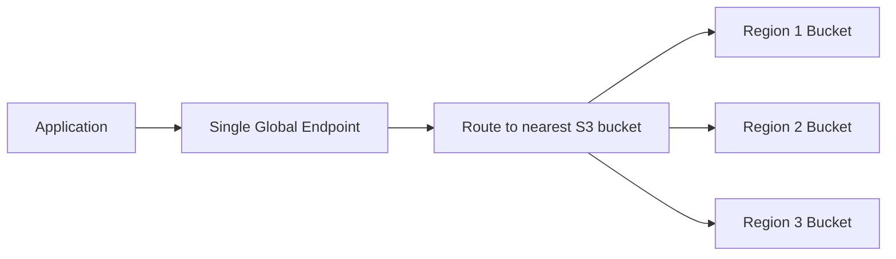
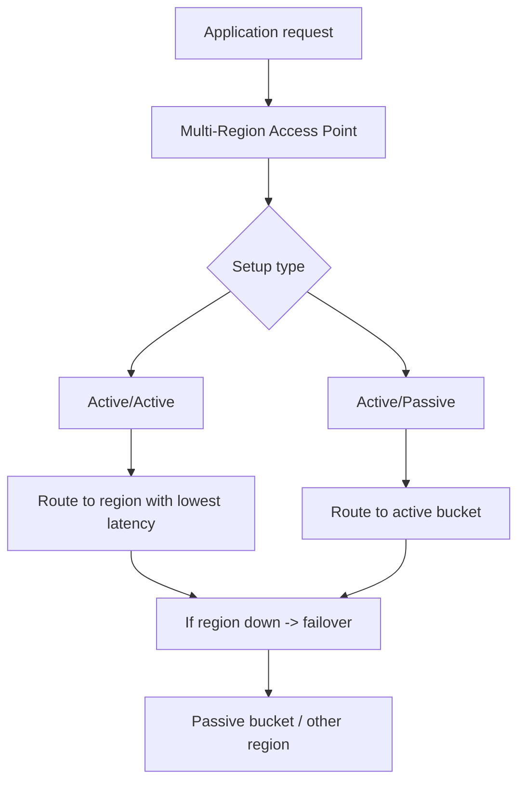

# 28. S3 Multi-Region Access Points

## 🎯 Giới thiệu
- **S3 Multi-Region Access Points** cho phép tạo một **global endpoint** trên Amazon S3.
- Endpoint này có thể span nhiều **S3 buckets** ở nhiều **regions** khác nhau.
- Mục tiêu:
  - Truy cập qua **một endpoint duy nhất**
  - Tự động route request đến bucket phù hợp theo region
  - Giảm **latency**
  - Hỗ trợ **replication** và **failover**

## 1. Cách hoạt động của Multi-Region Access Points
- Ứng dụng chỉ cần gọi **one endpoint**.
- Endpoint sẽ:
  - redirect request tới **S3 bucket** phù hợp
  - ưu tiên region có **lowest latency**
- Khi dữ liệu được đồng bộ giữa các bucket:
  - request có thể được phục vụ từ nhiều region khác nhau
  - hệ thống giữ các bucket ở trạng thái nhất quán

## 2. Replication giữa các bucket
- Dữ liệu giữa các bucket được **replicated bidirectionally**.
- Nghĩa là:
  - dữ liệu đi từ bucket này sang bucket khác
  - và cũng đi ngược lại
- Mục tiêu của replication:
  - đảm bảo **all regions are synchronized**
  - mọi bucket đều có cùng dữ liệu
- Transcript nhấn mạnh cần có **replication rules** giữa các bucket với nhau.

## 3. Failover controls: Active/Active và Active/Passive
- S3 Multi-Region Access Points hỗ trợ **failover controls**.
- Có 2 kiểu setup chính:
  - **Active/Active**
    - nhiều region có thể active cùng lúc
    - request có thể được route tới region có **lowest latency**
  - **Active/Passive**
    - một bucket là **active**
    - bucket còn lại là **passive / backup**
    - nếu region active gặp sự cố, request sẽ failover sang passive bucket
- Trong case **regional outage**:
  - failover được kích hoạt tự động
  - request chuyển sang bucket khác vẫn có dữ liệu đầy đủ

## 📊 Bảng tóm tắt
| Tiêu chí | Mô tả |
|----------|------|
| Global endpoint | Một endpoint duy nhất để truy cập nhiều S3 buckets ở nhiều regions |
| Routing | Tự động route request tới region phù hợp, ưu tiên lowest latency |
| Replication | Bidirectional replication giữa các buckets để đồng bộ dữ liệu |
| Failover | Có thể cấu hình active/active hoặc active/passive |
| Mục tiêu chính | Giảm latency, tăng khả năng sẵn sàng, hỗ trợ chuyển vùng khi có sự cố |

## 💡 Mẹo ghi nhớ cho kỳ thi AWS
- **Multi-Region Access Point = one endpoint, many regions**.
- Nhớ 3 ý chính:
  - **Route**
  - **Replicate**
  - **Failover**
- Nếu thấy câu hỏi về:
  - **lowest latency**
  - **global endpoint**
  - **active/passive backup**
  - **regional outage**
  thì nghĩ ngay tới **S3 Multi-Region Access Points**.
- **Active/Active**: nhiều region cùng phục vụ.
- **Active/Passive**: một region chính, một region dự phòng.

## ✅ Kết luận
- **S3 Multi-Region Access Points** giúp truy cập S3 qua **một global endpoint** nhưng vẫn phục vụ dữ liệu từ nhiều region.
- Hệ thống tự động **route request**, **replicate data**, và **failover** khi cần.
- Đây là cơ chế phù hợp khi cần **low latency**, **synchronization**, và **cross-region resilience**.
