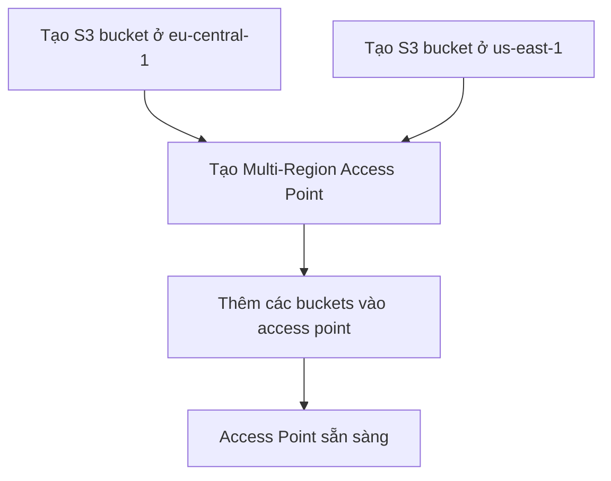
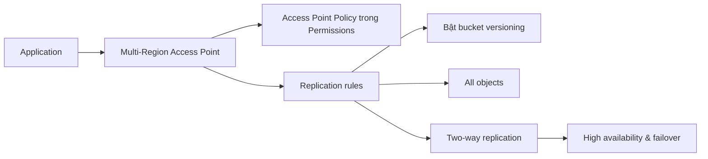

# 29. S3 Multi-Region Access Points - Hands On

## 🎯 Giới thiệu
Bài thực hành này tạo 2 S3 buckets ở 2 AWS Regions khác nhau, sau đó gom chúng vào một **Multi-Region Access Point** để ứng dụng có thể truy cập cùng một dữ liệu qua nhiều vùng. Nội dung chính xoay quanh cách tạo access point, cấu hình **Permissions**, và thiết lập **Replication rules** để hỗ trợ **high availability** và **failover**.

## 1. Tạo 2 S3 buckets ở 2 Regions khác nhau 🪣
- Tạo bucket `my-global-app-stephane` ở `eu-central-1`.
- Tạo bucket `my-global-app-stephane-us-east-1` ở `us-east-1`.
- Mục tiêu là:
  - Hai bucket ở hai vùng khác nhau.
  - Cùng giữ một bộ dữ liệu.
  - Được phục vụ qua cùng một **Multi-Region Access Point**.

## 2. Tạo Multi-Region Access Point 🌐
- Vào phần **Multi-Region Access Points** và tạo access point mới.
- Đặt tên `MyGlobalApp` nhưng khi tạo phải dùng tên lowercase: `my-global-app`.
- Thêm 2 bucket đã tạo vào access point này.
- Ghi nhớ:
  - Có thể thêm nhiều bucket hơn.
  - Hiện tại chỉ **1 bucket per AWS region**.
- Khi tạo xong, access point sẽ có:
  - **ARN**
  - **Alias**
  - Danh sách buckets bên dưới
- Thời gian tạo:
  - Thường dưới 30 phút
  - Có thể lâu tới 24 giờ

## 3. Permissions, Replication và Failover 🔐
- Trước khi ứng dụng truy cập được Multi-Region Access Point, cần cấu hình **access point policy** trong phần **Permissions**.
- Phần **Replication and failover** cho thấy trạng thái replication giữa các bucket.
- Ban đầu chưa có **replication rules**, nên hệ thống cảnh báo dữ liệu replication có thể chưa đầy đủ.
- Cách xử lý:
  - Tạo **replication rule** ngay trong console.
  - Chọn replicate giữa các bucket đã chỉ định.
  - Bật **bucket versioning** để enable replication.
  - Bật rule và áp dụng cho **all objects** trong bucket.
- Sau khi hoàn tất:
  - Có thể thấy **two-way replication** trên map.
  - Có thể kiểm tra lại trong tab **Management** để xem replication rules.

## 📊 Bảng tóm tắt
| Tiêu chí | Mô tả |
|----------|------|
| Mục tiêu | Dùng 2 S3 buckets ở 2 Regions và phục vụ qua cùng một Multi-Region Access Point |
| Tên access point | Phải dùng lowercase, ví dụ `my-global-app` |
| Quy mô bucket | Có thể thêm nhiều bucket, nhưng hiện tại 1 bucket per AWS region |
| Permissions | Cần **access point policy** để ứng dụng truy cập |
| Replication | Cần tạo **replication rules** và bật **bucket versioning** |
| Failover | Được hỗ trợ nhờ replication giữa các bucket |
| Thời gian tạo | Thường dưới 30 phút, tối đa 24 giờ |
| Chi phí | Không mất phí chỉ vì tạo access point; có phí dựa trên số GB đi qua nó |

## 💡 Mẹo ghi nhớ cho kỳ thi AWS
- **MRAP = nhiều bucket, nhiều Region, một điểm truy cập**.
- Muốn ứng dụng dùng được access point thì phải nhớ phần **Permissions** và **access point policy**.
- Nếu cần **replication**, hãy nhớ phải bật **bucket versioning**.
- Khi thấy yêu cầu **high availability** và **failover**, hãy liên hệ ngay tới **Multi-Region Access Point + replication rules**.
- Tên tạo resource trong console có thể cần **lowercase**.

## ✅ Kết luận
**Multi-Region Access Points** cho phép gom các S3 buckets ở nhiều Regions vào một điểm truy cập chung, đồng thời kết hợp **Permissions** và **Replication rules** để hỗ trợ **high availability** và **failover**. Đây là một hands-on quan trọng để hiểu cách S3 phục vụ dữ liệu đa vùng trong AWS.
