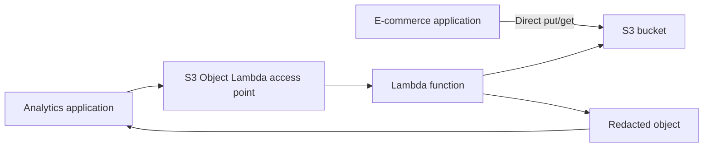

# 30. S3 Object Lambda

## 🎯 Giới thiệu
- **S3 Object Lambda** là một use case dùng với **S3 access points** để **biến đổi object ngay trước khi application retrieve nó**.
- Mục tiêu chính: **không cần tạo thêm nhiều S3 bucket** chỉ để lưu các phiên bản dữ liệu khác nhau.
- Thay vào đó, ta dùng:
  - **S3 bucket** chứa dữ liệu gốc
  - **S3 access point**
  - **Lambda function**
  - **S3 Object Lambda access point**

## 1. Cách hoạt động cơ bản
- Ứng dụng có thể truy cập trực tiếp **S3 bucket** để **put/get object gốc**.
- Với các use case khác nhau, ta tạo **S3 access point** gắn với **Lambda function**.
- **Lambda function** sẽ xử lý object trong lúc object đang được retrieve.

## 2. Các luồng sử dụng trong transcript
### 🧩 Redact dữ liệu cho Analytics
- **E-commerce application** sở hữu dữ liệu gốc trong **S3 bucket**.
- **Analytics application** chỉ được nhận **redacted object**.
- Thay vì tạo bucket mới:
  - tạo **S3 Object Lambda access point**
  - gắn với **Lambda function**
  - Lambda **xóa bớt dữ liệu** trước khi trả về object

### 🧩 Enrich dữ liệu cho Marketing
- **Marketing application** muốn nhận **enriched object**.
- Dữ liệu được tăng cường bằng cách tra cứu từ **customer loyalty database**.
- Cách làm:
  - dùng **Lambda function** để enrich data
  - tạo **S3 Object Lambda access point** trên cùng bucket
  - marketing app truy cập qua access point này để nhận object đã được enrich

### 🧩 Một bucket, nhiều cách truy cập
- Chỉ cần **1 S3 bucket**
- Có thể tạo nhiều **access point** và **object Lambda** khác nhau
- Mỗi application có thể nhận **phiên bản dữ liệu phù hợp** mà không cần duplicate bucket

## 3. Use cases chính
- **Redact PII data** cho:
  - analytics
  - non-production environments
- **Transform data**, ví dụ:
  - XML to JSON
- **Xử lý object động**:
  - resizing image
  - watermarking image theo từng user request

## 📊 Bảng tóm tắt
| Tiêu chí | Mô tả |
|----------|------|
| Mục đích | Modify object ngay trước khi application retrieve |
| Thành phần chính | S3 bucket, S3 access point, Lambda function, S3 Object Lambda access point |
| Lợi ích | Không cần duplicate bucket hay object cho nhiều phiên bản dữ liệu |
| Ví dụ xử lý | Redact PII, enrich data, XML to JSON, resize image, watermark image |
| Ứng dụng tiêu biểu | Analytics, Marketing, non-production environments |

## 💡 Mẹo ghi nhớ cho kỳ thi AWS
- Nhớ rằng **S3 Object Lambda** dùng để **transform data on the fly** khi object được retrieve.
- **S3 bucket** vẫn giữ **dữ liệu gốc**, còn **Lambda function** tạo ra phiên bản phù hợp cho từng application.
- Từ khóa cần nhớ:
  - **access point**
  - **Lambda function**
  - **redact**
  - **enrich**
  - **transform**
- Nếu đề bài nói:
  - “không muốn duplicate buckets”
  - “trả dữ liệu đã chỉnh sửa theo từng app/user”
  - “xử lý object ngay lúc read”
  thì rất dễ liên quan đến **S3 Object Lambda**.

## ✅ Kết luận
- **S3 Object Lambda** cho phép dùng **Lambda function** để thay đổi object ngay trước khi trả về cho ứng dụng.
- Giải pháp này giúp giữ **một S3 bucket duy nhất** nhưng vẫn phục vụ nhiều nhu cầu dữ liệu khác nhau như **redact**, **enrich**, hay **transform**.
- Đây là pattern rất hữu ích khi cần linh hoạt hóa dữ liệu mà không phải sao chép object sang nhiều bucket khác nhau.
