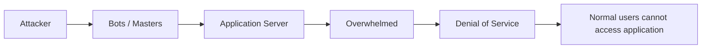
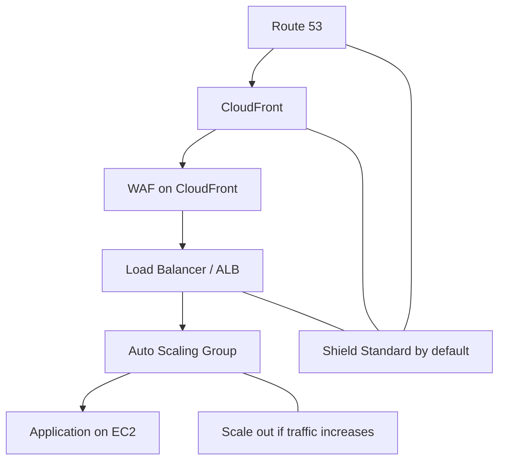

# 31. DDoS and AWS Shield

## 🎯 Giới thiệu
- **DDoS** là viết tắt của **Distributed Denial of Service**.
- Mục tiêu của DDoS là làm một **instance / application server** không thể nhận traffic mới, khiến ứng dụng **không truy cập được** với user bình thường.
- Cơ chế thường thấy:
  - attacker điều khiển nhiều máy tính/bots
  - các bots gửi rất nhiều request bất thường tới server
  - server bị **overwhelmed** và không còn phản hồi tốt cho request hợp lệ

## 1. Các kiểu tấn công DDoS
- **SYN Flood**
  - Là attack ở **layer 4**
  - Có quá nhiều **TCP connection requests**
- **UDP Reflection**
  - Các server khác gửi lượng lớn **UDP request** về server mục tiêu
- **DNS flood attack**
  - Làm quá tải **DNS**, khiến user không query được DNS service và không tìm thấy website
- **Slow Loris**
  - Là attack ở **layer 7**
  - Mở nhiều HTTP connections và giữ chúng tồn tại
  - Server phải duy trì quá nhiều connections nên bị cạn tài nguyên
- **Application level attacks**
  - Phức tạp hơn và phụ thuộc vào cách ứng dụng hoạt động
  - Có thể khai thác các điểm yếu do developer vô tình tạo ra
  - Ví dụ trong transcript:
    - làm overload backend database
    - invalidate cache
    - gửi quá nhiều request
    - gửi quá nhiều packet lớn

### 🧭 Luồng tấn công DDoS

## 2. Cách AWS bảo vệ khỏi DDoS
- **AWS Shield Standard**
  - Miễn phí
  - **Enabled by default** cho mọi customer
  - Bảo vệ trước các attack như:
    - **SYN attacks**
    - **UDP Floods**
    - **Reflection attacks**
    - các attack **layer 3 / layer 4**
- **AWS Shield Advanced**
  - Dành cho **enterprise customers**
  - Là dịch vụ **optional DDoS mitigation**
  - Giá: **$3,000 per month per organization**
  - Bảo vệ trước các attack tinh vi hơn trên:
    - **EC2**
    - **ELB**
    - **CloudFront**
    - **AWS Global Accelerator**
    - **Route 53**
  - Có **24/7 access** tới **AWS DDoS response team (DRP)**
  - Có hỗ trợ giảm rủi ro từ **higher fees** khi phải scale up bằng **Auto Scaling**
- **WAF (Web Application Firewall)**
  - Không phải chỉ dành riêng cho DDoS
  - Dùng để lọc request theo **rules**
  - Ví dụ: request lớn hơn **5 MB** thì drop ngay
  - Hữu ích cho **application level protections**
- **CloudFront** và **Route 53**
  - Có **Shield enabled by default**
  - Tận dụng **global edge network**
  - Giúp mitigation ngay tại **edge**
- **Auto Scaling**
  - Khi server bị quá tải, Auto Scaling sẽ tạo thêm instances
  - Làm attacker tốn kém hơn
- **S3 + CloudFront**
  - Nên tách **static resources**
  - Phân phối qua **S3 in CloudFront**
  - Dynamic requests có thể xử lý qua **EC2** và **ALB**

### 🏗️ Kiến trúc bảo vệ mẫu

## 3. Shield Standard vs Shield Advanced
| Tiêu chí | Shield Standard | Shield Advanced |
|----------|-----------------|-----------------|
| Chi phí | Free | $3,000 / month / organization |
| Trạng thái | ON by default | Optional |
| Đối tượng | Mọi customer | Enterprise customers |
| Loại bảo vệ | SYN attacks, UDP Floods, Reflection attacks, layer 3/4 | Attack tinh vi hơn |
| Dịch vụ được bảo vệ | Chung cho AWS customers | EC2, ELB, CloudFront, AWS Global Accelerator, Route 53 |
| Hỗ trợ sự cố | Không nêu trong transcript | 24/7 AWS DDoS response team (DRP) |
| Hỗ trợ chi phí scale | Không nêu | Có protection trước higher fees khi Auto Scaling tăng |

## 📊 Bảng tóm tắt
| Tiêu chí | Mô tả |
|----------|------|
| DDoS | Distributed Denial of Service, làm server không nhận được request hợp lệ |
| Mục tiêu của attacker | Làm ứng dụng bị quá tải để user không truy cập được |
| Layer 4 attacks | SYN Flood, UDP Flood, Reflection attacks |
| Layer 7 attacks | Slow Loris, application level attacks |
| AWS Shield Standard | Free, enabled by default, bảo vệ cơ bản |
| AWS Shield Advanced | Optional, $3,000/month/organization, bảo vệ nâng cao |
| WAF | Lọc request theo rules, hỗ trợ chống application-level abuse |
| CloudFront / Route 53 | Có Shield enabled by default và bảo vệ ở edge |
| Auto Scaling | Giúp tăng số instance khi traffic tăng cao |
| Static vs dynamic | Static nên đưa qua S3 + CloudFront, dynamic qua EC2 + ALB |

## 💡 Mẹo ghi nhớ cho kỳ thi AWS
- **Shield Standard** = **free** + **default** + bảo vệ **basic DDoS**
- **Shield Advanced** = **paid** + **enterprise** + có **DRP 24/7**
- **WAF** dùng để **lọc request theo rule**, không phải DDoS-only nhưng rất hữu ích khi chống attack ở layer application
- **CloudFront + Route 53** là lớp phòng thủ tốt vì có **Shield enabled by default**
- Khi thấy câu hỏi về giảm tác động DDoS:
  - nghĩ tới **Shield**
  - nghĩ tới **WAF**
  - nghĩ tới **Auto Scaling**
  - nghĩ tới tách **static resources** qua **S3 + CloudFront**

## ✅ Kết luận
- DDoS làm ứng dụng bị **overwhelm** và mất khả năng phục vụ user hợp lệ.
- Trên AWS, **Shield Standard** cung cấp bảo vệ cơ bản miễn phí, còn **Shield Advanced** cung cấp bảo vệ nâng cao cho nhu cầu enterprise.
- Kết hợp **WAF**, **CloudFront**, **Route 53**, và **Auto Scaling** là cách quan trọng để tăng khả năng chống chịu trước DDoS.
