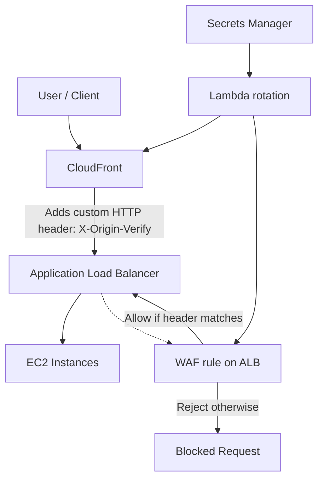

# 32. AWS WAF - Web Application Firewall

## 🎯 Giới thiệu
- **AWS WAF (Web Application Firewall)** dùng để bảo vệ web applications khỏi các **common web exploits** ở **layer 7 / HTTP layer**.
- WAF **không dùng cho DDoS protection**. Transcript nhấn mạnh: **DDoS protection là SHIELD**.
- WAF có thể triển khai trên:
  - **Application Load Balancer** để có **localized rules**
  - **API Gateway** để chạy ở **regional hoặc edge level**
  - **CloudFront** để rules chạy **globally trên all edge locations**
  - **AppSync** để bảo vệ **GraphQL APIs** trực tiếp
- Nếu muốn bảo vệ:
  - **classic load balancer**
  - **EC2 instances**
  - **custom origins**
  - **S3 websites**
  
  thì triển khai **CloudFront + WAF on CloudFront**.

## 1. Web ACL và rule types
- Trong WAF, bạn định nghĩa **Web ACL (Web Access Control List)**.
- Rule có thể dựa trên:
  - **IP addresses filtering**
  - **HTTP headers**
  - **HTTP body**
  - **URL strings**
- WAF hỗ trợ bảo vệ trước các tấn công phổ biến như:
  - **SQL injection**
  - **cross-site scripting (XSS)**
- Có thể đặt thêm:
  - **size constraints**: ví dụ chặn request lớn hơn một ngưỡng nhất định
  - **geomatch**: block/allow theo **country**
  - **rate-based rules**: đếm số lần xảy ra và chặn khi tần suất quá cao
- **Rule actions** gồm:
  - **allow**
  - **block**
  - **count**
- **count** rất quan trọng để:
  - kiểm tra rule có ảnh hưởng thật không
  - phát hiện **false positives** trước khi bật chặn
  - quan sát traffic trước khi áp dụng **Block**, **CAPTCHA**, hoặc **silent challenges**

## 2. Managed Rules
- WAF có **managed rules** và đây là điểm cần nhớ cho exam.
- Transcript nói có **hơn 190 managed rules**.
- Các nhóm chính:
  - **Baseline rule groups**
    - bảo vệ chung khỏi common threats
    - ví dụ: **managed rule common rule set**, **managed rules admin protection rule set**
  - **Use-case specific rule groups**
    - bảo vệ theo ứng dụng / nền tảng cụ thể
    - ví dụ: **SQL rule sets**, **Windows rule sets**, **PHP rule sets**, **WordPress rule sets**
  - **IP reputation rule groups**
    - chặn request dựa trên **source IP**
    - ví dụ quan trọng: **Managed Rules Amazon IP Reputation List**
    - có thể dùng để chặn spam rất nhanh
    - cũng có **anonymous IP list**
  - **Bot control managed rule group**
    - chặn và quản lý request từ **bots**
    - ví dụ: **AWS managed rule bots control rule sets**
- Điểm cần nhớ:
  - Các managed rules có thể đến từ **AWS** hoặc **marketplace sellers**
  - Trong exam, các nhóm như **Amazon IP Reputation List** rất dễ được hỏi

## 3. Logging và kiến trúc bảo vệ origin
- WAF có thể gửi logs đến:
  - **Amazon CloudWatch log groups**
    - giới hạn trong transcript: **5 MB/s maximum**
  - **Amazon S3 bucket**
    - logs được gửi mỗi **5 phút**
  - **Kinesis Data Firehose**
    - phù hợp khi traffic rất cao hoặc cần logging capacity lớn hơn
    - sau đó Firehose có thể đẩy tới các destination như:
      - **Amazon S3**
      - **Redshift**
      - **OpenSearch**
- Một kiến trúc quan trọng trong transcript là **enhance CloudFront Origin Security**:
  - **CloudFront** đứng trước **ALB** và **EC2**
  - Tạo một **custom HTTP header** trên CloudFront, ví dụ:
    - `X-Origin-Verify`
    - kèm **secret string**
  - Header này sẽ được thêm vào mọi request đi qua CloudFront
  - Trên **Application Load Balancer**, tạo **WAF filtering rule**:
    - nếu request có đúng header và value thì **allow**
    - nếu không có hoặc sai thì **reject**
  - Kết quả:
    - user truy cập trực tiếp ALB sẽ bị **WAF block**
    - vì họ không biết custom header bí mật này
- Transcript còn nêu cách tăng bảo mật:
  - dùng **Secrets Manager**
  - secret được **rotated automatically** bằng **Lambda**
  - Lambda cập nhật giá trị custom HTTP header trong **CloudFront**
  - đồng thời cập nhật filtering rule trong **AWS WAF**

## 📊 Bảng tóm tắt
| Tiêu chí | Mô tả |
|----------|------|
| Mục đích | Bảo vệ web applications khỏi **layer 7 / HTTP exploits** |
| Không dùng cho | **DDoS protection** |
| Nơi triển khai | **ALB**, **API Gateway**, **CloudFront**, **AppSync** |
| Đối tượng bảo vệ qua CloudFront | **classic load balancer**, **EC2**, **custom origins**, **S3 websites** |
| Thành phần cốt lõi | **Web ACL** và các rules |
| Rule inputs | **IP**, **HTTP headers**, **HTTP body**, **URL strings** |
| Rule actions | **allow**, **block**, **count** |
| Tính năng bảo vệ | **SQL injection**, **XSS**, **size constraints**, **geomatch**, **rate-based rules** |
| Managed rules | Hơn **190**, gồm baseline, use-case specific, IP reputation, bot control |
| Logging destinations | **CloudWatch Logs**, **S3**, **Kinesis Data Firehose** |
| Kiến trúc nổi bật | **CloudFront custom HTTP header + WAF on ALB** để chặn truy cập trực tiếp |

## 💡 Mẹo ghi nhớ cho kỳ thi AWS
- **WAF = Layer 7 protection**, không phải DDoS.
- Nhớ bộ đôi:
  - **WAF** để lọc request
  - **SHIELD** để chống DDoS
- Khi thấy yêu cầu bảo vệ **ALB / EC2 / S3 website / custom origin**, hãy nghĩ đến:
  - **CloudFront + WAF**
- Khi thấy câu hỏi về **false positives**, hãy nhớ **count action** trước khi bật block.
- Khi thấy **IP reputation** hoặc **bots**, hãy nhớ các **managed rule groups**.
- Khi cần bảo vệ **origin** sau CloudFront, nhớ pattern:
  - **custom HTTP header**
  - **WAF rule trên ALB**
  - có thể **rotate secret** bằng **Secrets Manager + Lambda**

## ✅ Kết luận
- AWS WAF là dịch vụ bảo vệ ứng dụng web ở **layer 7** bằng **Web ACL** và các loại rules linh hoạt.
- Nó hỗ trợ triển khai trên nhiều lớp như **ALB**, **API Gateway**, **CloudFront**, **AppSync**.
- Điểm mạnh quan trọng gồm **managed rules**, **count action**, **logging options**, và kiến trúc **CloudFront origin security** bằng **custom HTTP header**.
- Trong ôn thi AWS, cần nhớ rõ: **WAF lọc application attacks, SHIELD lo DDoS**.
