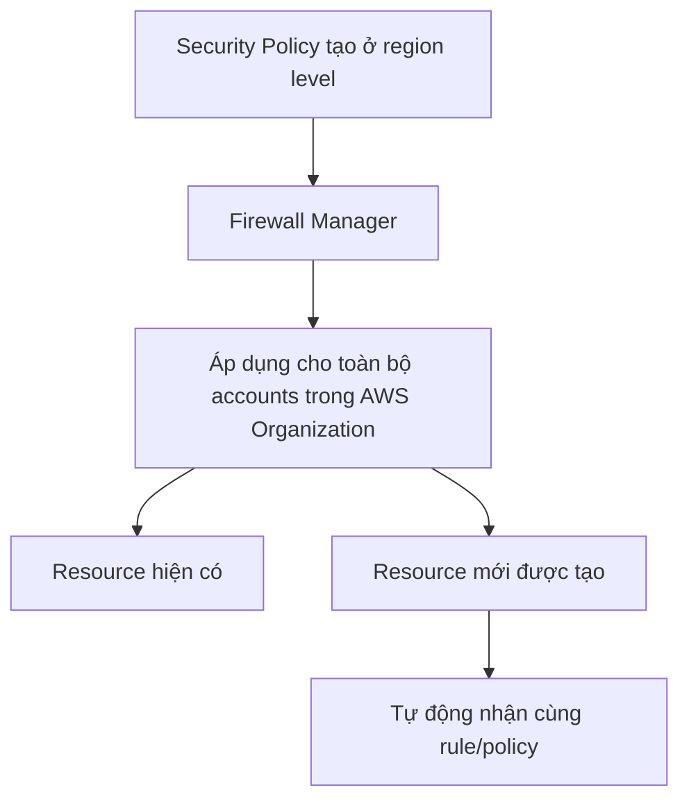

# 33. AWS Firewall Manager

## 🎯 Giới thiệu
AWS Firewall Manager là dịch vụ dùng để **quản lý toàn bộ firewall rules trong nhiều accounts** của một **AWS Organization**.

- Mục tiêu chính: **centralize** việc quản lý bảo mật ở một nơi
- Có thể tạo **security policy** để áp dụng đồng nhất trên nhiều accounts
- Policies được tạo ở **region level**, sau đó áp dụng cho toàn bộ organization
- Điểm quan trọng: khi có **resource mới** được tạo, Firewall Manager có thể **tự động áp dụng** rule tương ứng

## 1. Firewall Manager quản lý gì? 🛡️
Firewall Manager có thể dùng để quản lý nhiều loại security policy khác nhau:

- **WAF rules**
  - Áp dụng cho:
    - ALB
    - API Gateway
    - CloudFront
- **Shield Advanced rules**
  - Áp dụng cho:
    - ALB
    - CLB
    - NLB
    - Elastic IP
    - CloudFront
- **Security groups standardization**
  - Cho:
    - EC2
    - Application Load Balancer
    - ENI resources trong VPC
- **AWS Network Firewall**
  - Ở **VPC level**
- **Amazon Route 53 Resolver DNS Firewall**

## 2. Firewall Manager hoạt động như thế nào? ⚙️
- Bạn tạo **security policy** một lần
- Firewall Manager sẽ:
  - quản lý các rule tập trung
  - áp dụng rule cho **nhiều accounts**
  - tự động đưa rule vào các **resource mới** phù hợp
- Đây là điểm mạnh chính: **quản lý đồng bộ + tự động hóa bảo vệ**

## 3. Phân biệt với WAF và Shield Advanced 🔍
### WAF
- Dùng để định nghĩa **Web ACL rules**
- Phù hợp khi cần **one-time protection**
- Tập trung vào rule cho web application protection

### Firewall Manager
- Dùng khi muốn:
  - triển khai WAF trên **multiple accounts**
  - **accelerate** WAF configuration
  - **automate protection** cho resource mới
- Firewall Manager sẽ triển khai các rule đã có tới tất cả accounts/resource được quản lý

### Shield Advanced
- Dùng để bảo vệ khỏi **DDoS attacks**
- Có thêm các tính năng:
  - **dedicated support** từ **Shield Response Team (SRT)**
  - **advanced reporting**
  - có thể **tự động tạo WAF rules**
- Nếu thường xuyên bị DDoS, nên cân nhắc **Shield Advanced**
- Firewall Manager cũng có thể giúp **deploy Shield Advanced** trên toàn bộ accounts

| Dịch vụ | Vai trò chính | Điểm nổi bật trong transcript |
|----------|---------------|-------------------------------|
| WAF | Định nghĩa Web ACL rules | Phù hợp cho one-time protection |
| Firewall Manager | Quản lý rules tập trung nhiều accounts | Áp dụng policy tự động cho accounts và resource mới |
| Shield Advanced | Bảo vệ DDoS | Có SRT, advanced reporting, tự động tạo WAF rules |

## 📊 Bảng tóm tắt
| Tiêu chí | Mô tả |
|----------|------|
| Mục đích | Quản lý firewall rules trên nhiều accounts trong AWS Organization |
| Cách dùng | Tạo security policy và áp dụng đồng loạt |
| Phạm vi | Region level, sau đó áp dụng toàn organization |
| Tự động hóa | Tự áp dụng rule cho resource mới như ALB mới |
| Tích hợp | WAF, Shield Advanced, security groups, Network Firewall, DNS Firewall |
| Lợi ích thi | Quản lý tập trung, đồng bộ, giảm công sức cấu hình thủ công |

## 💡 Mẹo ghi nhớ cho kỳ thi AWS
- Nhớ: **WAF = rule**, **Firewall Manager = quản lý tập trung nhiều accounts**
- Khi đề bài nói:
  - **nhiều accounts**
  - **tự động áp policy**
  - **quản lý đồng loạt**
  
  thì nghĩ ngay đến **Firewall Manager**
- Khi đề bài nói:
  - **DDoS protection**
  - **SRT**
  - **advanced reporting**
  
  thì nghĩ đến **Shield Advanced**
- Khi đề bài nói:
  - **Web ACL**
  - **one-time protection**
  
  thì nghĩ đến **WAF**

## ✅ Kết luận
AWS Firewall Manager là dịch vụ giúp **quản lý và triển khai firewall rules một cách tập trung** trên nhiều accounts trong AWS Organization. Nó đặc biệt hữu ích khi muốn kết hợp với **WAF** và **Shield Advanced** để bảo vệ đồng nhất, tự động và dễ mở rộng cho toàn bộ hệ thống.
