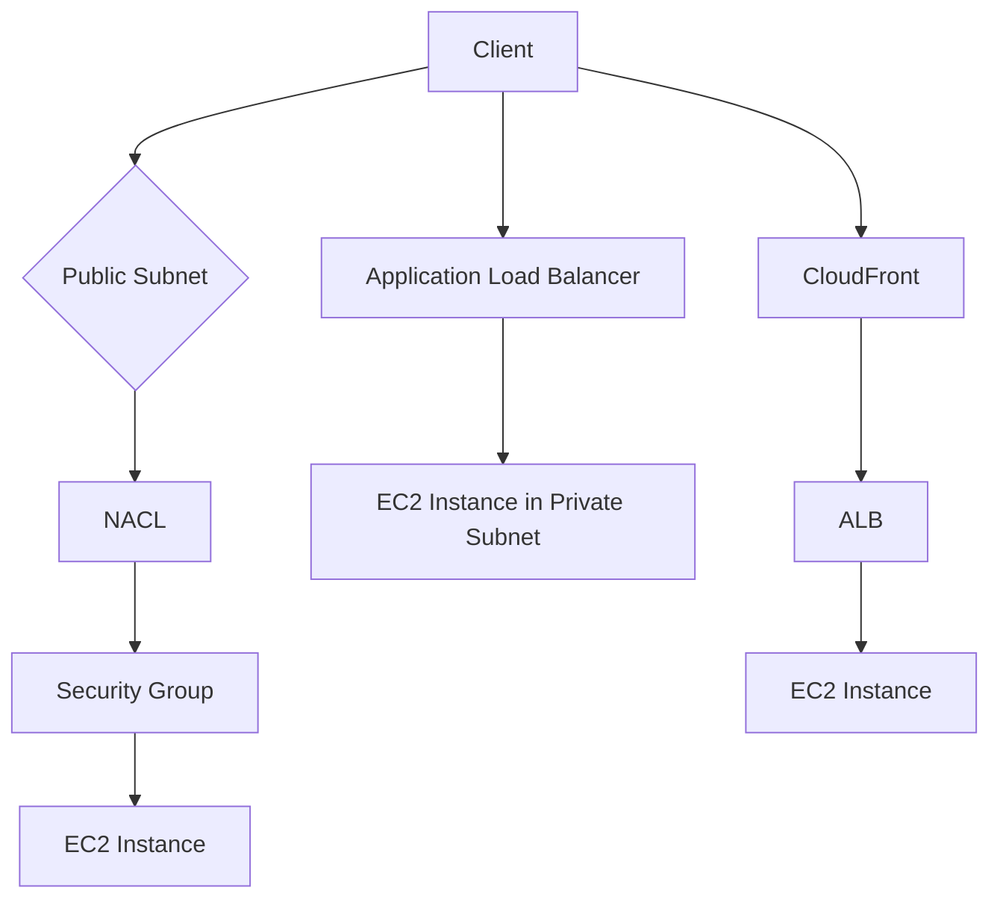

# 34. Blocking an IP Address

## 🎯 Giới thiệu
Bài này giải thích cách chặn IP trong AWS theo từng lớp bảo vệ của network. Ý chính là: đặt rule ở đúng vị trí trong luồng traffic sẽ hiệu quả hơn, rẻ hơn và dễ quản lý hơn.

## 1. 🛡️ Các lớp chặn IP trong public subnet
- **Network ACL (NACL)** là **line of defense đầu tiên** trong public subnet.
- NACL cho phép cấu hình **explicit deny** hoặc **allow** rất đơn giản và rẻ.
- Nếu NACL mặc định cho phép tất cả, thì **Security Group** trở thành lớp phòng thủ tiếp theo.
- **Security Group không có deny rules**, chỉ có **allow rules**.
- Nếu biết trước IP của client, có thể chỉ **allow** đúng IP đó vào EC2.
- Nếu traffic đã vào tới EC2, có thể chạy thêm **firewall software** trên instance:
  - kiểm tra packet trực tiếp
  - kiểm soát chi tiết hơn
  - nhưng sẽ tốn **CPU cost** và có thể làm chậm instance

## 2. 🔁 ALB / NLB và EC2 private subnet
- Khi dùng **Application Load Balancer (ALB)**:
  - client kết nối vào **ALB** ở public subnet
  - ALB chuyển traffic đến **EC2** ở private subnet
- Cách này giúp EC2 nằm trong **private subnet**, tăng bảo mật cho application.
- EC2 cần **Security Group** chỉ cho phép kết nối từ **ALB**.
- ALB thực hiện **connection termination**:
  - client connect đến ALB
  - ALB connect đến EC2
- Có thể quản lý security ở mức:
  - **ALB**
  - **Network ACL** ở public subnet
- Tương tự, **Network Load Balancer (NLB)** cũng có mô hình security tương tự theo transcript.

## 3. 🌐 WAF, CloudFront và Geo Restriction
- **AWS WAF** có thể gắn với **ALB** để:
  - lọc IP address
  - tăng khả năng phòng thủ
  - cung cấp thêm control cho infrastructure
- **AWS WAF** cũng có thể đặt quanh **CloudFront**.
- Khi dùng **CloudFront**:
  - traffic đi từ edge locations của CloudFront vào ALB
  - **NACL không còn hữu ích để filter client traffic**
  - vì client không đi thẳng đến AWS traffic path theo cách NACL ở public subnet có thể lọc
- Do đó cần:
  - đặt security ở **ALB level** bằng **Security Group**
  - chỉ allow các **CloudFront public IPs**
- Có thể dùng **Geo Restriction** để block một quốc gia cụ thể.
- Có thể dùng **WAF at CloudFront level** để:
  - tạo firewall ở CloudFront
  - implement **IP address filtering**

## 📊 Bảng tóm tắt
| Tiêu chí | Mô tả |
|----------|------|
| NACL | Lớp phòng thủ đầu tiên trong public subnet, có thể allow/deny explicit |
| Security Group | Chỉ có allow rules, dùng để chỉ cho phép IP hoặc source hợp lệ |
| Firewall trên EC2 | Kiểm tra packet ngay trên instance, linh hoạt nhưng tốn CPU |
| ALB | Client vào ALB, ALB chuyển tiếp đến EC2; giúp EC2 ở private subnet |
| NLB | Mô hình security tương tự ALB theo transcript |
| WAF | Gắn với ALB hoặc CloudFront để lọc IP và tăng bảo vệ |
| CloudFront | Traffic đi qua CloudFront nên cần security ở ALB level, không trông chờ NACL |
| Geo Restriction | Chặn theo quốc gia khi cần |
| Connection termination | ALB nhận kết nối từ client rồi tự kết nối tiếp đến EC2 |

## 💡 Mẹo ghi nhớ cho kỳ thi AWS
- **NACL = first line, allow + deny**
- **Security Group = allow only**
- **ALB/NLB trước EC2 private subnet = security tốt hơn**
- **WAF dùng để lọc IP / tăng defense**
- **CloudFront đi trước ALB thì phải nghĩ đến CloudFront IPs và WAF**
- Nếu cần chặn theo vị trí địa lý, nhớ **Geo Restriction**
- Khi phân vân rule đặt ở đâu, hãy **vẽ traffic path trước**

## ✅ Kết luận
Cách chặn IP trong AWS phụ thuộc vào **vị trí của traffic trong kiến trúc**. NACL, Security Group, firewall trên EC2, ALB, CloudFront và WAF đều có vai trò riêng. Muốn thiết kế đúng, cần xác định rõ **client đi qua đâu** và đặt rule ở **đúng lớp** trong luồng mạng.
