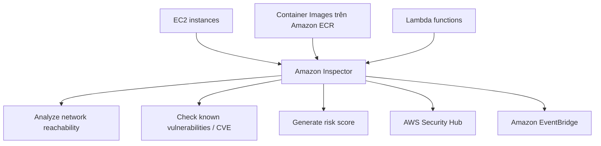

# 35. Amazon Inspector

## 🎯 Giới thiệu
Amazon Inspector là dịch vụ dùng để thực hiện **automated security assessments** cho:
- **EC2 instances**
- **Container Images** đẩy lên **Amazon ECR**
- **Lambda functions**

Mục tiêu chính của Inspector là phát hiện **security vulnerabilities** và cung cấp kết quả để bạn dễ **prioritize** và xử lý.

## 1. Amazon Inspector trên EC2
- Inspector dùng **Systems Manager agent** trên EC2 instances.
- Nó đánh giá:
  - **Unintended network accessibility**
  - **Running operating system** để tìm **known vulnerabilities**
- Việc đánh giá này diễn ra **continuously**.

## 2. Amazon Inspector trên ECR và Lambda
- Với **Container Images** đẩy lên **Amazon ECR**:
  - Inspector phân tích image để tìm **known vulnerabilities**.
- Với **Lambda functions**:
  - Khi function được deploy, Inspector kiểm tra:
    - **software vulnerabilities** trong **function code**
    - **package dependencies**
- Việc kiểm tra Lambda diễn ra **as the functions are being deployed**.

## 3. Kết quả và cơ chế đánh giá
- Inspector chỉ đánh giá:
  - **Running EC2 instances**
  - **Container Images on ECR**
  - **Lambda functions**
- Inspector dựa trên **database of vulnerabilities (CVE)** để kiểm tra:
  - **package vulnerability** cho **EC2, ECR, Lambda**
  - **network reachability** trên **Amazon EC2**
- Nếu database **CVE** được cập nhật:
  - Inspector sẽ **tự động chạy lại**
  - để đảm bảo hạ tầng được kiểm tra lại
- Mỗi lần chạy, Inspector gán một **risk score** cho các vulnerabilities để **prioritization**.

## 📊 Bảng tóm tắt
| Tiêu chí | Mô tả |
|----------|------|
| Đối tượng kiểm tra | EC2 instances, Container Images trên ECR, Lambda functions |
| Cách hoạt động trên EC2 | Dùng Systems Manager agent để kiểm tra network accessibility và OS vulnerabilities |
| Cách hoạt động trên ECR | Phân tích Container Images khi được push lên ECR |
| Cách hoạt động trên Lambda | Kiểm tra khi function được deploy |
| Dữ liệu so sánh | Database of vulnerabilities, CVE |
| Kết quả đầu ra | Findings, risk score |
| Tích hợp | AWS Security Hub, Amazon EventBridge |
| Tính chất | Continuous scanning, tự chạy lại khi CVE được cập nhật |

## 💡 Mẹo ghi nhớ cho kỳ thi AWS
- Nhớ 3 đối tượng chính của Inspector: **EC2, ECR, Lambda**.
- Với **EC2**: liên tưởng ngay đến **Systems Manager agent**.
- Với **ECR**: Inspector kiểm tra **Container Images** khi push lên.
- Với **Lambda**: kiểm tra lúc **deployment**.
- Inspector không chỉ tìm lỗi, mà còn tạo **risk score** để ưu tiên xử lý.
- Findings có thể đi vào **Security Hub** và **EventBridge**.

## ✅ Kết luận
Amazon Inspector là dịch vụ **security assessment tự động** cho **EC2, ECR, Lambda**, tập trung vào **vulnerabilities**, **network reachability**, và **CVE-based scanning**. Kết quả được gửi sang **Security Hub** và **EventBridge**, giúp theo dõi tập trung và tự động hóa xử lý.
