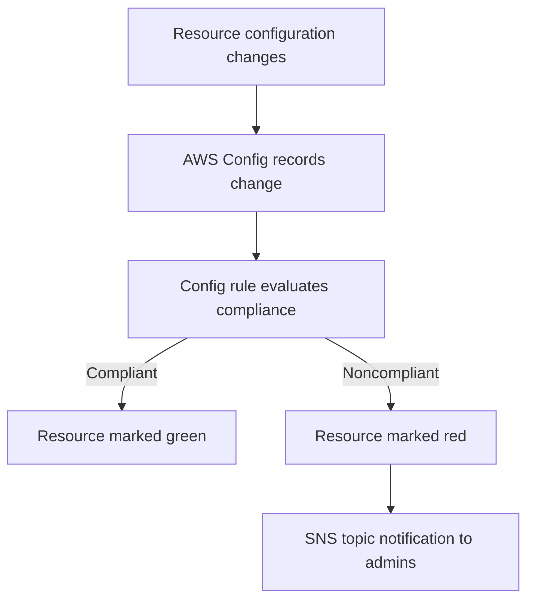

# 36. AWS Config

## 🎯 Giới thiệu
AWS Config là service dùng để:
- **Audit** và **record compliance** của AWS resources.
- Ghi lại **configuration** và **changes to configuration** của resource theo thời gian.
- Theo dõi resource **compliant hay not compliant** dựa trên các **config rules**.

## 1. Mục đích và phạm vi hoạt động
- AWS Config giúp bạn trả lời các câu hỏi về trạng thái cấu hình và thay đổi cấu hình của resource.
- Ví dụ use case trong transcript:
  - Có **unrestricted SSH access** trên Security Group không?
  - S3 bucket có **public access** không?
  - **ALB configuration** đã thay đổi như thế nào theo thời gian?
- Khi có thay đổi, bạn có thể theo dõi lại lịch sử để **backtrack**.

## 2. Config Rules
- **Config rules** chỉ dùng để **evaluate compliance**.
- Chúng **không ngăn chặn** hành động xảy ra trên resource.
- Không có cơ chế kiểu **deny rule** trong Config rules.
- Nếu muốn chặn hành động, transcript gợi ý đây là use case phù hợp hơn cho **SCP**.

### Luồng đánh giá compliance

## 3. Managed Rules, Custom Rules và Automation
- AWS Config có **AWS managed config rules**:
  - Hơn **75 managed rules**.
- Bạn cũng có thể tạo **custom configuration rules**:
  - Cần tạo **Lambda function** và liên kết với AWS Config.
  - Ví dụ trong transcript:
    - Kiểm tra EBS disk có phải **gp2** không.
    - Kiểm tra EC2 instance có phải **t2.micro** không.
- Custom rule có thể được:
  - Trigger mỗi khi có **config change**.
  - Hoặc chạy theo **regular time interval** như mỗi ngày.

### Tích hợp khi noncompliant
- Có thể gửi event sang **Amazon EventBridge** khi rule **noncompliant**.
- AWS Config còn tích hợp sâu với **SSM automations**:
  - Có thể thực hiện **auto remediation**.
  - Ví dụ:
    - Sửa ngay **security group rules**.
    - **Stop instances** có tag không được phép.

## 📊 Bảng tóm tắt
| Tiêu chí | Mô tả |
|----------|------|
| Mục đích | Audit và record compliance của AWS resources |
| Theo dõi | Configuration và changes to configuration theo thời gian |
| Config rules | Chỉ evaluate compliance, không chặn hành động |
| Thông báo | Có thể gửi alert qua **SNS topic** |
| Phạm vi | Là **per region service**, phải enable ở từng Region |
| Aggregation | Có thể aggregate data across **accounts and regions** vào một central account |
| Rules | Có **AWS managed config rules** và **custom rules** với **Lambda** |
| Tự động hóa | Tích hợp **EventBridge** và **SSM automation** để remediation |

## 💡 Mẹo ghi nhớ cho kỳ thi AWS
- **Config = compliance visibility**, không phải **prevention**.
- Nếu đề bài nói đến:
  - **Ai thay đổi gì, khi nào**, và **resource có compliant không** → nghĩ đến **AWS Config**.
- Nếu cần **chặn** hành động ngay từ đầu, transcript nhắc tới **SCP** chứ không phải Config rules.
- Nhớ 3 điểm hay gặp:
  - **Per region**
  - **SNS notification**
  - **SSM automation / EventBridge** cho remediation và integration

## ✅ Kết luận
AWS Config dùng để theo dõi cấu hình, lịch sử thay đổi và mức độ compliant của AWS resources theo thời gian. Service này rất hữu ích cho audit, phát hiện noncompliance, nhận alert qua **SNS**, và kích hoạt **EventBridge** hoặc **SSM automation** để xử lý tự động khi có vi phạm.
