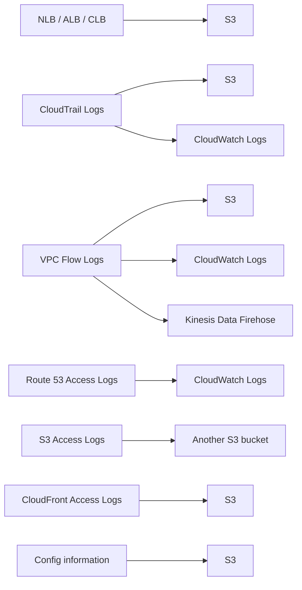

# 37. AWS Managed Logs

## 🎯 Giới thiệu
AWS Managed Logs là các loại log do dịch vụ AWS tạo ra, hữu ích cho thiết kế kiến trúc hệ thống và theo dõi hoạt động.  
Trong transcript, các log chính cần nhớ là:

- **Load Balancer access logs**
- **CloudTrail Logs**
- **VPC Flow Logs**
- **Route 53 Access Logs**
- **S3 Access Logs**
- **CloudFront Access Logs**
- **Config information export**

## 1. Load Balancer Access Logs 📥
- Dùng để lấy chi tiết tất cả request gửi tới **load balancer**.
- Áp dụng cho:
  - **ALB**
  - **NLB**
  - **CLB**
- Có thể export vào **S3**.

## 2. CloudTrail Logs và VPC Flow Logs 🔍
- **CloudTrail Logs**
  - Ghi lại tất cả **API calls** trong account.
  - Có thể export vào **S3** và **CloudWatch Logs**.
- **VPC Flow Logs**
  - Cung cấp thông tin về toàn bộ **IP traffic** đi vào và đi ra khỏi **network interfaces** trong **VPC**.
  - Có thể gửi tới:
    - **S3**
    - **CloudWatch Logs**
    - **Kinesis Data Firehose**

## 3. Các Access Logs còn lại 🌐
- **Route 53 Access Logs**
  - Ghi lại thông tin về tất cả **queries** mà Route 53 nhận được.
  - Có thể stream trực tiếp vào **CloudWatch Logs**.
- **S3 Access Logs**
  - Có thể gửi sang **một S3 bucket khác**.
  - Cung cấp thông tin về các **request access** xảy ra trong bucket.
- **CloudFront Access Logs**
  - Export vào **S3**.
  - Cho biết chi tiết về mỗi **user request** mà CloudFront nhận được.
- **Config information**
  - Có thể export vào **S3**.
  - Dùng như **backup** và để **analysis**.

## 📊 Bảng tóm tắt
| Tiêu chí | Mô tả |
|----------|------|
| Load Balancer access logs | Chi tiết request tới **ALB, NLB, CLB**; export vào **S3** |
| CloudTrail Logs | Log mọi **API calls** trong account; export vào **S3** và **CloudWatch Logs** |
| VPC Flow Logs | Theo dõi **IP traffic** vào/ra **network interfaces** trong **VPC**; gửi tới **S3**, **CloudWatch Logs**, **Kinesis Data Firehose** |
| Route 53 Access Logs | Ghi nhận các **queries** của Route 53; stream vào **CloudWatch Logs** |
| S3 Access Logs | Gửi sang **another S3 bucket**; ghi lại request access trong bucket |
| CloudFront Access Logs | Chi tiết mọi **user request** tới CloudFront; export vào **S3** |
| Config information | Export vào **S3** để **backup** và **analysis** |

## 💡 Mẹo ghi nhớ cho kỳ thi AWS
- Nhớ cặp quan trọng:
  - **CloudTrail = API calls**
  - **VPC Flow Logs = IP traffic**
- Nhớ điểm đến phổ biến:
  - **S3** là nơi export log rất thường gặp
  - **CloudWatch Logs** hay đi cùng **CloudTrail**, **VPC Flow Logs**, **Route 53**
- Khi thấy câu hỏi về:
  - request tới load balancer → nghĩ đến **Load Balancer access logs**
  - truy vết hoạt động trong account → nghĩ đến **CloudTrail Logs**
  - traffic trong VPC → nghĩ đến **VPC Flow Logs**
  - query DNS → nghĩ đến **Route 53 Access Logs**
  - request đến CloudFront → nghĩ đến **CloudFront Access Logs**

## ✅ Kết luận
AWS Managed Logs là nhóm log quan trọng cho việc quan sát, phân tích và lưu trữ hoạt động của các dịch vụ AWS.  
Điểm cần nhớ nhất là **loại log nào gắn với dịch vụ nào** và **log đó có thể được export tới đâu**.
