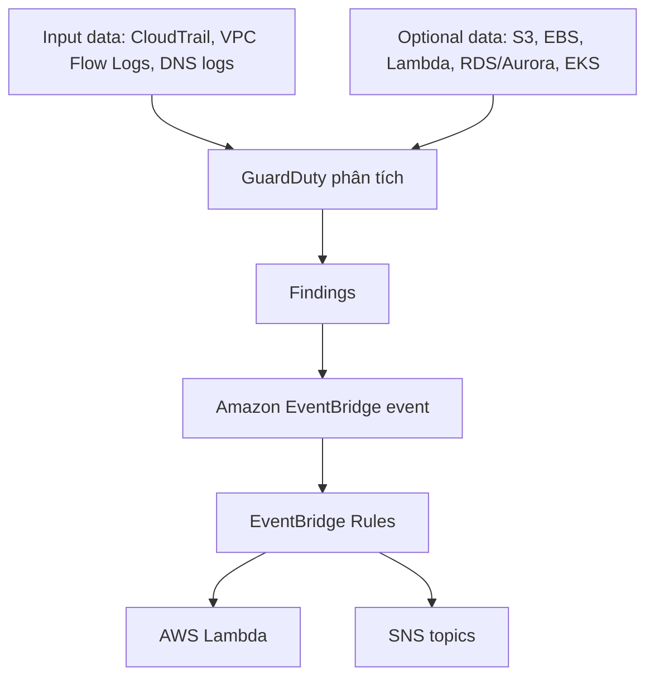

# 38. Amazon GuardDuty

## 🎯 Giới thiệu
- **Amazon GuardDuty** là dịch vụ **intelligent threat discovery** để bảo vệ AWS accounts.
- GuardDuty dùng:
  - **machine learning**
  - **anomaly detection**
  - **third-party data**
- Bật GuardDuty rất đơn giản:
  - chỉ cần **1 click**
  - có **30 days trial**
  - **không cần cài software**

## 1. Nguồn dữ liệu GuardDuty phân tích
GuardDuty theo dõi nhiều nguồn input data để phát hiện hành vi bất thường:

- **CloudTrail event logs**
  - tìm **unusual API calls**
  - tìm **unauthorized deployments**
  - bao gồm:
    - **management events**
    - **data events**
- **VPC Flow Logs**
  - phát hiện **unusual internet traffic**
  - phát hiện **unusual IP addresses**
- **DNS logs**
  - phát hiện **EC2 instances sending encoded data within DNS queries**
  - đây có thể là dấu hiệu instance đã bị **compromised**

Ngoài ra còn có **optional features** để phân tích thêm:
- **EKS audit logs**
- **RDS and Aurora login events**
- **EBS**
- **Lambda**
- **S3 data events**
- **runtime monitoring**

## 2. Findings và luồng phản ứng
GuardDuty sẽ tạo ra **findings** khi phát hiện vấn đề.

### Mermaid Flow

- Khi có **findings**:
  - một **event** sẽ được tạo trong **Amazon EventBridge**
- Từ **EventBridge rules**, có thể kích hoạt:
  - **AWS Lambda**
  - **SNS topics**
- GuardDuty có thể giúp bảo vệ trước **cryptocurrency attacks**
  - vì có **dedicated finding** riêng cho loại tấn công này

## 3. Delegated Administrator trong AWS Organization
- Với **AWS Organization**, một **member account** có thể được chỉ định làm **GuardDuty Delegated Administrator**
- Tài khoản này sẽ có quyền:
  - **enable**
  - **manage GuardDuty**
  - cho **all accounts** trong Organization
- Việc chỉ định **Delegated Administrator**:
  - **chỉ thực hiện được từ Organization Management Account**

## 📊 Bảng tóm tắt
| Tiêu chí | Mô tả |
|----------|------|
| Mục đích | Intelligent threat discovery để bảo vệ AWS accounts |
| Cách hoạt động | Dùng machine learning, anomaly detection, third-party data |
| Triển khai | One-click, có 30 days trial, không cần cài software |
| Input data chính | CloudTrail logs, VPC Flow Logs, DNS logs |
| Optional data | S3 data events, EBS, Lambda, RDS/Aurora login events, EKS audit logs, runtime monitoring |
| Kết quả | Tạo **findings** |
| Tích hợp xử lý | EventBridge → Lambda hoặc SNS |
| Điểm thi quan trọng | Có dedicated finding cho **cryptocurrency attacks** |
| Organization | Có thể dùng **Delegated Administrator** để quản lý GuardDuty cho toàn Organization |

## 💡 Mẹo ghi nhớ cho kỳ thi AWS
- Nhớ cụm: **CloudTrail + VPC Flow Logs + DNS logs** là các nguồn dữ liệu cốt lõi của GuardDuty.
- GuardDuty không chỉ phát hiện mà còn đẩy **findings** sang **EventBridge** để tự động hóa phản ứng.
- Nếu đề bài nói về:
  - **unusual API calls**
  - **unauthorized deployments**
  - **encoded data trong DNS**
  - **cryptocurrency attack**
  
  thì hãy nghĩ ngay đến **GuardDuty**.
- Trong **AWS Organization**, nhớ rằng:
  - **Delegated Administrator** chỉ được chỉ định từ **Organization Management Account**.

## ✅ Kết luận
- **Amazon GuardDuty** là dịch vụ phát hiện mối đe dọa thông minh cho AWS.
- Dịch vụ này phân tích nhiều nguồn logs để phát hiện hành vi bất thường và tạo **findings**.
- GuardDuty tích hợp tốt với **EventBridge**, **Lambda**, và **SNS** để tự động hóa phản ứng.
- Trong môi trường **AWS Organization**, tính năng **Delegated Administrator** giúp quản lý tập trung GuardDuty cho nhiều account.
